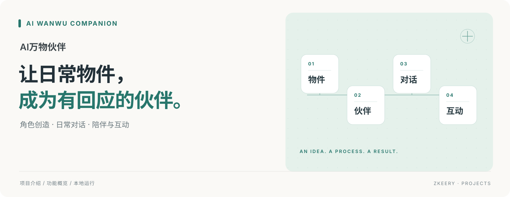
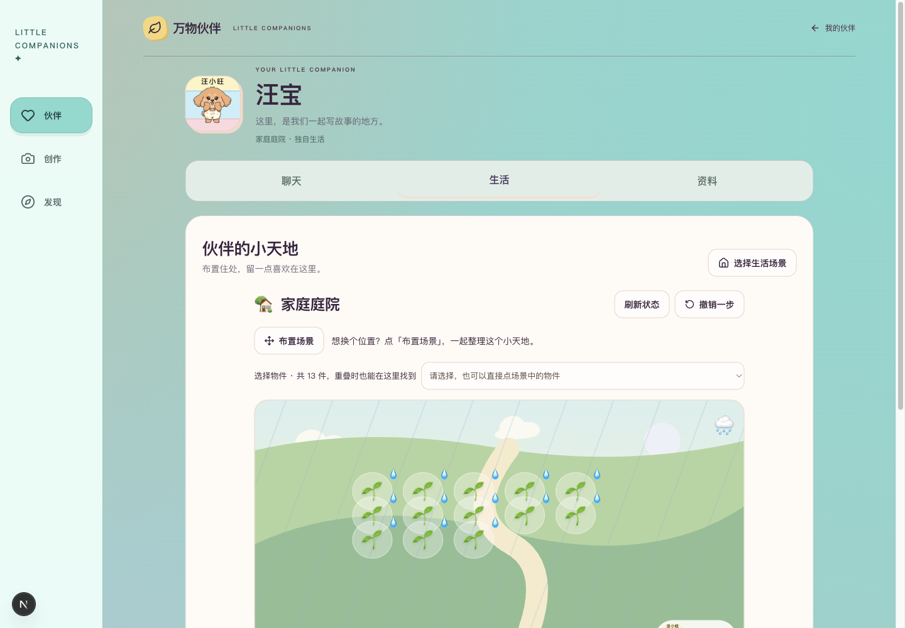

# AI万物伙伴

**把身边的日常物品，变成能聊天、能一起生活的小伙伴。**

拍一张照片，从物品的外观和特点出发，生成伙伴的形象与性格。你可以给它起名字、聊聊天，再为它布置庭院、绿洲或营地，让一次创作慢慢变成一段陪伴。

Next.js · React · FastAPI · SQLite

[快速启动](#快速启动) · [功能介绍](#可以做什么) · [使用文档](docs/README.md)

## 可以做什么

| 能力 | 你可以这样用 |
| --- | --- |
| 照片变伙伴 | 上传照片，识别物品，生成形象、名字和性格；不满意时调整描述 |
| 聊天与记忆 | 与伙伴持续对话，查看聊天记录，手动管理希望它记住的内容 |
| 布置小天地 | 在庭院、绿洲或营地摆放物件、照料植物，保存自己的生活场景 |
| 展示与分享 | 收藏创作，在作品墙主动发布或撤下作品；为已有伙伴播放已配置的动作 |



*项目生活页截图。具体伙伴形象、场景和动作取决于已有数据与配置。*

## 从一张照片开始

1. 登录，上传一张包含日常物品的照片。
2. 查看识别与创作结果，留下喜欢的伙伴。
3. 打开聊天，逐渐补充它与你的共同记忆。
4. 选择生活场景，布置空间并照料里面的物件。

## 快速启动

准备 Python 3.12 和 Node.js 22+。首次体验可使用本地模拟模式，无需模型密钥。

```bash
git clone https://github.com/Zkeery/ai-wanwu-companion.git
cd ai-wanwu-companion/backend
python3.12 -m venv .venv
.venv/bin/pip install -r requirements.txt
cp .env.example .env
DEV_SMS_FIXED_CODE=123456 .venv/bin/uvicorn app.main:app --host 127.0.0.1 --port 8020
```

另开终端，在仓库根目录运行：

```bash
cd frontend
cp .env.example .env.local
npm ci
NEXT_PUBLIC_DEV_SMS_CODE=123456 npm run dev
```

打开 [本地页面](http://127.0.0.1:3020)，用本地测试手机号和验证码 `123456` 登录。上述固定验证码仅用于本机开发。

## 当前边界

未配置模型密钥时，识别、生成和聊天返回模拟结果。真实体验需要在 `backend/.env` 配置模型服务；语音、短信、自主生活和动作生成有各自的配置要求。生成速度及真实效果因模型而异，部分体验仍在完善。

## 继续了解

配置说明、动作演示与部署入口见 [使用文档](docs/README.md)。需求、开发过程和历史验收记录保存在文档目录，按需查阅。
