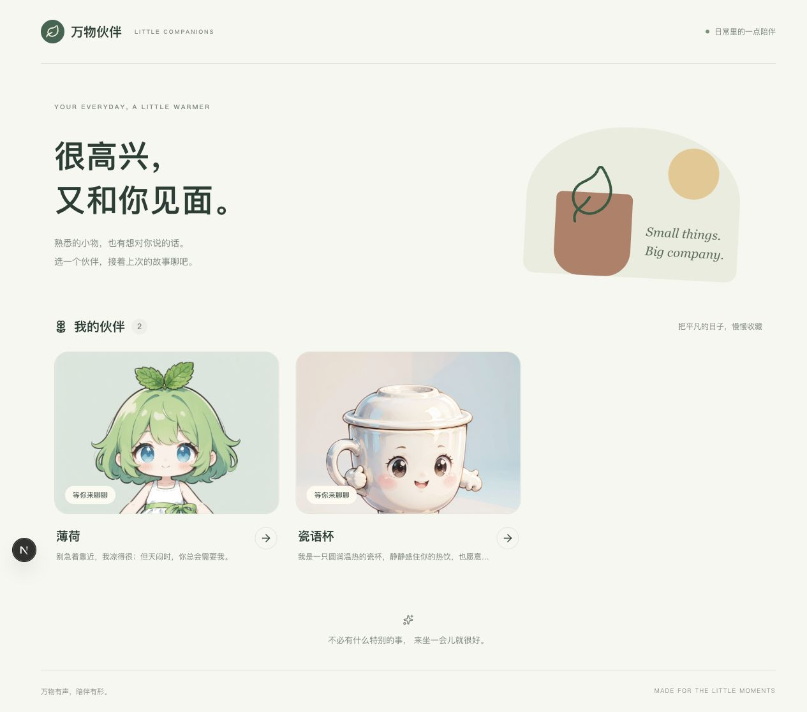
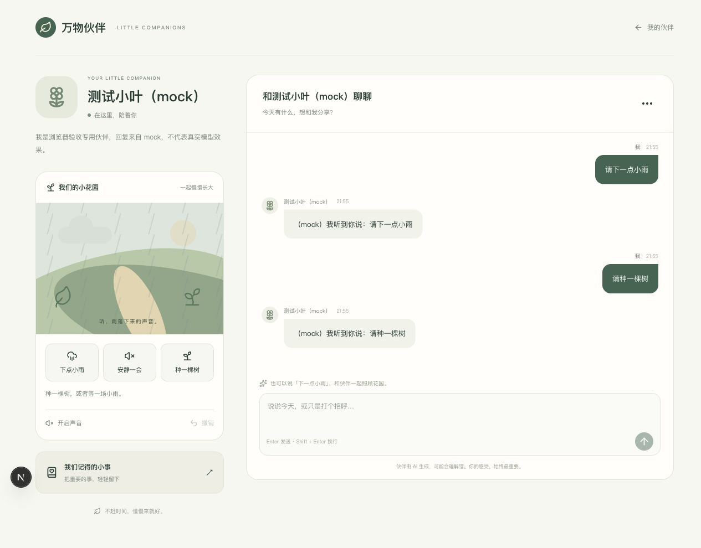
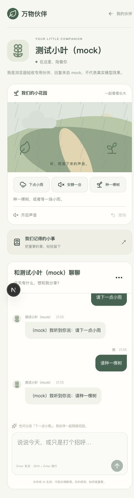

# 正式前端第一阶段 · 工程验收报告

> 本文为首轮交付记录。最新发现、修复、真实模型调用及结论见[验收复查结论](../前端阶段1复验/验收结论.md)。首轮“未新增收费调用”仅描述当时状态。

日期：2026-09-18。结论：本阶段开发与工程验证通过，可在 http://127.0.0.1:3020 查看。界面视觉待产品反馈；真实模型质量评分仍待完成。本报告不替代模型质量验收，不表示全部 V1 或上线完成。

## 交付范围

- Next.js 正式工程、收藏入口、伙伴独立 URL、真实角色图片、人设与历史恢复。
- 聊天流式显示、发送锁、输入法保护、断流提示、失败保留输入、从后端核对已保存结果。重试只重新读取，不自动重发模型请求。
- 小雨/安静/种树，持久化提议确认/拒绝，单步撤销；页面读取与场景操作串行，避免旧结果覆盖。
- Web Audio 雨声、明确声音状态、安静后恢复小雨、离开页面释放声源。
- 记忆查看/新增/编辑/删除确认；清空聊天及删除角色说明影响并二次确认。
- 暖白、植物绿与陶土色；手机与桌面布局、键盘焦点、原生 dialog 焦点约束、减少动画偏好。

## 验证证据与边界

| 验证 | 结果 | 证据范围 |
| --- | --- | --- |
| lint / TypeScript strict / production build | 通过，无 lint 警告 | 正式前端 |
| 前端单元与组件测试 | 17 项通过 | SSE 字节分片/CRLF/终止标记/错误、消息发送防重、失败保留输入、输入法、离页 abort、持久化 token、记忆删除确认与失败保留编辑、音频声源释放 |
| 后端兼容回归 | 107 项通过 | 既有后端；保留两条依赖弃用警告，不影响结果 |
| 原静态页面回归 | 13 项通过 | 原 8020 验收页 |
| 真实后端只读联调 | 通过 | 真实收藏、角色图、详情、历史及花园状态从 3020 同源代理加载；没有提交新聊天或修改现有角色数据 |
| Chrome 完整写入流程 | 通过 | 3021/8021 隔离测试库；聊天回复明确为 mock；提议出现前场景未变、刷新恢复提议、确认小雨、拒绝种树、声音启用、安静→小雨恢复、撤销后按钮禁用、记忆新增与编辑 |
| 无效角色页面 | 通过 | 显示“角色不存在”、重新加载与返回收藏入口 |
| 响应式 | 通过 | 收藏与详情均在 375、390、768、1280、1440px 检查，document scrollWidth 不超过视口宽度 |
| Chrome 应用异常 | 已处理 | 初次发现浏览器扩展注入 body 的 mpa-* 属性导致 hydration 提示；仅为 body 外部属性加 suppressHydrationWarning，保留子树报错。重载后未新增应用异常；无效角色请求的 404 是预期行为 |
| 真实模型输出评分 | 待验 | 本轮未新增收费模型调用；mock 结果仅验证交互和持久化 |
| 主观视觉与音色 | 待产品反馈 | 功能与状态通过，不代替用户评价 |

工程选型修正：中断前的 TypeScript 7.0.2 与 typescript-eslint 不兼容，ESLint 10.10.0 与 React 插件不兼容；改为 TypeScript 6.0.3、ESLint 9.39.5，保留 Next.js 16.3.5、React 19.3.0。所有实际版本已锁入 package-lock.json。

## 可复核操作

1. 打开 http://127.0.0.1:3020 ，点击已有伙伴，核对图片、名字和历史。
2. 点击小雨、开启声音，再点击安静、小雨，查看播放状态；撤销后再次撤销按钮应禁用。
3. 打开“我们记得的小事”，新增并编辑一条记忆；删除前会显示确认提示。
4. 聊天“请下一点小雨”会触发模型调用及受控提议。真实模型收费调用仍按既有授权边界处理；无费用复现方式见 frontend/README.md 的隔离联调入口。
5. 刷新伙伴 URL 应恢复历史、场景及尚未处理的提议；返回收藏后旧声源停止。

## 阶段闸门

| 项目 | 是否通过 | 说明 |
| --- | --- | --- |
| 开发范围与文档一致 | 是 | 已有伙伴代表页及必要收藏/记忆入口 |
| 接口、失败、持久化、确认机制 | 是 | 17 项前端测试及浏览器隔离联调 |
| 真实业务数据读取 | 是 | 原角色与历史正常展示，无迁移 |
| 新页面真实收费聊天质量 | 待验 | 本轮未调用收费模型，不宣称质量通过 |
| 桌面、手机与生产构建 | 是 | 五种宽度、构建与类型检查通过 |
| 证据与可访问入口 | 是 | 本目录截图、3020 页面及启动说明 |
| 产品视觉/音色确认 | 待反馈 | 可运行版本供审阅 |

工程实现可以交付，尚不能宣布全部阶段验收或整体产品完成。下一步依据代表页反馈调整视觉，再开发正式照片创建流程；真实样例质量评分保持独立待验。

## 截图

真实收藏页：

桌面交互页（隔离 mock 数据）：

手机交互页（隔离 mock 数据）：

