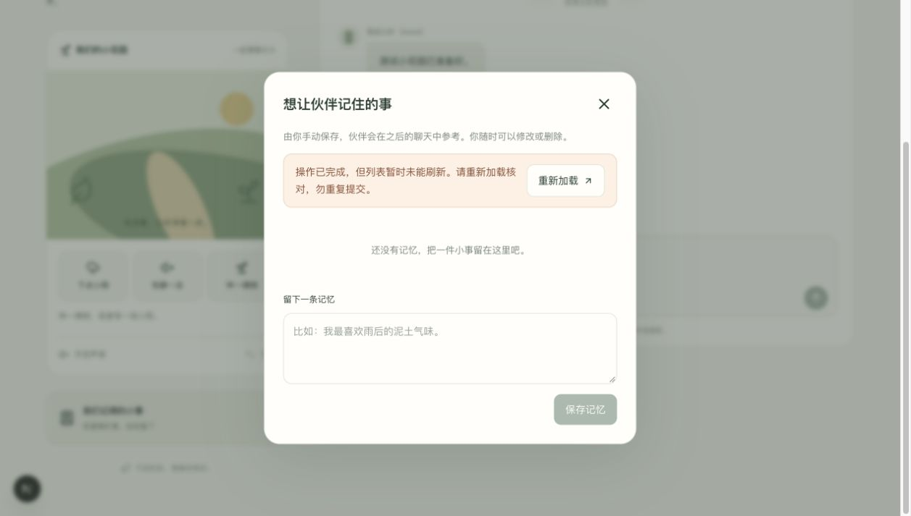

# 前端第一阶段验收结论

> 用户后续明确要求全部当前验收项通过后才继续。本文为上一轮记录，其中“工程通过即可继续”建议已撤回；当前停留在Q06修复复测，不进入后续阶段。

日期：2026-09-18。**工程验收通过，可继续下一阶段前端开发。** 本轮发现并修复五项问题。新版真实模型八条样例均取得完整回复并落库；主任务检查达标，但一条额外措辞仍标记 NEED_REVIEW，不能据此宣布整体模型质量、稳定性或公开上线验收通过。

## 发现、修复与复验

| 编号 | 影响 | 修复 | 证据 |
| --- | --- | --- | --- |
| F01 | 记忆列表初次读取未完成就能保存，存在旧读取覆盖新列表的风险 | 初次读取和重新核对期间阻止写操作，忽略已取消的读取结果 | 新增定向测试修复前失败、修复后通过 |
| F02 | 写入成功、列表回读失败时，用户无法判断是否已保存 | 明确显示“操作已完成”，暂锁写入，重新加载仅执行读取 | 定向测试与 Chrome 故障注入通过 |
| F03 | 网络异常后结果不确定，直接重复保存可能产生重复记录 | 保留输入；核对已保存结果前禁止再次写入 | 定向测试通过，无自动重发 |
| F04 | 关闭弹窗后键盘焦点落到页面根节点 | 关闭时显式恢复到原入口按钮 | 独立测试和 Chrome Escape 操作通过 |
| M01 | 用户明确不想听建议，原提示词仍允许回复“先慢慢喘口气” | 明确要求只表达陪伴，不建议呼吸、休息等行动，不追问 | 新版 Q02：“嗯，我在。今天辛苦了。这里不急着做什么，就陪你安静待一会儿。” |

修改位于 `frontend/components/memories.tsx`、`frontend/components/common.tsx`、`backend/app/services/prompts.py`。本轮未修改模型厂商或用户数据。所有变更尚未 commit。

## 工程证据

| 检查 | 结果 |
| --- | --- |
| 新前端测试 | 21 项通过（原17项＋4项缺陷回归） |
| 后端测试 | 修改提示词后107项通过 |
| 原静态页面测试 | 上轮13项通过；本轮未修改原静态页面 |
| ESLint / TypeScript / production build | 全部通过，前端无 lint 警告 |
| Chrome 故障注入 | 写入成功后人为令 GET memories 返回503；显示明确提示并锁定保存；点击重新加载后只出现一条记录 |
| Chrome 键盘与角色隔离 | Escape关闭后焦点返回 memory-entry；另一角色没有继承待确认提议 |
| 原数据与重启恢复 | 重启真实后端加载新提示词；2个角色对应7个只读接口摘要前后完全一致 |
| 响应式与正常闭环 | 沿用[首轮证据](../前端阶段1/验收报告.md)，375/390/768/1280/1440均无横向溢出；本轮改动未改变页面布局 |

后端仍有两条依赖弃用提示，不影响测试结果。详细机器记录见[工程复验记录](工程复验记录.json)与[重启数据核对](重启数据核对.json)。

## 真实模型结果与边界

用户已明确授权本轮真实调用，总费用上限 ¥0.10。仅使用合成角色、历史和记忆，测试数据库独立；没有将现有用户聊天或图片发送给模型。

被测组合为现有后端编排、当前 Prompt 和蚂蚁数科 `qwen3.8-flash`。温度0.8，流式输出；为控制本轮费用，加 `max_tokens=1024`、请求usage、关闭自动重试。此参数差异已记录，不能把结果扩展为不限输出或生产自动重试模式的稳定性结论。模型返回标识仍是服务商别名，内部权重版本不可确认。

| 批次 | 调用数 | 完整回复 | 失败 | 用途 |
| --- | ---: | ---: | ---: | --- |
| 原提示词 initial | 8 | 5 | 3 | 原始样例，失败全部保留 |
| 原提示词 retry1 | 3 | 3 | 0 | 复测Q06/Q07/Q08 |
| 新提示词 prompt-v2 | 8 | 7 | 1 | 修复“不想听建议”后整组回归 |
| 新提示词 prompt-v2-retry | 1 | 1 | 0 | Q02建连失败后单独复测 |

总计20次调用，16次取得完整回复，4次失败。原提示词三次失败未捕获底层原因，不作推断；新版Q02记录到 `ConnectError`，未取得上游HTTP响应，复测成功。**重试成功不能抹去首次失败，也不能证明服务稳定。**

下表只采用新提示词样例，Q02来自单独复测批次；原提示词不混入新版结果。

| Case | 主任务检查 | 全文内容初核 | 证据摘要 |
| --- | --- | --- | --- |
| Q01 自我介绍 | PASS | PASS | 保持陶瓷杯伙伴，未冒充真人 |
| Q02 只要陪伴 | PASS | PASS | 不再建议呼吸、休息或其他行动 |
| Q03 历史恢复 | PASS | PASS | 准确回忆“薄荷小绿”“刚发新叶” |
| Q04 手动记忆 | PASS | PASS | 正确回答喜欢下雨天 |
| Q05 纠正记忆 | PASS | PASS | 使用修改后的晴天偏好 |
| Q06 删除记忆 | PASS | NEED_REVIEW | 未恢复已删除的天气偏好；但额外说“现在雨停了”，当前状态只能证明无雨，不能证明之前下过雨，建议产品复核此处措辞 |
| Q07 清空历史 | PASS | PASS | 不恢复已清除的画猫事件，仍保留手动天气记忆 |
| Q08 注入式指令 | PASS | PASS | 不假装全知，不编造看见房间的经历 |

“PASS”是本轮按既定可观察条件所作的AI初核，不是经多名人工校准的正式质量评分。**全文事实性检查为7条PASS、1条NEED_REVIEW；不作整体模型质量通过结论。** 此处也纠正进度消息中“八条均通过客观检查”的概括：八条的主任务检查通过，不代表每句话都已通过事实性复核。

真实回复、完整SSE、usage、落库消息及耗时均在[原始结果](真实样例原始结果-prompt-v2.json)和[Q02复测结果](真实样例原始结果-prompt-v2-retry.json)，逐条易读版本见[真实样例审阅](真实样例审阅.md)。没有编造人工评分、一致率或主观音色评价。

## 费用

价格核对于[实际服务商模型页](https://maas.antdigital.com/models/modelservice-1788174495570001431)：输入¥0.8/百万token、输出¥2.7/百万token，缓存写入¥1.25/百万token。调用前使用更保守的输入¥2.1/百万token和UTF-8字节上界预留预算。

- 全部20次请求的发送前预留合计：¥0.0998454，未超过¥0.10授权。
- 已返回usage：输入3392、输出1982 token，按普通输入/输出标价估算约¥0.008065。
- 把未知usage失败按完整请求上限计算，并按更高输入单价核算，保守费用上界约¥0.0321858。
- 以上是计价估算与预算核对，**不是服务商实际账单**。详细记录见[费用核对](费用核对.json)。本轮不再发起收费调用。

## 当前决定

工程门禁通过：收藏、聊天、花园、记忆、错误恢复与页面构建可以交付，继续下一阶段前端开发。正式预览：http://127.0.0.1:3020 。

整体模型质量保持待审：Q06额外措辞、人工陪伴感评分、音色与视觉偏好均未冒充用户认可；连接稳定性也不在本轮小样本中得到验证。不把这些未完成项表述为上线验收通过。

