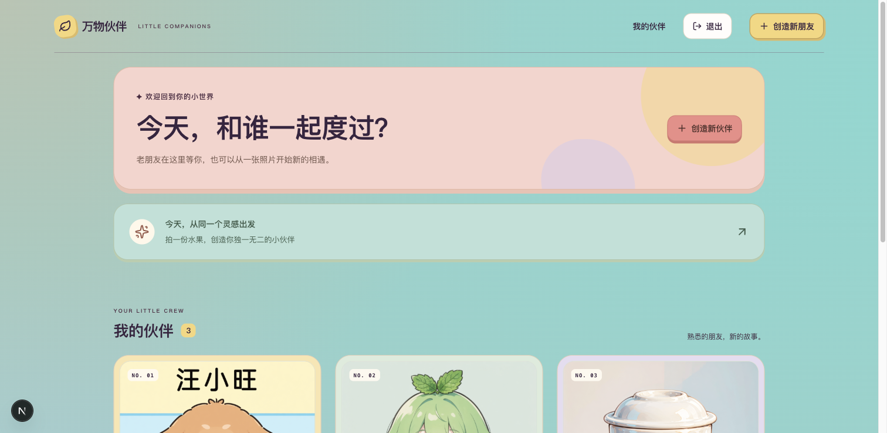
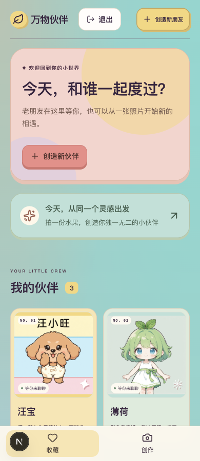

# R6.2 权限、生产保护与 Tiffany 蓝绿背景

日期：2026-09-21。先补齐第6阶段前后端手册，再实施本批。工程与本地验证通过，V1.1 整体验收仍未完成，未上线、未调用真实模型或短信。本轮按用户要求随本次 Git 提交交付。

## 交付结果

- 私人图片需要当前账号权限；保持已有图片路径，本人的收藏、创建结果、详情、聊天和场景正常加载。图片请求携带登录凭证，地址中不包含凭证；退出、换号或切换图片时丢弃旧请求和旧图片。公开墙和队内展示沿用各自权限。
- 历史无主数据认领默认关闭；只有本地明确配置的账号可认领，生产环境始终拒绝。
- 后端增加生产启动保护，开发令牌、固定验证码、模拟模型及不安全配置不能直接进入生产。当前短信仍为模拟实现，因此设置 `APP_ENV=production` 会明确拒绝启动，不能靠改一个标志冒充真实短信。
- 前端生产构建拒绝开发验证码提示、离线体验标志和敏感命名的公开环境变量。本地开发配置保留，构建验证通过显式环境覆盖执行。
- 按用户咖啡页参考增加明显的 Tiffany 蓝绿：底色 `#95CFC9`，亮部 `#81D8D0`，配合奶油、蜜桃、珊瑚和少量雾紫。保留现有布局与功能。

## 验证证据

修复前在隔离测试中复现两项问题：已知私人图片地址匿名返回 200，普通账号可认领无主数据；对应回归测试当时均失败。修复后：

| 检查 | 结果 |
| --- | --- |
| 后端完整回归 | 590/590；含图片所有权、路径和符号链接、撤下／删除、小队边界、认领与生产配置 |
| 前端完整回归 | 202/202；含换号迟到响应、图片回收、重试及生成结果加载计时 |
| 类型／Lint／生产构建 | 通过；包含最后的 Tiffany CSS 修改 |
| 不安全生产构建 | 带开发验证码提示时实际构建被拒绝，错误不回显输入值 |
| 隔离环境实际双账号 HTTP | 本人图片 200、匿名 401、其他账号 404、普通认领 403；图片 `private, no-store` |
| 浏览器图片 | 主收藏、详情、放大、聊天与场景头像正常；离线生成结果、公开墙和小队图片正常 |
| 布局 | 收藏页 375／390／768／1024／1440px 无横向溢出；详情和创建页补查 390px |
| 主数据保留 | SQLite 备份后重启 8020，24 张表行数及内容摘要完全一致，原 9 个伙伴保留 |
| 上线预检 | 6 通过、5 阻塞、9 待验；移除不安全静态图片／认领模式后转为运行时待验，不伪报生产验收通过 |

浏览器验证中两次等待用了错误的元素类型（原生 dialog 与“开始聊天”链接），随后按页面实际结构核实图片和结果均正常；未重复发起生成。离线新增的苹果伙伴属于 3035 独立测试库，非真实模型结果。主库没有新增或删除伙伴。

机器可读结果：[验证摘要](验证摘要.json)。日志保留在项目忽略目录 `.runtime/r6/security/`，不纳入交付截图或提交。重启前备份为 `.runtime/backups/before-r6-security.db`，此备份只覆盖数据库，不替代后续数据库与图片共同恢复演练。

## 打开验证

打开[主页面](http://127.0.0.1:3020/)，刷新后可看到蓝绿背景。已有登录状态会显示伙伴收藏；进入详情、点伙伴头像放大，图片应正常显示。

打开[离线体验页](http://127.0.0.1:3035/companions/new?theme=fruit)，测试账号 `13900000055`，先获取验证码，再填 `123456`。点“模拟生成伙伴”可验证生成结果图片；该页面始终标明模拟来源，不消耗付费模型。

## 本批闸门

| # | 检查项 | 是／否 |
| --- | --- | --- |
| 1 | 本批手册范围已实现 | 是；V1.2 未实施 |
| 2 | 模拟自动化测试通过 | 是；后端 590/590、前端 202/202 |
| 3 | 真实模型冒烟 | N/A：本批为权限与视觉；R6.4 真实质量仍待验 |
| 4 | 类型／Lint／生产构建 | 是 |
| 5 | 密钥排除 | 是：未修改、提交或输出本地密钥配置；凭证不进入图片 URL |
| 6 | 重启后数据恢复 | 是：24 张表内容不变；完整图片备份恢复仍属 R6.3 |
| 7 | 桌面与移动宽度 | 是：以上视口已检查；真实手机整体流程待验 |
| 8 | README 启动与验证说明 | 是 |
| 9 | 项目状态更新 | 是 |
| 10 | 证据包 | 是：本报告、截图、验证摘要 |

下一批为 R6.3 数据库与图片共同备份、隔离恢复及完整性验证。真实模型质量、费用、正式短信、生产部署与真实手机验收仍未关闭，不能将本批通过写成 V1.1 完成。
