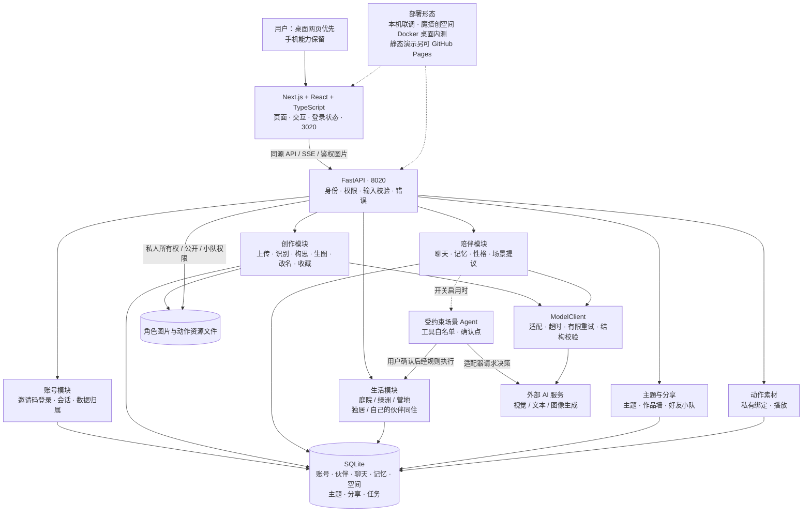
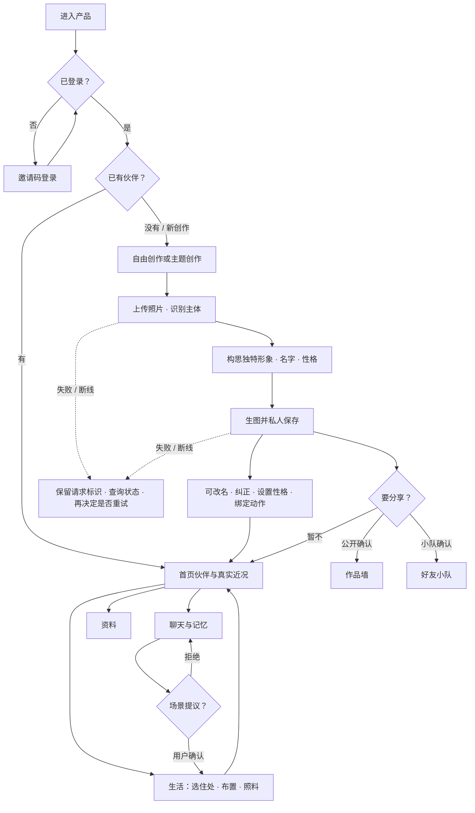

# AI 万物伙伴 V1.2 PRD

## 文档信息

| 项 | 内容 |
| --- | --- |
| 文档名称 | AI万物伙伴 · V1.2 产品需求文档 |
| 版本 | V1.2 |
| 更新日期 | 2026-10-06 |
| 负责人 | 小龙兰 |

基线规则沿用 [V1.1 PRD](../V1.1/PRD.md)；本版记录 V1.2 增量、桌面内测范围与分批细则。实现与闸门以 [项目状态](../../../项目状态.md) 为准。

## 1. 用户问题、使用场景与产品目标

### 1.1 为什么做

成年人希望从日常物品或植物创造**独特、可持续陪伴**的虚拟伙伴：不只看一张生成图，而是能聊天、布置生活场景、积累共同记忆，在复杂现实之外有一个可回来停留的温柔空间。

### 1.2 为谁服务

- 主要：会用中文网页的成年人（桌面内测优先；手机能力保留，实体机验收本轮暂缓）  
- 内部：维护者配置邀请码、模型额度与部署  

### 1.3 使用场景

| 场景 | 用户要完成的事 | 产品承担 |
| --- | --- | --- |
| 第一次认识 | 用照片生成自己的伙伴 | 识别→构思→生图→私人收藏 |
| 日常陪伴 | 聊天、改名、调整性格 | SSE 对话、性格版本保存 |
| 一起生活 | 选住处、布置、照料 | 庭院／绿洲／营地；独居或与自己的伙伴同住 |
| 同题创作与分享 | 主题创作、作品墙、好友小队 | 私人默认；公开／小队须预览确认 |
| 回来继续 | 看到真实近况再聊或进生活 | 首页伙伴优先；不编造未发生事件 |

### 1.4 本期目标与边界

- **桌面主链路内测**：邀请码登录 + 创作／聊天／生活主路径可在已部署环境验证；短信、生成≤8秒提速、实体手机测试**不阻塞**本轮桌面内测，亦不标为已通过。  
- **形象规则**：生成形象应为独立、完整的拟人角色；植物以叶片／茎与原有色彩纹理构成身体，可省略照片中附带的盆土、承托花盆、底座；杯子等本身为主体的物件保留主体结构。生活空间可布置物件不受影响。9号「蔓蔓」静态方向已采用，不自动等于动作全量、8秒或24小时闸门通过。  
- **绿洲四季**：须形成可分辨的季相（鲜绿、强日照沙地、枯黄落叶、薄雪等），地形与可布置物件独立；夏季使用独立背景，不与「未设置」共用。精致微缩布置（落点预览、分类物件、起步方案先预览再应用）为已确认方向，正式接入前完成素材与持久化细则。  
- **性能**：上传开始至最终图片展示全链路硬上限 **8秒（8000ms）**；5秒为优化方向。现状未达标，不得改写为已通过。  

伙伴是持续角色（身份、性格、动作、关系、经历），不要求一律人类外形，须保留来源物件显著特征。细则见第14节与第22节。

## 2. 输入、过程和产物

| | 内容 |
| --- | --- |
| 输入 | 照片（格式／大小校验）；可选主题；邀请码；聊天文本；生活操作；性格编辑；手动记忆 |
| 过程 | 登录→创作（识别／构思／生图）→收藏→聊天／生活／资料；可选公开或小队分享；断线先查请求状态 |
| 产物 | 伙伴（名字、人设、开场白、形象图、性格修订）、消息与记忆、生活空间存档、主题作品、小队提交、动作资源绑定 |
| 长期保留 | SQLite 业务数据 + 私有图片／动作文件；原图不长期落盘 |

## 3. 系统架构

本节概括本机开发与桌面内测架构，依据 [项目架构与流程图](验收证据/交互梳理/项目架构与流程图.md)、[架构与功能总览](../../../架构与功能总览.md) 与仓库代码核对。本机默认前端 **3020**、后端 **8020**（隔离验收可用其他端口）。模型密钥仅服务端；前端经同源代理访问后端。

### 3.1 系统架构概览

逻辑上为单前端 + 单后端，不是微服务拆分。桌面内测按用户确认走**免费魔搭创空间**（闲置可休眠；休眠期间后台生活暂停已获接受）；付费云主机采购未授权（`deploy/ecs` 仅准备模板与本地工具）；**Vercel 不适合**本项目常驻 SQLite 与后台任务，未作为完整产品宿主。短信能力代码可保留，正式签名／资质与收信验收暂缓；当前桌面内测以**邀请码登录**为准。

### 3.2 主业务流程

### 3.3 模块职责

| 模块 | 职责 |
| --- | --- |
| 前端（3020） | 伙伴／创作／发现导航；聊天、生活、资料分区；邀请码登录入口；动作播放与降级静态 |
| 账号 | 邀请码登录（摘要存库、明文仅私有交付）；会话；账号隔离；短信模式保留未作本轮正式验收 |
| 创作 | 上传校验、识别、构思、生图、改名、纠正、额度与失败恢复 |
| 陪伴 | SSE 聊天、手动记忆、性格读写、场景提议（须确认） |
| 生活 | 三场景、独居／同住、布置／照料／成长／收纳／撤销 |
| 主题与分享 | 个人主题、作品墙发布／撤下、好友小队邀请与提交 |
| 动作 | 私有动作资源绑定与播放；失败保留静态形象 |
| ModelClient / Agent | 模型调用边界；场景 Agent 白名单工具，主开关未开时不得宣称为正式启用 |
| SQLite + 文件 | 业务持久化与私有图片／动作资源 |
| 部署 | 本机联调；魔搭 Docker 桌面内测（现行）；`deploy/ecs/` 含单机 systemd／HTTPS／挂盘／备份模板（未采购、未上云主机）；静态动作演示可走 GitHub Pages；Vercel 不承载完整常驻后端 |

更细图解见 [项目架构与流程图](验收证据/交互梳理/项目架构与流程图.html)。

## 4. 页面与字段

### 4.1 页面与控件

| 页面／区域 | 主要字段与控件 | 说明 |
| --- | --- | --- |
| 登录 | 邀请码（密码框） | `AUTH_MODE=invite`；不展示固定测试码 |
| 首页（伙伴） | 概览列表：形象、名字、住处、最近活动 | `GET /api/v1/characters/overview` |
| 创作 | 上传、主题、结果（改名／纠正／去聊天／住处） | 断线先查 `photos/requests/{id}` |
| 发现 | 主题、作品墙、好友小队 | 公开与小队范围分离 |
| 伙伴 · 聊天 | 消息、输入、记忆 | `POST .../chat`（SSE） |
| 伙伴 · 生活 | 住处、布置／照料／收纳 | `/api/v1/living/*` |
| 伙伴 · 资料 | 改名、性格、记忆 | 性格 `PUT/PATCH .../personality` |
| 动作 | 播放／失败重试／减少动态 | `/api/v1` motion 系列 |

### 4.2 主要接口与字段（摘自代码）

API 前缀默认 `/api/v1`（私有图片路由除外）。

| 能力 | 方法与路径 | 请求／响应要点 |
| --- | --- | --- |
| 邀请码登录 | `POST /auth/invite` | 请求 `{code}`；响应 `{token, user:{id,phone}}`（邀请账号 phone 对外为空串） |
| 短信验证码／登录 | `POST /auth/code`、`POST /auth/login` | 仅 `AUTH_MODE=sms`；本轮桌面内测不作为正式验收 |
| 当前用户／登出 | `GET /auth/me`、`POST /auth/logout` | Bearer 会话 |
| 上传识别 | `POST /photos` | 响应 `PhotoOut`：`id,status,objects[{id,label,visual_features,category}],theme_id` |
| 识别回执 | `GET /photos/requests/{request_id}` | 断线恢复查询 |
| 生成伙伴 | `POST /characters` | `CharacterCreate`：`object_id, free_creation?, label?, visual_features?`；SSE 进度 |
| 伙伴列表／详情 | `GET /characters`、`GET /characters/{id}` | `CharacterOut`：`id,name,persona,opening_line,image_path,status,created_at,theme_id` |
| 首页概览 | `GET /characters/overview` | `character` + `residence{space_id,scene_type,mode}` + `recent_activity` 等 |
| 改名 | `PUT/PATCH /characters/{id}` | `{name}` 1–40 字 |
| 再创作 | `POST /characters/{id}/recreations` | 保留原伙伴；耗额度 |
| 性格选项／读写 | `GET /personality-options`；`GET|PUT|PATCH /characters/{id}/personality` | 写：`expected_revision, mode(original\|custom), tags[], custom_text, priority?`；冲突 409 |
| 聊天 | `POST /characters/{id}/chat` | `{message, request_id?}`；SSE |
| 消息／记忆 | `GET .../messages`；`POST|GET .../memories` | `MessageOut`／`MemoryOut` |
| 生活空间 | `/living/spaces` CRUD、成员、actions、season | 庭院 home／绿洲 desert／营地 forest；private｜shared |
| 作品墙／小队 | `/wall`、`/teams` 等 | 发布／撤下／邀请／提交须鉴权 |
| 动作 | `/characters/{id}/motion-*`、motion-candidates | 绑定包 `pack_id`、activity、state |

完整错误码与鉴权细节见各阶段技术手册；上表覆盖主链路字段，竞赛／聚会等扩展接口不在此展开。

## 5. 状态与可做的事

| 对象 | 状态（产品语义） | 可做 | 不可做 |
| --- | --- | --- | --- |
| 账号会话 | 未登录／已登录／已注销 | 邀请码登录；登出 | 越权读他人伙伴与私有图 |
| 生成任务 | 进行中／成功／失败／未知 | 查询回执；失败后由用户决定重试 | 状态未知时自动重复付费生成 |
| 伙伴 | 私人收藏 | 聊天、生活、改名、性格、动作播放 | 未确认的场景提议直接改场景 |
| 公开作品 | 私人／已发布／已撤下 | 作者发布或撤下 | 围观者编辑或进私人会话 |
| 小队 | 成员可见提交 | 邀请、提交、退出 | 把队内提交当成公开发布 |
| 场景提议 | 待确认／已确认／已拒绝／过期 | 确认后执行；拒绝不执行 | 迟到旧确认改写新场景 |
| 动作资源 | 未准备／准备中／ready／失败 | ready 可播放；失败可重试 | 失败时假装已播放 |

## 6. 成功标准

| 维度 | 通过条件 | 现状口径 |
| --- | --- | --- |
| 创作闭环 | 形象与人设保存完整；失败可识别；成功前不误开聊天；断线可核对且不重复扣费 | 工程与桌面内测有记录；真实质量持续抽检 |
| 角色一致性 | 保留来源物件显著特征；性格／开场白／回复一致 | 独立拟人方向已写规则；多样本待验 |
| 生成时延 | 上传→最终图展示 ≤8000ms | **未达标** |
| 生活规则 | 布置／照料／撤销／提议确认符合既有规则与第22节 | 规则代码有验证；主开关以项目状态为准 |
| 隔离与安全 | 跨账号私有资源 404；密钥不进前端 | 有云端／工程检查记录 |
| 动作 | ready 可播；失败静态降级 | 已绑定样例伙伴；非全量用户资产 |

## 7. 交付阶段与优先级

| 阶段 | 范围 | 状态 |
| --- | --- | --- |
| V1.1 基线 | 创作、聊天、三场景、主题墙与小队等 | 工程基线在；上线闸门未全部关闭 |
| A 批 | 导航、排版、模块联动 | 正式前端分区已交付；细则见第19节 |
| B 批 | 模型与全链路≤8秒 | 硬门槛保留；**未通过**；付费测速须单独授权 |
| C 批 | 自主生活、共同空间、四季 | 需求见第22节；真实试跑预算另定 |
| D 批 | 心情与语音 | 需求见第23节；正式音质待验 |
| 桌面内测 | 邀请码 + 魔搭部署主链路 | 有部署与验收记录；≠全部 V1.2 关闭 |

### 7.1 已交付能力摘要

下列为项目状态与证据已记载的交付，**不等于** V1.2 全部闸门关闭：

| 能力 | 事实摘要 |
| --- | --- |
| 邀请码登录 | 每人独立私密邀请码；桌面内测采用；短信正式验收暂缓 |
| 桌面内测部署 | 魔搭创空间 Docker 免费部署与主链路验收有记录；服务可恢复正常模式 |
| 正式前端导航 | 伙伴／创作／发现；聊天／生活／资料分区已接入 |
| 性格设置 | 结果页／资料页预设多选、自填、保存与恢复；公网曾修网关 PUT |
| 动作素材与绑定 | 私有动作资源、播放器；9号「蔓蔓」休息／散步／观察等已采用绑定（证据包） |
| 独立 3D 角色方向 | 用户确认并采用 9 号蔓蔓静态方向（植物成体、可省略附带盆土／花盆／底座）；不自动等于动作／8秒／24小时通过 |
| 作品墙与小队 | V1.1 R5 工程与离线验证；真实社区质量仍待验 |

仍未关闭：≤8秒、正式短信、实体手机、部分稳定性／双人校准等，见项目状态与第21节。

## 8. 模型与成本

- **接入方式**：服务端 `ModelClient` 经可配置的 HTTP 兼容端点调用视觉识别、文本构思／聊天、图像生成；密钥仅环境变量／服务端配置，不进前端。  
- **图像／对话**：沿用当前已跑通配置；更换供应商或提速评测须单独方案与预算，不得静默切换。历史全链路测速曾录得约45秒量级慢样本；**8秒硬门槛未达标**。  
- **动作／语音**：另有配置项与额度账；正式音质与全量动作以授权批次为准。  
- **费用规则**：无维护者明确额度授权不得发起付费调用；失败／未知先查回执，禁止自动重复扣费；生成额度与生活／语音额度分账。  
- **离线流程验证**：可先跑通状态机，须显式标注，不得当作真实模型效果证据。

## 9. 数据与非功能要求

| 项 | 要求 | 现状 |
| --- | --- | --- |
| 存储 | SQLite + uploads 与动作资源 | 本机与魔搭持久卷方案；账号隔离 |
| 备份 | 完整库／文件／ledger 可离线备份恢复；异地传输工具已备 | `deploy/ecs` 含备份／巡检模板；云主机未采购，不以已上线异地备份宣称 |
| 性能 | 生图全链路≤8s；动画准备另计上限 | 生图未达标 |
| 可用性 | 桌面内测可恢复服务；闲置休眠时后台生活暂停纳入范围 | 魔搭免费档可能休眠 |
| 限流 | 邀请码登录按来源限流 | 以配置与手册为准 |

## 10. 内容安全与隐私

| 红线 | 要求 | 来源 |
| --- | --- | --- |
| 数据驻留 | 上线要求国内、不出境；实际部署区域待上线方案核实 | 补全清单已确认；V1.1 §8 |
| 原图 | 识别后不长期保存原图文件；保留识别结果与生成依据 | V1.1 F02 |
| 密钥 | 仅服务端；前端产物不得含密钥 | 工程验收口径 |
| 账号隔离 | 私人伙伴、图片、聊天、记忆按账号隔离；公开／小队字段最小化 | F09、架构图 |
| 场景改写 | 模型不可绕过确认直接改生活场景 | F06 |
| 费用 | 无明确授权不得发起付费模型调用；失败恢复先查状态 | 项目状态／B 批 |
| 儿童与真人 | 首版正式支持物品和植物；真人暂缓 | V1.1 §3.3 |

## 11. 上线与账号

| 项 | 规则与现状 |
| --- | --- |
| 登录 | 桌面内测：`AUTH_MODE=invite`；短信模式代码保留，正式收信验收暂缓 |
| 账号数据 | 邀请登录不要求手机号；兼容非手机命名空间标识；保留既有账号 |
| 桌面内测宿主 | 魔搭创空间 Docker（仅公开体验、代码私有）；接受闲置休眠 |
| 静态演示 | GitHub Pages 可承载无后端演示，不等于完整产品上线 |
| Vercel | 不适合常驻 SQLite／后台 worker；未作完整宿主 |
| ECS | `deploy/ecs` 已备 systemd、HTTPS、挂盘、备份与巡检模板；采购与实际上云未授权 |
| 域名与备案 | 桌面内测使用魔搭平台分配地址；自有域名、备案与商用 HTTPS 证书在采购云主机或对外正式发布前确定，当前未采购、未备案 |

## 12. 非目标

- 不把离线流程验证、静态演示站或局部接口测速宣称成真实全链路≤8秒已通过  
- 不把 GitHub Pages 静态演示或仅前端托管称为完整产品上线  
- 本轮不阻塞于正式短信、实体手机测试；但不将其标为已通过  
- 不新增商业化商店、人类用户即时私聊、排行榜（见第7节）  
- 不删除已有功能；不自动提高付费额度  
- 不以未采购云主机或静态演示冒充完整常驻上线；`deploy/ecs` 模板≠已部署  

## 13. 验收用例

转写自本版闸门与项目状态，不编造新的通过结论。

| # | 检查项 | 期望 | 结果口径 |
| --- | --- | --- | --- |
| AC01 | 邀请码登录 | 正确码进入；错码／过期失败；隔离 | 以桌面内测证据为准 |
| AC02 | 创作主链路 | 上传→识别→生图→私人保存；断线可查状态 | 真实调用须单独授权与记费 |
| AC03 | 性格保存 | 保存后重读一致；冲突先核对 | 工程与公网修复记录已有 |
| AC04 | 动作播放 | ready 可播；失败静态降级可重试 | 绑定伙伴以证据包为准 |
| AC05 | 生活布置 | 保存／撤销／刷新恢复；提议须确认 | 规则以 V1.1 F05／F06 为准 |
| AC06 | 跨账号隔离 | 他人404私有资源 | 云端检查有记录 |
| AC07 | ≤8秒出图 | 上传至最终图展示≤8000ms | **未达标，不得宣称通过** |
| AC08 | 正式短信 | 真实收信 | **本轮暂缓** |

## 14. 本轮优先目标与边界

面向已有 V1.1 用户和首次进入的成年人，先让用户明白产品能做什么、自己在哪里、接下来能做什么。核心仍为从日常物品或植物创造独特伙伴，持续聊天并一起生活。

新增体验目标：让伙伴在春夏秋冬中持续生活，让用户在复杂的现实生活之外，拥有一个熟悉、温柔、可以回来歇一会儿的地方。四季应影响日常活动与共同记忆；四季的变化方式由用户选择，不由系统替用户决定。具体规则见第 22.11 节。

**伙伴的产品定义**：生成图片是角色外观的起点。伙伴进入自己的生活圈、组队和共同空间后，应作为一个持续存在的虚拟角色参与生活，拥有身份、性格、动作、关系和经历。用户看到的应是“谁正在和谁做什么”，而不只是图片并排展示。这里的“人物”指角色身份与行为，不要求所有伙伴变成人类外形，也未限定必须采用3D技术；角色形态仍保留来源物件的独特特征。具体联动见第22.13节。

### 14.1 产品目的：被吸引，愿意留下，获得不同的感受

目标不只是功能可以使用，而是进入后被吸引、愿意留下，并获得独特的陪伴感。首屏要吸睛且让人一眼明白用途；第一次创作带来“这是属于我的伙伴”的惊喜；后续通过角色一致的交流、自主生活、四季变化与共同记忆，让用户愿意回来。温馨、可爱、浪漫、梦幻与鲜明的视觉表现共同服务于这个目的。

留存依靠值得再次体验的内容与持续关系，不以强制任务、惩罚缺席或让用户愧疚为手段。用户可只聊天、安静看看伙伴生活，或主动参加共同活动；不能把“留下”简单等同于在线时间越长越好。

### 14.2 从首次认识到持续陪伴

| 用户阶段 | 用户看到和做什么 | 模块如何衔接 | 希望形成的感受 |
| --- | --- | --- | --- |
| 第一眼 | 鲜明的视觉、伙伴示例、一句用途说明、一个注册／登录入口 | 示例通向创作说明，登录后回原操作 | 好看，也明白这是做什么的 |
| 第一次创造 | 拍照或上传，自动识别构思并生成独特伙伴 | 展示真实进度；结果可纠正、可改名，私人保存 | 日常物件有了新的生命，伙伴属于我 |
| 第一次相处 | 文字或语音交流，选择生活场景 | 同一名字、人设、聊天与记忆延续；住处由用户安排 | 它有自己的性格，也会回应我 |
| 再次回来 | 首页先看伙伴与真实近况 | 直接继续聊天、看生活或参与照料；四季按用户所选节奏变化 | 熟悉的生活在延续，又有一点新变化 |
| 主动拓展 | 主题创作、作品分享、小队相聚、合作与趣味比赛 | 独立入口，主动加入与发布；私人住处和私密交流保留 | 可以一起玩，也有自己的空间 |

### 14.3 范围与实施基线

V1.2 按需求分批：**A：模块导航、排版与联动优化；B：模型替换与生成提速；C：伙伴自主生活、小队共同空间与四季；D：心情适配与语音会话。** 本版强调全链路8秒为硬性要求，B 的方案与测量准备前置，在 A 的创作链路稳定后优先验证，再推进 C、D 扩展；候选与新评测预算待确认。批次编号用于跟踪，不代表同时开发。A 的界面工作可独立推进，但完成 A、C 或 D 不表示生成性能达标；B 未通过时不能宣布本版生成体验或整体验收完成。

实现基线为 V1.1 `0f13a8b`。V1.1 R6.3–R6.5 备份恢复、真实质量、短信和上线仍未完成，保留为交付前待办；进入本版需求设计不等于关闭旧版闸门。继续保留 Tiffany 蓝绿、多彩卡片、温馨可爱风格，当前主要调整信息层级和交互。

## 15. 现状问题与证据

以下为浏览器和源码核对后的问题线索；尚未开展新用户可用性测试，不将推断写成用户测试结果。

| 编号 | 当前表现 | 对用户的影响 | 改进方向 |
| --- | --- | --- | --- |
| U01 | 首页／主题页手机导航为“收藏、创作”，伙伴页增加“聊天、场景” | 全局功能与单个伙伴的功能混在同一层，位置和数量变化 | 固定全局导航，伙伴内另设局部导航 |
| U02 | 首页叫“我的伙伴”，导航叫“收藏”；创作入口又有“创造新朋友／创造新伙伴” | 同一件事出现多种名称 | 统一入口名称，情感文案保留在正文 |
| U03 | 好友小队入口在主题页流程说明下方 | 从首页不易知道有好友活动，也不易理解小队与作品墙区别 | 设稳定的发现入口，区分公开作品与私密小队 |
| U04 | 桌面伙伴详情同时摆放资料、完整场景编辑器和聊天；手机隐藏了部分场景界面 | 同一个详情页承担过多任务，跨设备模块组织不同 | 伙伴页统一“聊天、生活、资料”任务层级 |
| U05 | 首页伙伴卡片统一显示“等你来聊聊” | 不能据此知道真实近况、所在场景或上次互动 | 使用已有真实记录；没有数据时不编造状态 |
| U06 | 生成结果同时出现改名、聊天、选择场景、回收藏、分享、纠正、再创作 | 下一步选择过多，缺少明确主操作 | 一项主操作，其他动作按优先级分组 |
| U07 | 场景选择有“进去看看／搬进来”，入口依附当前伙伴 | 容易混淆“看场景”和“改变伙伴居住地”，同住又可能被理解为与好友同住 | 显示当前伙伴和住处，搬家明确确认，“同住”说明为自己的伙伴 |
| U08 | 主题创作跳到结果后，小队提交和公开发布分布在不同页面 | 创作前的意图容易在结果页丢失 | 保留主题、来源和返回目标；发布和提交仍由用户确认 |

依据：[页面与源码核对记录](验收证据/交互梳理/现状核对与PRD补全清单.md)、[架构与流程图](验收证据/交互梳理/项目架构与流程图.md)。四张现状截图仅作为改版前证据。

## 16. 信息架构与首页（已确认，按阶段接入）

2026-09-22：交付独立交互原型与第1阶段前后端手册后，用户确认“嗯 commit，再继续开发”，据此接入下述固定入口与伙伴三分区。后续模块仍按各自开发阶段实施，不因导航接入而视为已完成。

### 16.1 固定全局入口

| 入口 | 回答的问题 | 内容 |
| --- | --- | --- |
| 伙伴 | 我的伙伴在哪里，今天和谁在一起？ | 伙伴列表、真实近况、继续聊天、进入住处 |
| 创作 | 怎么从照片认识新伙伴？ | 自由创作／主题创作，上传、进度、结果与恢复 |
| 发现 | 有什么主题，可以和谁一起玩？ | 主题活动、公开作品墙、我的好友小队；页内明确写“主题与好友” |

登录后的手机底部、桌面主导航保持相同顺序和名称；进入详情时不增加或替换全局入口。主题创作归“创作”，作品墙和小队归“发现”；当前项始终可辨认。

未登录首页仍只保留一个“注册／登录”账号按钮，不增加整块注册表单。用一句话和示例说明“把日常物品变成独特伙伴，一起聊天和生活”，示例明确标注，不冒充用户已拥有的伙伴。登录后回到用户原本要完成的操作。

### 16.2 已登录首页

首屏优先伙伴与可执行动作，压缩重复欢迎语和大面积介绍。已有伙伴显示名字、形象、真实居住场景，以及有记录才展示的最近互动摘要／时间；不虚构心情、在线状态、未读消息或新事件。

每张卡片以“和它聊聊”为主入口，“去它的住处”为次入口；未安排住处时写“选择住处”。资料与改名放在伙伴内部。创作入口始终可见，但不重复堆放多个相同大按钮。

没有伙伴时只突出“创造第一位伙伴”，配一个简洁示例。无近况、加载失败和真正的空收藏分开呈现；失败给重试，不误导用户重复生成。

### 16.3 伙伴内部

统一伙伴抬头：形象、名字、当前住处和返回来源。局部导航固定为“聊天／生活／资料”，均属于同一个伙伴。

- 聊天：对话与输入框优先；相关场景提议在对话中展示，确认后给“去生活里看看”的入口。
- 生活：先直接进入该伙伴当前住处，未选择时再引导选择。场景选择、搬家、同住成员管理为次级操作；编辑画布只在“布置”状态展开相应工具。
- 资料：名字、性格、记忆、再创作与删除管理。名字可编辑；性格先由AI生成，随后支持分组多选预设、自行填写或二者组合，见第21.7节。改名不绘图；再创作保留旧伙伴并沿用额度规则；删除仍需确认。

伙伴内部切换不丢失已输入未发送的聊天文字，不重置当前对象或误切他人存档。手机和桌面保持相同功能归属，排版可分别适配。

## 17. 模块联动契约

| 从哪里来 | 做什么 | 完成后去哪／保留什么 |
| --- | --- | --- |
| 首页伙伴卡片 | 聊天／进入生活 | 定位明确伙伴；返回恢复列表位置 |
| 自由创作 | 上传后自动识别与创造 | 保存私人伙伴；结果主操作“和它聊聊”，次操作“安排住处” |
| 主题活动 | 按主题创造 | 保留主题；结果可预览后发布到该主题墙，未确认不公开 |
| 好友小队 | 为小队主题创作或选择已有作品 | 保留小队与主题；回到小队预览提交，失效或退出时保留私人伙伴并解释原因 |
| 伙伴聊天 | 提出场景操作 | 显示目标住处与变更；用户确认后保存，跳转生活查看同一结果；拒绝不改变场景 |
| 伙伴生活 | 布置、照料、搬家、切换同住 | 保存后反馈明确；聊天与首页读同一当前住处，不各自保留相互冲突的状态 |
| 资料 | 改名／记忆管理 | 首页、聊天、生活和相关展示使用最新结果；失败不假报保存成功 |
| 生成结果／伙伴资料 | 选择预设或自填性格，预览并保存 | 展示当前有效性格；后续聊天、语音和生活读取同一设定，取消不修改；详细规则见第21.7节 |
| 任一私人入口 | 登录过期／需登录 | 轻量登录；成功后回到原操作，不自动重新扣额、生成或发布 |

所有来源只识别产品内部已知目标，禁止外部地址任意跳转。操作中的请求标识保留，断线或刷新先查询已保存状态；未知结果不自动重做。切换账号清空旧账号的临时界面状态，不暴露旧图片或草稿。

现有“生活同住”指用户自己的多个伙伴共用布置；现有“好友小队”指不同用户围绕主题展示作品。新增 C 批拟扩展伙伴共同生活，但不能把现有小队直接视为已拥有共同空间。小队作品页与共同生活页分开，开启共同生活需要明确选择；规则见第 22 节。

## 18. 排版与反馈规则

### 18.1 视觉方向与信息层级

沿用此前确认的吸睛、多彩、时尚、可以适度夸张的方向，并增加 Tiffany 蓝绿元素；温馨、可爱、浪漫、梦幻体现在角色、光影与相处体验里。早期淡紫、淡粉是探索过程，不再作为全站必须浅色、小清新的限制。参考图中的卡片、角色和色彩可借鉴，不直接引入其排行、商店、稀有度或数值体系。

2026-09-26伙伴形象补充：用户提供四只物体小精灵参考图，明确希望“古灵精怪”。新形象向有性格的立体物体小怪灵探索：圆润紧凑的身体、短小肢体、可辨识的陶瓷／果皮等材质，狡黠、慵懒、好奇或臭屁等有差异的表情，搭配与原物有关的小魔法细节。保持原照片主体和至少两项显著特征；具体造型为待样图确认的设计，不能把参考图角色逐个复制、将所有角色套成同一笑脸，或据此增加战力／稀有度／排行榜。此要求用于新生成画风探索，不自动重绘已有伙伴，不改变聊天性格、动画准备或8秒时限。

2026-09-26样图评审：R7.14杯子与苹果两张样图整体方向认可，材质与细节精致度仍低于参考图。古灵精怪的立体小怪灵方向作为后续开发基线，材质与细节精致度列为持续优化项；该方向认可不等同于固定API、同图独特性或8秒整体验收通过。

每屏优先说明“当前模块／当前伙伴／主要行动”。同一区块仅一个强调色主按钮；高频动作可见，管理动作放在具名次级菜单。减少重复标题、长介绍与大块空白，不依靠色彩承担全部信息区分。

手机检查 360／390／430px，平板 768px、桌面 1440px；操作区不能被底部导航、键盘或安全区遮住；触控目标至少 44×44 CSS px，支持键盘和可见焦点。正文与背景对比度目标至少 4.5:1。卡片、按钮、反馈样式统一，Tiffany 蓝绿作为背景与局部呼应。

明确呈现加载中、空数据、失败、成功和待确认状态；即时按钮反馈不等于业务成功。生成进度基于真实阶段，不显示虚构百分比或“8 秒一定完成”。返回、取消、撤销的影响在有差异时说清楚。

### 18.2 从此前反馈保留的交互验收点

以下作为回归检查，不表示旧问题当前仍全部存在：

- 登录：手机号、获取验证码、填写与提交的步骤可理解；按钮不可用时能看懂原因，弹层在手机和桌面都能完成操作。
- 生成：不长期停留在无解释的“正在识别”；失败给可执行的下一步，恢复上次结果与主动新创作分开，不重复扣额。
- 名字：生成后可改名；未修改、保存中、已保存与保存失败有明确反馈；保存名字不重绘形象。
- 场景：选中、悬停不让物件漂移；拖动、撤销和刷新结果一致。计数要说明含义与上限，例如“树木 1/7”不能让用户误以为成长等级；具体数值继续沿用已有规则，调整规则须另行确认。
- 用户界面：正式体验不展示框架调试浮标、内部日志或原始技术错误。开发环境工具与产品功能区分清楚。

### 18.3 动态伙伴与悬停跳舞

2026-09-27 小样反馈：用户对R1.6真实视频表示“先暂时这样吧”，本轮表情／转身方向临时保留，暂停继续打磨。圈数、速度、音轨和水印问题留待后续；不等同于正式接入或8秒／10秒验收通过，不另行授权生成费用。

2026-09-27 动作反馈补充：用户连续认为局部切图摆动僵硬，明确希望加入自然表情变化和转圈等连续动作。首个质量小样目标为眨眼／调皮微笑、身体完整转一圈回到正面，保持原角色与背景。先评估连续动画素材路线；这条需求不代表已授权新增模型费用、不放宽既定动画准备10秒要求，不将平面贴图旋转作为转身交付。

**已确认方向**：新生成的伙伴，以及用户再次查看的已有伙伴，都有动态表现；鼠标移到伙伴上时，伙伴本体左右跳舞，手脚、身体有动作，背景保持稳定。此处是主动设计的伙伴展示交互，不能与场景物件意外漂移混为一谈。

悬停跳舞是角色展示中的一种互动；生活空间中的动作还应由角色实际活动触发，不能只在鼠标移入时才有生命感。动画表现与角色活动状态的对应见第22.13节。

**效果已由用户选定**：伙伴本体有动作、背景稳定。整张静态图片的移动／旋转不能作为交付替代。具体采用何种动画资产和实现方式，先在技术手册评估；当前没有指定生成视频或骨骼方案，也没有授权额外模型调用费用。

**推荐交互与验收边界，待手册细化**：

- 覆盖新伙伴生成结果、我的伙伴列表和伙伴详情展示，旧伙伴同样可体验，不要求为此重新创建角色。
- 悬停的检测区域保持稳定，动画不改变卡片尺寸、按钮位置和场景存档坐标；避免图片移动后反复触发进入／离开，产生抖动或停不下来。
- 鼠标移开后停止并回到静止状态；不在整个列表里同时自动跳舞。动画不能阻碍点击进入聊天、资料或生活场景。
- 肢体动作适配实际角色结构：已有手脚的角色可以摆手、踏步和扭身；没有这些部位的角色采用自身躯体或既有附属部位的舞动，不凭空长出手脚或变成另一只伙伴。背景及卡片边框稳定，不能整图平移假装角色在动。
- 手机触发方式已确认：增加小型“跳个舞”按钮，点击播放伙伴本体动作，不改变原卡片进入详情的行为，不抢占页面滚动或场景拖动。未就绪时说明动画准备状态，不假装已经播放；按钮同时支持键盘操作，减少动态效果偏好下保留可用的静态体验。
- 表现保留伙伴原来的形象、名字与性格，不因加入动态而更换角色身份、覆盖原图或修改用户存档。必要的动态资源状态与旧伙伴兼容方式先设计再实现。
- 不得因动态效果放宽全链路8秒出图要求或增加交互卡顿。若选定效果需要额外生成动态资源，先明确其准备流程、耗时与成本，并经范围确认；不能用还没准备好的动画冒充已完成结果。
- 已确认最终伙伴图片从上传到显示≤8秒，动画在最终图片显示后最多再等待10秒准备就绪；这是两个连续计时段，不把静态出图延后到动画完成。图片阶段超8秒或动画准备阶段超10秒都分别记为不达标；就绪后悬停立即本地播放，不把每次悬停做成远程生成。
- 动画失败或超时保留静态伙伴，明确提示“动态暂未准备好”，用户可手动重试；不自动重试或阻塞聊天、资料、生活入口。重试先核对已有任务状态，避免重复生成动态资源；迟到结果与资源替换规则在手册说明。首次旧伙伴缺少动画时从展示现有图片并开始准备动画计时，使用同样10秒上限；已准备的动画直接使用缓存，不重开生成。
- 图片加载失败、资源未就绪、低性能设备或用户选择减少动态时，静态伙伴和原有操作仍可用，但降级不等于动态效果已验收通过。

验收须覆盖新旧伙伴、不同尺寸和宽高比、持续悬停／移出／快速反复移入、列表多卡片、移动端与键盘操作、页面切换及资源失败；检查角色效果符合用户选定方向、无抖动漂移、无布局跳动、无额外重复请求，原业务流程与性能标准仍通过。当前只登记需求，尚未开发动态功能。

## 19. A 批验收任务

### 19.1 模块与流程验收

| 任务 | 通过条件 |
| --- | --- |
| 初次进入并登录 | 能理解产品用途；一个账号入口；登录后回原任务 |
| 找到已有伙伴并开始聊天 | 从首页一次点击到对应伙伴聊天区，不串伙伴 |
| 进入住处并布置 | 已有住处可从首页或伙伴生活入口直接进入；不用重复选择场景；保存、刷新结果一致 |
| 聊天改变场景 | 提议、确认、执行反馈和生活视图指向同一伙伴、同一空间；拒绝无变化 |
| 从主题创造并发布 | 主题上下文保留，生成后私人保存；预览确认才公开，撤下有效 |
| 从好友小队创造并提交 | 不要求用户自行重新查找小队；提交前预览确认，离队不自动公开 |
| 改名、返回与重进 | 已保存名字一致；返回列表位置恢复，聊天草稿不意外丢失 |
| 异常恢复与跨账号 | 失败有解释及下一步；未知结果先核对，不重复生成／扣额／分享；账号数据隔离 |

建议对 5 名未看过说明的试用者做任务测试：至少 4 人能独立指出“伙伴、创作、发现”的用途并完成找伙伴聊天、进入住处、找到好友小队三项任务。该目标为推荐验收标准，尚未实测；浏览器自动化通过不能替代真实用户理解验证。

### 19.2 吸引与陪伴体验的验证（跨批规划）

除“能操作成功”外，还需要验证用户为什么愿意留下。以下为推荐观察项，尚无实测基线，不把它们当作已达到的结果；C、D 相关项在对应功能可试用后验证，不扩大 A 批开发范围。

| 目标 | 观察方式 | 需要据此改进什么 |
| --- | --- | --- |
| 被吸引且看懂 | 首次进入后，让用户说出用途、最想点的入口与困惑点 | 视觉表现是否吸睛，主信息是否被装饰淹没 |
| 愿意认识伙伴 | 记录进入创作、完成创作、主动开启第一次交流的转化，以及离开的原因 | 等待、失败与生成质量是否打断惊喜 |
| 感到独特与被陪伴 | 让用户描述伙伴性格、与原物的关联，以及一次有印象的回应 | 角色是否千篇一律，会话是否自然且连贯 |
| 愿意再次回来 | 后续试用观察次日／七日回访及自述回访原因，区分聊天、生活和活动 | 回来是否有真实内容和延续感，而非只剩任务提示 |
| 仍保有选择权 | 检查跳过活动、纠正心情、设置四季、离开小队后能否正常继续 | 陪伴是否舒适、自主，没有被安排或被催促的感觉 |

转化与回访指标的样本口径、采集方案和目标值在技术手册及试用方案中明确，不先承诺留存百分比；此处不授权接入第三方分析服务或采集聊天正文。

### 19.3 流程完整与全模块响应

**规则要求的验收优先级**：首先整条流程必须跑通，其次每个模块操作与响应都要流畅，不能出现明显等待、卡顿或无反馈。单个接口返回成功、页面能打开或按钮有动画，不能代替完整业务流程验收。生图维持第21.3节全链路≤8000ms的硬门槛；其他模块也必须有可测量的响应标准。

**完整流程覆盖**：

| 流程 | 必须连续验证的步骤 |
| --- | --- |
| 第一次认识伙伴 | 首页理解用途 → 注册／登录 → 上传 → 自动识别构思与出图 → 私人保存 → 改名／下拉调整性格 → 开始交流或安排住处 |
| 回来继续生活 | 登录或恢复会话 → 首页伙伴与真实近况 → 聊天 → 进入原住处 → 布置／照料／生活活动 → 返回与刷新，状态一致 |
| 主题与分享 | 从主题进入创作 → 保留来源 → 私人结果 → 预览确认发布 → 回到原作品墙／小队，不自行公开 |
| 共同生活 | 邀请与接受 → 主人选择伙伴相聚 → 共同操作与任务 → 召回／退出 → 回私人住处，原数据保留 |
| 语音与心情 | 选择伙伴 → 录音发送 → 转写 → 符合当前性格的回复与播放 → 心情纠正／切回文字，继续同一会话 |
| 比赛 | 选择自己的伙伴或跨账号邀请 → 按规则参加 → 过程与结果 → 赛后交流 → 返回生活，无重复结算 |

每阶段先验证本阶段涉及的完整链路及其影响到的既有功能；尚未开发的模块明确标“未实现”，不因离线联调通路通了就宣称整个产品跑通。第8阶段才汇总验证以上全部本版交付链路。

**异常流程同样属于跑通**：至少覆盖登录过期、刷新／重进、网络中断、重复点击、服务失败、任务结果未知、跨账号切换及权限失效。用户应能看懂当前结果并继续或恢复，不陷入死路；关键操作不重复扣额、生成、发布或结算，已保存状态不丢失。

**逐模块性能要求**：

- 记录用户操作至首次可见反馈、至真实业务完成的两类耗时；界面先响应不等于业务已经完成。图片、音频和数据真正可用后才计相应完成时间。
- 检查导航、列表、伙伴详情、改名／性格保存、场景拖动与保存、聊天、语音、邀请和比赛；拖动与输入不能抖动、漂移、掉字或因后台请求锁住整个页面。
- 各阶段技术手册在开发前写明本阶段模块的计时起止点、具体耗时上限、测试设备／网络、数据量、并发、样本量和异常处理；除生图8秒已有明确硬标准外，不擅自声称用户已经确认其他具体数字。
- 完成后给出逐项实测、慢请求与失败记录，首次访问和连续使用分别检查；不通过预加载示例、缓存命中单个最快样本、进度动画或忽略慢请求宣称达标。
- 发现明显卡顿或超出已定上限时，定位前端渲染、传输、后端、排队、模型等实际原因，修复并复验。不能把所有延迟都归给网络，也不能承诺网络和外部服务在任何条件下绝对零延迟。

流程断点及本阶段响应不达标项是验收失败，不用完成更多功能来覆盖；先解决并提供证据，再进入依赖这些能力的开发阶段。

> 推进顺序与暂缓项以第7节为准。以下为分批细则。

## 20. PRD 确认与继承

### 20.1 交流结论索引

本表合并此前相关交流，记录最终有效结论，具体规则只在对应章节展开。已确认的需求不等同于代码已经实现；涉及当前开关、缺失能力及验证状态以对应章节说明为准。

| 主题 | 最终有效结论 | 归属／状态 |
| --- | --- | --- |
| 核心目的 | 吸引用户进入，愿意留下，获得不同的体验和现实之外的一丝慰藉 | 第 1、6 节；已确认目标 |
| 伙伴是角色 | 图片是外观起点；伙伴在自己的圈子里具有持续身份、性格、动作、关系和经历，组队后是真实状态驱动的角色互动 | 第1、10.13节；产品方向已明确，表现技术待手册评估 |
| 首页与联动 | 先看伙伴和近况，再去聊天、布置；创作、好友活动入口清楚 | 第 3–4 节；方向已定，具体导航待审阅 |
| 视觉 | 吸睛、多彩、时尚，可适度夸张，增加 Tiffany 蓝；保持温馨、可爱、浪漫、梦幻 | 第 18 节；沿用最新方向 |
| 动态伙伴 | 本体跳舞、背景稳定；最终图片≤8秒，显示后动画最多再等10秒；超时保留静态、手动重试；手机用“跳个舞”按钮 | 第18.3节；效果、时限与失败处理已确认，资源方案待技术验证 |
| 注册登录 | 未登录首页一个注册／登录按钮，不铺大块注册表单；保留必要账号流程 | 第 16.1 节；已确认 |
| 独特伙伴 | 照片触发生成形象、名字与性格；名字可自动生成，也可修改 | 第 4、9 节；沿用核心能力 |
| 性格修改 | AI先生成；保留推荐选项并加入用户五组特征，支持多选预设、自行填写或组合；建议3–5个性格词 | 第21.7节；最新自由输入要求覆盖此前仅下拉限制，第2阶段新增 |
| Jev 技术候选 | 先纳入需求，后续逐步评估和迭代，当前不立即接入 | 第24节；用户确认登记方向，未确定供应商接入与真实调用预算 |
| 识别与绘图 | 借鉴照片→识别与构思→文本描述→生图的链路；不只按名字画，也不假定参考产品使用某个已知模型 | 第 21.2 节；流程要求，具体替代模型未定 |
| 自动与纠正 | 上传后自动选主体并生成，完成后可纠正，不强制中途确认对象 | 第 21 节；已确认 |
| 同主题与同图片 | 同主题允许各不相同的伙伴；同图也可主动新创作，同一请求恢复则保留原结果 | 第 21 节；差异质量仍需验证，不能保证绝无相似 |
| 主题与分享 | 大家围绕同一主题创作并展示差异，例如水果；私人保存和主动发布分开 | 第 17 节；沿用现有主题功能，不在本轮擅自新增活动频率 |
| 生成速度 | 上传开始至最终图片展示全程不超过8秒是硬性验收门槛，超时即该次不合格 | 第21节；当前未达标，优先验证，真实评测预算待定 |
| 生成额度 | 每账号初始 5 次；技术失败返还，成功后因不满意再创作仍扣 1 次 | 沿用 V1.1；再创作主环境开放情况见第 21.5 节 |
| 多种住处 | 不限花园，保留家庭庭院、沙漠绿洲、森林营地，由用户选择 | 第 22 节；沿用场景基础 |
| 自主生活 | 伙伴自主规划、聊天并完成任务，接受额外 AI 成本方向 | 第 22 节；新增方向已定，具体付费额度未授权 |
| 私人家与相聚 | 保留原住处，去小队空间相聚；私人交流与共同生活分开 | 第 22 节；已确认方向 |
| 小队组合与活动 | 共同空间最多5位用户、每人2位伙伴共10位；成员可添加和照料，只能移动或撤回自己的物件 | 第22.8节；容量与基本布置权限已确认，其他管理细则待审阅 |
| 趣味比赛与交流 | 两种参赛范围、三类比赛与奖励都做；伙伴自主参赛；每日前3场基础10资源、胜者另10，每类首次完成获装饰 | 第22.12节；容量、时长、计分、投票、退出、故障、公平条件及奖励兑换已定，先写手册再开发验证 |
| 分歧与回家 | 首版加入温和分歧、独处和和好，用户可关闭；不强迫用户安慰，不强制每次意见不同都哭泣 | 第22.7节；方向已确认，具体频率与表现待样例验证 |
| 四季与选择权 | 伙伴经历春夏秋冬，变化节奏由用户自己选，不替用户默认决定 | 第 22.11 节；已确认方向，具体设置待审阅 |
| 语音与心情 | 点按说话、说完发送、伙伴语音回复；主动选心情或按当前表达轻量理解，可纠正 | 第 23 节；已确认，不包含绘画 |
| 开发顺序 | 先整理需求，分别写前端／后端技术手册，再按手册开发；自主生活先做离线流程验证，再定真实试跑预算 | 第 7、10–11 节；沿用已定执行方式 |

### 20.2 已纠正的理解

- “会话”指说话，不是画画；此前绘画建议作废，不加入待开发清单。
- “每季两周、八周一轮”由统一节奏修正为供用户选择的方案，不作为默认启用值。
- 早期偏淡紫、淡粉的探索已被后续更吸睛、多彩、适度夸张并加入 Tiffany 蓝的方向补充，不把旧参考当作唯一视觉限制。
- 生成名可以修改，不代表改名就要重新生图；同一请求的恢复也不等于重新创作。
- 现有主题作品小队不等于伙伴已经能跨账号一起生活；新共同空间需要单独设计与验证。

### 20.3 尚待审阅或验证

| 类别 | 待定内容 | 不影响哪些已定结论 |
| --- | --- | --- |
| 页面交互 | 具体导航名称、分区与返回细则、试用验收标准 | 首页伙伴优先、模块联动清楚的目标 |
| 自主生活 | 作息细则、每轮步骤与成本上限、退出处理及温和剧情触发／恢复细节 | 有人查看最多每10分钟规划1轮，无人查看每空间每天最多2轮；温和剧情可关闭，容量与布置权限已定 |
| 趣味比赛 | 赛场与物件视觉审阅；技术手册落实有效行动校验、计时与结算 | 容量、每目标1分、去重、同分／零分、部分／全员退出、单人继续、故障取消、同等比赛条件及奖励兑换均已确认，见第22.12节 |
| 四季设置 | 四季场景与动作样例的体验审阅 | 现实模式手动选南／北半球、按月份计算；虚拟季节1／2／4周；共同修改过半同意、24小时截止，未通过时成员变更须取消重提；通过立即切换，不清空成长或中断任务 |
| 会话细则 | 音色目录、供应商与费用 | 单段60秒，到时停止等待发送；用户已发送原始录音与伙伴回复音频均保留7天，可主动删除；取消或未发送录音不归档 |
| 性格选择 | 标签同义整理、输入长度上限、组合冲突提示与保存校验 | 原推荐＋用户五组特征；支持多选和自填，可组合；3–5词只是建议，不强制凑满 |
| 真实模型 | 生成候选、差异质量标准、评测样本与费用、自主生活试跑预算 | 全链路 8 秒目标及先做离线流程验证的顺序 |
| Jev 候选 | 适用场景、接口能力、样例效果、失败回退、延迟与费用 | 先记录需求，后续迭代，不阻塞现有阶段 |

本文件中的“推荐”“样例”“候选”不因整理入 PRD 就自动成为已确认规则。接受额外 AI 成本方向不等于授权具体收费调用，实际模型、总费用和次数仍须明确。

### 20.4 继承与版本边界

V1.1 的手机号验证码登录、每账号初始 5 次生成及失败返还规则、原图临时处理、私人图片权限、公开与小队分享边界、国内数据与上线约束继续适用。上线预算与 B 批模型成本仍待定，当前 A 批方案不引入新费用。

本轮整理交流只更新 V1.2 需求，不改写 V1.0／V1.1 原始记录，不关闭未完成验收。只有选项编号、无法对应到具体题目的历史答复，不推测其含义或扩展为新规则。后续按本文已确认范围补技术手册；技术实现和验收结果另存对应目录，不混入需求结论。

## 21. B 批目标：模型与生成速度（保留）

本版明确：若5秒暂时无法实现，允许调整为8秒，但必须控制在8秒内。因此**上传开始到最终生成图片加载展示，全链路不超过8秒（8000ms）是硬性验收门槛**，不是尽量达到的建议值，也不能放宽成仅模型接口耗时8秒。V1.1 未切换模型，原有真实结果未达标；当前仍不得宣称具备8秒生成能力。本轮需求确认不自动授权新的付费测速。

### 21.1 已知问题

现有服务三组真实测试分别为约 42.6 秒、识别限流失败、51.9 秒。成功样本中识别／构思约 27.914 和 36.423 秒，绘图接口约 11.933 和 13.266 秒。两段都需要评估，单纯更换绘图模型不能据此保证全链路达标。

来源：[V1.1 真实全链路测速报告](../V1.1/验收证据/阶段3/真实全链路测速报告.md)。现有测试是同一张杯子插画的有限样本，不代表多样照片的质量与 P95。

### 21.2 功能与体验要求

| 编号 | 需求 | 边界 |
| --- | --- | --- |
| P01 | 评估识别与生图模型替换，按整条链路选择组合 | 不能仅看单模型宣传耗时；提供实测速度、成功率、画质与费用 |
| P02 | 保持照片 → 对象识别与角色构思 → 文字描述 → 最终形象的流程 | 绘图依据物体特征、完整角色设定和独特性要求，不是只按名字合成 |
| P03 | 保留自动生成、结果可纠正、名字可修改 | 不恢复必须中途点“确认对象”的等待；改名不重新绘图 |
| P04 | 保留温馨、可爱、浪漫、梦幻和独一无二的形象要求 | 同主题的不同照片应有可辨别差异，不能用固定模板图替代真实生成 |
| P05 | 提示具体失败原因并支持安全恢复 | 区分繁忙／限流、识别失败、生成失败和连接中断；结果未知时先查询状态，不自动重复付费 |
| P06 | 保留已有伙伴与场景数据 | 模型替换不重绘旧伙伴，不改变已保存的名字、聊天、记忆或生活场景 |
| P07 | 同一图片可主动重新创作不同伙伴；请求恢复保持原结果 | 前端区分“继续上次／重新创作”；后端保存请求与独立角色构思，不能把网络重试当成新创作 |

### 21.3 性能与质量验证

计时覆盖上传、识别与构思、绘图、最终图片下载和浏览器加载展示。占位图、预览图、首个进度提示均不算完成。逐次记录总耗时和分段耗时，同时记录失败与重试，不能只展示最快样本。

**判定规则**：

- 对符合已公开输入规格的生成请求，从用户开始上传该照片到最终有效形象实际显示，耗时须≤8000ms；排队、自动重试及图片传输时间均计入，不重新起表。
- 任一有效验收请求超过8000ms，该次即不合格；失败、空白、图片加载失败及仅给出超时提示都不能算“8秒成功出图”。验收批次出现超时或失败时，本项不得标为通过，不能删掉慢样本后重算。
- P50、P95、最快值和平均值用于定位问题，不代替逐次检查与最大耗时门槛。界面响应快、播放动画、先显示模板或把生成移到后台，都不等于满足要求。
- 必须同时检查最终形象质量、原物关联和独特性，不用不符合质量要求的图片换取达标数字。若现有候选组合无法兼顾，保留阻塞并继续评估，不擅自放宽产品要求。

使用多类真实物品照片验证，报告样本数、逐次总时间与分段耗时、P50／P95／最慢值、失败原因和实际或有来源的成本；测试包括首次请求、连续请求、约定并发、手机与桌面及代表性网络条件。具体输入规格、设备／网络条件、并发档位与样本量在技术手册列明，不以临时缩小测试范围掩盖慢请求。有限样本通过不代表可以承诺所有未来网络和服务状态下绝不超时。

**超时体验与恢复（实现细则在技术手册明确）**：到8秒仍未显示最终结果时，应明确告知本次未按时完成并提供查询／恢复入口，不无限显示“马上完成”。请求仍保留原标识，先查最终状态，不能自动重复付费生成。超时反馈不等于模型任务已取消，也不能据此立即返还后再次扣费；是否失败、是否返还按可核对的最终状态及既有技术失败返还规则处理。此措施只处理异常体验，不作为性能达标方案。

未通过时如实记录，不能将 离线演示流程、供应商宣传速度或局部接口测速当成真实全链路验收。新生成链路的正式开放与 V1.2 整体通过，均以本门槛及质量验收通过为条件；既有本地入口保留用于排查，不擅自删除已有能力。

### 21.4 B 批实施前需确定

- 候选服务、具体模型、账号／接口可用性及单次生成费用上限。尚未选定替代模型。
- 新一批真实评测的样本量与总费用额度，以及质量评分标准。此前“三组／1 元”授权已结束，不能自动沿用。

执行顺序：完善并确认本 PRD → 撰写对应技术开发文档与评测方案 → 在新的明确额度内评测 → 按结果实施 → 真实复验。当前仅登记需求，不代表批准任何新费用或已完成模型替换。

### 21.5 同图不同伙伴：当前代码与后续校验

2026-09-22 按用户问题核对源码与非敏感配置：前端新上传使用新的请求标识；后端图片摘要用于核对同一请求是否换了输入，不是全站“同图只能生成一次”的限制。相同图片重新发起独立创作会进入新请求，网络重试或恢复同一请求则返回原结果。

已有“再创作”实现会保留物体特征，并把旧角色提供给模型，要求重新构思名字、性格和形象。当前主配置的生成额度开关关闭，因此再创作入口尚未正式开放。本次仅做静态核对，没有调用模型证明同图差异质量。

现阶段没有生成后图像相似度判定，不能保证每次形象都明显不同。文件名、角色 ID、图片哈希或名字不同不等于视觉不同。后续推荐把“新角色构思”和“重复结果检查”分别设计：允许同图产生不同表情、姿态、轮廓细节和性格，但保留物体可辨认特征；明显重复时给用户解释与选择，不静默循环收费重画。具体差异标准、检测方式、误判处理与再试成本先写入技术手册并以真实样例确认，不作“绝无重复”的承诺。

### 21.6 形象、名字与性格的生成关系及改名

2026-09-22 按用户问题核对当前代码，生成顺序为：照片 → 识别物体与可见特征 → AI 构思名字、性格和外形描述 → 将物体、照片特征及角色构思组合为文字生图提示 → 生成形象并保存伙伴。识别与构思可在一次调用中完成；旧路径可能分开调用，但角色构思在绘图前准备，不是出图之后才追加性格。

当前用户输入主要是照片，必要时纠正对象及特征；创建接口没有用户自填名字或性格的字段。生图接口接收文字描述而非原始照片，以主色、轮廓、纹理等照片特征为优先依据，性格影响表情和姿态；名字仅作角色称呼，不应替代物体特征或绘制成图片文字。当前没有供用户自由修改性格的接口与界面，不把它当作已实现能力。

伙伴生成完成后，主人可以在生成结果或伙伴详情中改名，没有“只可修改一次”的限制。名字为去除首尾空白后的1–40字，改名不消耗生成额度、不重新绘图、不改变性格，也不改写既往聊天记录。未改动名字时保存按钮禁用是避免重复保存，不表示次数用尽。

依据：`backend/app/schemas/schemas.py` 的创建／改名契约、`backend/app/services/appearance.py` 的生图素材与提示、`backend/app/api/characters.py` 的生成与改名流程，以及 `frontend/components/rename-companion.tsx`。此处为当前逻辑核对，没有新增业务代码或真实模型验证。

### 21.7 AI 初始性格、预设多选与用户自定义

**已确认需求**：伙伴初始性格先由AI生成；用户可以从分组下拉中选择预设、自行填写想要的性格，或选择后补充描述。用户最新补充覆盖此前“只能下拉、不能自行填写”的限制。预设保留原推荐性格，并加入社交、情绪、做事、道德／立场、趣味反差五组特征，支持组合而非单选；每角色3–5个词作为易理解的人设建议，不要求凑满。当前代码尚未实现该编辑能力；本项在第2阶段开发，第3–6阶段接入同一有效性格。

**推荐交互，待审阅细则**：

- 生成结果与伙伴资料提供“性格”下拉框，初始展示“AI 原生性格”及其简短描述；不要求用户再次选择才能开始聊天。
- 用户选择候选性格后显示一句容易理解的风格说明，点“保存性格”才生效；取消保留原设定。以后可以再改，并可以恢复“AI 原生性格”。
- 用户可只选预设、只自填或两者组合；界面展示已选标签、自定义描述与最终设定预览，不要求每组都选或至少选满3项。保留／恢复原生性格是独立操作，不要求旧伙伴先补齐标签才能继续使用。
- 自定义输入可以写词语或简短描述，例如“平时话少，但聊到植物就很健谈”。保存前提示具体长度上限与重复／冲突，限制在手册中按完整描述需要明确；空内容不清空已有性格，不静默截断或改写用户表达。预设与自定义冲突时让用户修改或明确主次，不擅自忽略其中一部分。
- 自定义文本只作为角色设定素材，不能改变账号权限、系统规则、扣费或工具执行约束；身份、记忆与当前性格分别保存。后端校验所有权、选项标识、描述长度和版本，不依赖前端限制；实现不因允许自填就授权任何额外模型调用。
- 标签名称、提示说明及组合一致性规则在手册中落实；去除重复选择，同义标签提示合并。对明确冲突的组合给出解释并让用户调整，不静默替换用户选择；合理反差如“嘴硬心软”或“外表凶、内心软”必须保留，不能因有反差就判错。

| 已保留的原推荐选项 | 表达与行为倾向示例 |
| --- | --- |
| AI 原生性格 | 保留这个伙伴出生时独特的性格描述 |
| 温柔体贴 | 说话柔和，愿意倾听，邀请而不催促 |
| 活泼开朗 | 表达轻快，乐于分享和发起互动 |
| 安静内敛 | 表达简洁，喜欢安静相处，不过度追问 |
| 好奇探索 | 对场景变化和新事物感兴趣，愿意探索 |
| 幽默俏皮 | 用轻松有趣的方式交流，不嘲讽用户或其他伙伴 |
| 沉稳可靠 | 表达清楚，有耐心，做事有条理 |

**用户新增的性格素材**：下列各行保留原意，主词作标签，附带短语用于说明和组合设定；最终展示文案在手册中整理，不删除已提出的类型。

| 分组 | 性格标签／原始描述 |
| --- | --- |
| 社交型 | 外向热情：健谈、爱社交 |
| 社交型 | 内向安静：话少、慢热 |
| 社交型 | 讨好型：圆滑、怕冲突 |
| 社交型 | 直球型：有话直说、不绕弯 |
| 情绪型 | 乐天乐观：爱开玩笑 |
| 情绪型 | 阴郁沉稳：偶尔毒舌 |
| 情绪型 | 敏感细腻：易共情 |
| 情绪型 | 冷静理性：情绪稳定 |
| 情绪型 | 暴躁易怒：一点就着 |
| 情绪型 | 佛系淡定：无所谓 |
| 做事型 | 完美主义：较真、强迫症倾向 |
| 做事型 | 拖延懒散：临时抱佛脚 |
| 做事型 | 行动派：想到就干 |
| 做事型 | 谨慎保守：先观察再决定 |
| 做事型 | 野心强：好胜、爱竞争 |
| 做事型 | 佛系躺平：不争不抢 |
| 道德／立场 | 正直守矩：原则强 |
| 道德／立场 | 实用主义：结果导向 |
| 道德／立场 | 腹黑算计：喜布局 |
| 道德／立场 | 天真单纯：易相信人 |
| 道德／立场 | 犬儒嘲讽：不信童话 |
| 趣味反差 | 外表凶、内心软 |
| 趣味反差 | 嘴硬心软 |
| 趣味反差 | 社恐但工作很猛 |
| 趣味反差 | 天才但生活白痴 |
| 趣味反差 | 温柔但底线极硬 |
| 趣味反差 | 搞笑担当／气氛组 |

用户给出的组合示例也作为验收样例保留：`冷静理性 + 毒舌 + 护短`、`热情外向 + 大大咧咧 + 怕孤独`、`慢热内向 + 完美主义 + 嘴硬心软`。标签库同时覆盖其中的“毒舌、护短、大大咧咧、怕孤独、慢热”等可独立组合特征；“热情外向／外向热情”等同义展示归一，不能因模板未包含而让用户例子无法选择。

以上是虚拟角色的写作特征，不给现实用户作人格或心理诊断。“强迫症倾向”按用户的角色素材保留，其表现应落实为较真、注重细节等可观察习惯，不凭标签宣称角色患有临床疾病。毒舌、暴躁、腹黑等风格可以有辨识度，但不因此获得辱骂用户、强迫互动、越权操作、破坏存档或改变比赛规则的权限；“怕孤独”也不触发缺席惩罚。规则边界与人设差异同时验证。

**与其他模块联动（推荐生效规则）**：

- 下拉组合调整当前性格特征，保留照片来源、角色身份、名字、独特背景与共同记忆；不能把选择相同标签的伙伴变成完全相同的角色。保存有序标签组合和有效描述，避免各模块自行解释成不同人设。
- 保存后新的聊天与语音回复采用新性格；自主生活下一次规划、比赛后续交流读取同一有效设定。已有消息、已生成音频和已完成事件不重写；正在执行的任务不因改性格被重复执行或重新计分。
- 修改性格不自动重绘已有形象，不扣伙伴生成额度；页面说明“会影响之后的交流与生活，当前形象保持不变”。重新创造形象仍走独立再创作流程及其额度规则。
- 保存原生性格和当前选择，生成回复时以当前选择为准，不把相互冲突的新旧描述同时当作有效指令。前后端校验可选值与所有权，保存失败或结果未知时先核对已保存状态。
- 性格是伙伴的稳定偏好，用户当前心情是会话情境，两者分开。例如活泼伙伴面对难过的用户仍应体贴，不因为性格活泼就强行开玩笑。音色规则已确认：初始按性格匹配，用户可以试听和更换；之后改性格不自动换声音。保存的当前音色与当前有效性格分别读取，具体语音规则见第23.4节。

**验收**：AI 原生性格可见；无需修改即可聊天；选择、取消、保存、再次修改、恢复原生性格、刷新及重启后结果一致；越权和非法选项被拒绝；旧图片／消息／记忆不变且不扣生成额度。新消息使用当前性格，后续语音、生活、比赛阶段分别验证联动效果，不提前宣称尚未开发的模块已通过。

## 22. C 批：伙伴如何生活，以及如何一起生活

### 22.1 目标与决定

用户希望空间里有持续发生的生活：伙伴能自主规划、互相聊天、完成任务，用户进入时可以参与，而不是只看静态形象和摆放物件。此为新需求规划，当前代码不具备完整自主生活与跨账号共同场景。

| 项目 | 结论 | 状态 |
| --- | --- | --- |
| 私人空间与共同空间关系 | 私人住处保留；小队空间用于相聚，退出后可回家 | 已确认 |
| 自主程度 | AI 可规划、聊天、完成任务；愿意考虑额外运行成本 | 已确认方向；预算尚未授权 |
| 推进方式 | 先完整规划、写技术手册、离线流程验证，再确认真实试跑预算 | 已确认；当前不调用收费服务 |
| 谁能一起生活 | 推荐自己的伙伴和经主人同意加入的其他用户伙伴均可参与；共同生活不限制创作主题 | 推荐规则，待整体审阅 |
| 小队活动主次 | 共同生活为主，轻量合作目标辅助 | 推荐规则，待整体审阅 |
| 矛盾与回家 | 首版加入温和分歧、独处、恢复与和好，用户可以关闭 | 已确认方向，具体触发／恢复细则待验证 |

共同生活不继承旧“主题作品”对角色题材的限制，但旧小队作品提交仍遵循主题规则。现有作品小队默认保持原状，不自动把历史提交者、照片、聊天或角色搬入新场景。

### 22.2 三种空间关系

| 方式 | 谁住／谁参与 | 用户进入后可以做什么 |
| --- | --- | --- |
| 私人独居 | 自己的一位伙伴 | 看日常、聊天、布置、照料、设定生活目标 |
| 自己的伙伴同住 | 同一账号选择的多个伙伴，沿用已有共居存档 | 观察伙伴互动、切换聊天对象、共同经营同一布置 |
| 小队共同空间 | 成员各自选择自己的伙伴，并确认参与 | 观察相聚、共同布置和照料、参加合作目标、查看共同日常 |

“家”与“当前活动位置”区分保存。推荐一个伙伴同时最多参加一个小队活动空间；出访期间私人住处显示“去某小队相聚了”，不同时在两个空间执行任务。回家结束出访但不退出用户的小队成员关系，原住处及其物件不重建、不覆盖。私人植物仍按既有照料窗口结算自然成长；出访伙伴不能远程重复浇水。

伙伴主人可随时召回；小队解散、主人退出、角色取消参与或权限失效时，出访结束，伙伴回原住处。原住处因明确删除而不存在时，引导主人重新选家，不擅自新建或进入他人空间。

### 22.3 伙伴的一天：用行为表达生活

下面为推荐作息主题，不是要求用户按点上线，也不是每个时间段固定调用一次模型。伙伴性格影响活动选择和表达，时间、天气、场景与可用物件决定哪些行为可执行。

| 时段示例 | 私人生活 | 有同伴时 |
| --- | --- | --- |
| 早上 07:00–10:00 | 醒来、看看院子、选择今日小目标 | 打招呼、商量今天先做什么 |
| 白天 10:00–18:00 | 散步、看书、检查植物、处理获准的照料任务 | 一起观察、轮流照料、合作布置 |
| 傍晚 18:00–22:00 | 休息、欣赏今天的变化 | 在长椅旁相聚、分享小发现、留下日常记录 |
| 夜间 22:00–07:00 | 安静休息，暂停常规自主对话与工作 | 共同空间安静下来；用户仍可主动访问或聊天 |

第一版按空间统一时区（默认 Asia/Shanghai）确定时段；角色不必具有人的身体结构，例如杯子伙伴可以摇晃、眨眼、靠近长椅表达活动。不存在长椅时不能叙述“坐上长椅”，不存在伙伴时不能生成与它的对话。

动作由场景内移动、朝向、姿态、表情与短气泡表达；只使用已支持动作，不承诺任意复杂肢体表演。用户点击伙伴可看到“正在做什么、为什么、下一步”，再选择聊天、邀请一起行动或让它休息。

### 22.4 用户进入空间时看到什么

1. 顶部明确空间名称、私人／小队属性，以及自己的伙伴在哪里。
2. 场景显示伙伴当前状态：休息、闲逛、聊天、任务中、回家独处等，不把所有状态统称为在线。
3. 主操作是“和伙伴互动”，并提供“布置”“共同目标”“生活记录”入口。布置工具只在编辑时展开。
4. 进入时最多展示 3 条有存档依据的近况；点开查看完整记录，记录标明来自用户操作、伙伴自主行动或成长结算。
5. 小队里始终显示“带伙伴回家”；私人住处提供“去小队相聚”。已参加时直接回同一空间，不重复建立副本。

聊天保持两类清楚入口：“和我的伙伴说话”为私人对话；“伙伴们的相处”为队内可见的角色互动。后者不新增人类用户群聊，不将任何人的私人聊天、记忆或手机号导入共同对话。

### 22.5 AI 自主生活的边界

模型负责提出计划、生成角色对话和选择下一步；系统负责核实场景事实、权限、时机、次数、预算及保存。一次生活循环为：读取当前空间与可公开角色信息 → 提出有限计划 → 校验 → 执行一个获准步骤 → 记录结果 → 再安排下一步。

| 行为 | 推荐执行规则 |
| --- | --- |
| 休息、散步、看书、观察、短交流 | 可在主人开启自主生活的范围内自行发生；根据可用场景物件与参与者限制 |
| 浇水等无消耗照料 | 主人允许后可自行决定何时做；只对当前空间、现有植物执行，不能提前囤积多天照料 |
| 放置装饰、种树、改变天气 | 默认提出方案；用户确认目标或明确授予该类权限后，才在指定区域和数量内执行 |
| 移动其他用户角色或改其设置 | 不开放；只能由对应主人决定参与、召回及修改角色 |
| 回家独处 | 在主人允许的“自主回家”范围内发生；先安全结束当前步骤，再更新位置，主人能看到去向 |
| 删除、公开发布、邀请成员、付费生成 | 保留用户直接确认；自主生活不取得这些权限 |

“打开自主生活”不是授予一切操作权限。开启时用简单选项说明活动、照料与任务范围；私人空间由主人开启，小队由发起人开启空间功能、各成员分别允许自己的角色参与。其他用户未授权的伙伴不能被模型代演或控制。

保留现有直接聊天的提议／确认规则；新增的是主人明确授权后可执行的生活任务，不把过去的聊天确认自动扩大成永久许可。

### 22.6 生活目标与自然成长

已确认首个合作目标为“一起布置休息角落”：种下一棵树、摆一张长椅，并共同照料至树木成熟。用户主动选择后才开始，不自动分配或开启。AI 可拆成观察、建议位置、获准布置、定时检查与照料等步骤，沿用既有成长与授权规则。成员不必同时在线，不强制每个人完成同样次数。

沿用既有树木规则：一次照料覆盖接下来 24 小时，约 72 小时有效成长成熟，缺照料暂停、不枯萎、不死亡，收纳期间暂停。连续点击或多个伙伴浇水不叠加成瞬间成熟；AI 照料也遵循相同限制。现有花丛是装饰，不把树木成长规则伪称为已经支持花朵生长；花卉独立养成另行设计。

完成条件由真实存档判定；模型说“完成了”不算完成。场景、目标和成员贡献需实际一致；失败不记成功贡献。第一版纪念卡推荐用已有角色图、场景快照与文字制作，不额外调用生图。无需新货币、排行榜或强制连续签到。

### 22.7 伙伴关系、分歧与回家

私人住处首先是独立、安全可控的生活空间。“委屈后回家”可以是角色故事的一种表现，并不是保留房子的唯一原因。

已确认第一版加入温和分歧、独处和和好，并允许关闭。只产生有场景依据的轻微分歧，例如一个伙伴喜欢热闹、另一个想安静，或对装饰位置意见不同。表达可以短暂低头、眼眶湿润或说“我想回家安静一会儿”，但不辱骂其他角色、评价角色主人的现实人格或强迫用户选边。关闭后不再发起新分歧剧情；正在独处的伙伴仍可自然恢复，不能卡在低落状态或影响正常功能。共同事件与个人关闭偏好的作用范围在手册中写清，不让未开启的伙伴被强制加入剧情。

温和剧情流程：出现意见不同 → 尝试表达与协商 → 仍想独处时回私人住处 → 休息或做喜欢的事 → 恢复平静 → 愿意时再相聚。允许先独处，也允许直接和好，不把每次差异都强制升级成哭泣。

推荐普通低落在约 15–30 分钟的休息过程中缓解，并在一个日常周期内恢复参与意愿；具体时间与触发频率待样例验证。用户可以安慰、邀请或尊重它的独处，不在线也能恢复，不以用户缺席或未付费制造痛苦。伙伴之间的轻微分歧不得造成植物损坏、物件删除或他人任务失败。

关系呈现用少量可解释状态，例如初识、熟悉、默契、暂时想独处；不先做一组难懂的数值。角色关系来自已记录的相处事件，不冒充用户之间建立了好友关系。界面明确是角色的故事表现，不声称模型具有真实痛苦。

### 22.8 共同空间的权限与并发

已确认：每个小队共同空间最多5个账号，每位用户最多带2位伙伴，总计最多10位伙伴。该上限只约束共同空间，不限制个人伙伴收藏。一个人也可以用自己的伙伴体验共同生活。

已确认基本布置权限：成员都能添加物件和照料，只能移动或撤回自己添加的物件；不能移动、删除或通过撤销覆盖别人的贡献。角色仍由自己的主人操作或授权。

已确认退出后的贡献处理：贡献物件保留在共同空间，标注“已离开成员”；主动退出前可自行撤回自己的物件。退出时伙伴与访问权撤出，不自动搬走物件、不持续公开退出者的私人资料。系统保留贡献归属用于权限与审计，退出不自动把所有权改给创建者或其他成员，也不因此授予其他成员移动或撤回权限。重新加入后的归属恢复在手册中落实，解散按下述已定规则处理。

已确认成员管理：创建者可以邀请、移除成员及转交管理权；被移除者收到通知，伙伴回私人住处，访问与活动权限撤销，贡献物件沿用上述离队保留和归属规则。管理权不包含修改他人伙伴、私人资料或移动他人物件的权限；转交后由新管理者承接管理职责，具体交接和通知流程写入手册。

已确认解散规则：创建者（管理权转交后为现任管理者）发起，过半成员同意后解散，不能单方面解散。物件退回各自贡献者库存，包括已离队成员的物件；保留共同回忆，不因解散删除已有共同经历，也不扩大私人数据可见范围。伙伴回家、空间任务终止、库存返还和权限撤销需一致且可恢复，重试不得重复返还。解散投票从发起起24小时截止，过半同意可提前通过；截止未通过则不解散。尚未通过时若成员加入、退出或被移除，取消本次投票，须按新名单重新发起，旧选票不迁移；季节投票同样适用。已通过决议不因后续成员变化自动撤销，竞态顺序在手册中明确。

物件放入共同空间时说明归属、离队及解散规则。开放区域等其他共有设置仍待明确；共同季节按第22.11节已确认的过半同意和24小时投票规则，不自动将管理权限扩大到季节单方修改。

并发操作按场景版本校验，冲突时刷新并说明；不能后写覆盖他人结果。撤销仅撤回本人最近且仍安全可撤销的操作，不恢复整份旧快照覆盖他人新操作。退出、移除、取消授权后，排队中的旧任务必须再次核验权限，不得继续操控该伙伴。

### 22.9 离线、暂停与费用

用户离开后，存档中的自然成长按时间结算。开启自主生活且已具备运行预算时，后台可按节奏执行持久化任务；后台未运行、预算用尽或模型失败时，只展示实际发生的活动，不补写虚构对话冒充离线执行。

已确认第一轮采用适中频率：有人查看时，每空间最多每10分钟一轮自主规划；无人查看时，每空间每天最多2轮自主任务。按空间计量，不因多个用户同时查看而成倍增加；这是上限而非必须执行次数，也不是具体费用授权。

每轮最多2次模型请求（含重试）、最多3个计划步骤、角色间对话最多2个来回仍为技术预算建议，在手册中明确。界面小动作不逐帧调用模型，呼吸、走动动画、时钟及自然成长由规则驱动，不受10分钟规划间隔约束，也不能把这些动画记成额外模型任务。

内测按项目已确认总预算执行，不自动向小队成员收费，也不消耗“生成伙伴”的 5 次额度。成本记录按空间、调用、用途与成功／失败计量，设置全项目与单空间限额；限额耗尽时暂停 AI 自主部分，继续允许用户手动互动。多人观看同一空间不会各自触发重复循环。

正式试跑前需给出候选服务、输入输出量、预计轮数、重试上限和人民币总费用上限。用户已接受 AI 成本方向，尚未授权具体额度；当前不调用收费服务。自主任务只能调用白名单工具，不具备任意网络请求、脚本执行或其他账号操作能力。

### 22.10 第一版推进与验证

| 子阶段 | 交付 | 验证重点 |
| --- | --- | --- |
| C0 规则与场景样例 | 私人一天、同住互动、合作种树、委屈回家四种可审阅故事；角色授权与费用方案 | 用户能理解伙伴为什么行动、何时需要用户介入；规则不互相冲突 |
| C1 私人自主生活 | 一位伙伴自主计划、执行、对话入口与生活记录；保留已有三场景 | 权限、次数、状态持久化、暂停恢复、角色事实一致 |
| C2 小队相聚与合作 | 先以家庭庭院验证跨账号空间、伙伴选择、共享布置与合作目标，再适配绿洲／营地 | 本人／成员／非成员隔离，并发不互相覆盖，退出后排队任务失效 |
| C3 关系与回家情节 | 轻微分歧、协商、独处、恢复、再次相聚 | 不把故事当成用户责任，不伤害场景和别人任务；两处不重复执行 |
| C4 真实样例复验 | 已授权额度内验证 AI 计划、对话与任务完成效果 | 模型输出合规、真实任务完成、耗时与费用、失败恢复；与离线流程验证结果分开 |

每阶段先写对应前端／后端技术手册，再实现；不一次铺开。至少覆盖：正常一天、没有可用物件、伙伴被召回、成员中途退出、两人同时照料、服务重启、模型超时、重复请求、预算耗尽、夜间静息，以及模型提出越权或虚构事件。

人工审阅样例要检查：性格可辨识、理由与场景相符、对话自然、合作进度真实、情绪变化温柔且可恢复。未经过真实调用的部分只标“离线流程验证通过”，不宣称已实现自主智能效果。

### 22.11 四季生活与陪伴感

**已确认方向**：伙伴像人一样经历春夏秋冬，通过持续生活给用户慰藉。用户自己选择现实或虚拟四季；虚拟模式可选每季1周、2周或4周，分别4／8／16周一轮，不自动预选两周一季。实施进度：R3.1 已实现私人设置、季节计算、场景配色及恢复并完成工程验证及提交前桌面／手机复验；共同投票、自主日常与事件联动尚未完成，见[阶段3报告](验收证据/阶段3/开发与验证报告.md)。

**选择与修改（以下规则已确认，界面在交互原型中落实）**：

- 设置生活空间时，平等展示“跟随现实四季”和“虚拟四季”，不预选、不自动提交。选择虚拟模式后，由用户选择每季1／2／4周并确认；现实模式由用户手动选择北半球或南半球，按月份划分，不获取定位。北半球3–5月为春、6–8月为夏、9–11月为秋、12–2月为冬；南半球相反，9–11月为春、12–2月为夏、3–5月为秋、6–8月为冬。日期按空间统一时区计算，说明这是一套月份规则，不接入实时天气。
- 用户可以稍后选择，仍可聊天、布置与生活；未选择时保留场景基础外观，不暗中启动季节轮转。设置入口随时可找，修改前说明目标季节与生效时间。私人设置确认后、共同设置投票通过后立即切换环境表现；正在进行的任务和比赛继续，不清空或加速已有成长进度，不因季节切换重复结算奖励。
- 私人住处由主人设置。共同空间使用同一套季节；已确认成员可以提出修改，须过半成员同意才生效，未通过保持原设置。按成员账号一人一票，不按伙伴数量增加票数；5位成员需要至少3位同意，“未回复”不算同意，不能仅按已投票者的多数修改。共同设置不改变成员私人住处，创建者不能绕过投票单方面修改。
- 季节投票从发起起24小时截止，达到过半成员同意即可通过，不必等满24小时；截止未通过则结束并保持原设置，不将未回复当作同意。页面显示截止时间、所需票数与结果。
- 共同空间首次季节由创建者主动选择，成员加入前可见；后续修改按过半同意和24小时投票规则。创建者未选时保留基础场景，不擅自启用现实或虚拟模式；虚拟季节长度也由创建者选择。尚未通过的投票期间发生成员加入、退出或移除时，取消该投票，须按新名单重新发起，旧选票不迁移；不得直接按缩小后的成员数让旧投票自动通过。已通过的设置立即生效。

**四季如何体现在生活里（内容样例，待审阅）**：

| 季节 | 空间变化 | 伙伴的自主日常 | 用户可以一起做的事 |
| --- | --- | --- | --- |
| 春 | 新芽、柔和春光、偶尔细雨 | 观察新芽、散步，照顾已有植物 | 种下一棵树，聊聊最近期待的小事 |
| 夏 | 明亮日照、树荫、夜间萤火 | 到已有树荫下休息，傍晚相聚 | 听伙伴讲今天的见闻，一起布置凉快的角落 |
| 秋 | 暖色光线、落叶与成熟的景色 | 看落叶、整理庭院，回忆共同生活 | 回看真实发生的生活片段，分享一天的小收获 |
| 冬 | 柔和冬光、适合场景的冬日氛围 | 安静休息，在已有暖光或营火旁聊天 | 说一会儿话，或只是安静待在一起 |

以上不是四套强制任务。庭院、绿洲、森林营地应有各自季相，不统一套上雪景；行为引用真实存在的物件，不能凭空生成已完成的种植、收获或共同回忆。天气是虚拟表现，除非另行确认，不接入真实位置或天气服务。

**模块联动与连续性**：

- 场景展示当前季节和变化方式；首页近况展示实际发生的一两件小事，聊天与语音可引用这些真实记录。用户可以不参与活动，不要求每日打卡才能维系关系。
- 季节作为自主计划的环境条件，由已有执行边界校验行动；切季不额外解除任务权限或费用限制。季节表现尽量由确定性规则驱动，不为每次渲染额外调用模型。
- 保留已有 24 小时照料、约 72 小时有效成长规则。切季或修改节奏不重置伙伴、植物进度、布置或回忆，不因冬天让植物死亡，也不借切换季节重复领取奖励。
- 季节设置、起点、切换记录和活动状态持久化。离线后按已选择的节奏恢复当前季节，不补跑大量模型对话，不虚构用户离线期间双方共同参与的事件。
- 欢迎用户回来时表达熟悉与接纳；不因缺席责备用户，不把伙伴难过设计成催促登录、付费或照料的手段。慰藉是体验目标，不能承诺替代现实关系或解决用户所有情绪问题。

**离线流程验收补充**：覆盖未选择／稍后选择、两种节奏、修改预览与确认、跨季离线恢复、服务重启、不同场景季相、共享空间设置冲突；检查成长与存档不被重置、事件不重复、语音和近况引用同一季节及真实记忆。先按已确认流程编写前后端技术手册，再做离线流程验证；真实自主生活试跑预算仍需另行确定。

### 22.12 趣味比赛与赛后交流

**已确认方向**：生活里不同伙伴可以比赛、交流，让日常更有乐趣。首版两种参与范围均支持：同一用户选择自己的伙伴比赛；邀请其他用户的伙伴参赛。跨账号参赛须由对方主人接受邀请，不因伙伴已在系统中就自动获得参与权限。比赛属于 C 批生活活动，不建立与伙伴关系脱节的另一套系统；不把此前暂缓的排行榜、商店或商业化自动纳入范围。

已确认伙伴自主参赛：用户负责报名、观战和加油，伙伴依据当前性格与比赛规则行动。首版不加入用户直接操控的竞赛模式；自主不等于模型可以修改规则、分数或奖励，也不表示允许未限定预算的连续调用。

**体验流程（推荐方案，待审阅）**：生活中发现可参加的活动 → 查看玩法、参与对象、时长与评判方式 → 主人选择伙伴并确认参与 → 伙伴在规则内行动和交流 → 展示真实比赛结果与过程片段 → 可选赛后聊天或再次相聚 → 返回原生活空间。

| 环节 | 推荐规则 |
| --- | --- |
| 发起与参加 | 已确认不要求同一小队：用户可直接邀请其他用户的伙伴，对方主人接受后参赛；只开放本场比赛所需信息，不开放私人空间或聊天。每场最多5个账号、每账号2位伙伴，共10位；至少2位伙伴开赛，同一用户的2位伙伴也可参赛。邀请入口在交互方案中落实 |
| 日常联动 | 与休息、照料和已有任务协调；记录当前活动位置，避免同一伙伴同时在两处执行比赛与生活任务 |
| 比赛过程 | 伙伴表现自己的性格，可相互鼓励或轻松打趣；模型表达不能擅自改变规则、成绩或别人的选择 |
| 公平与说明 | 行为计分由代码结算。庭院赛由参赛用户投票，每账号1票、可投任一参赛伙伴、同票并列，不能用AI判断替代用户选票 |
| 结果与回忆 | 结果包含参与者、规则、有效行动与得分依据；生成的赛后交流引用真实结果，经允许留下共同记录，不读取私人聊天或心情 |
| 自主选择 | 已确认主动退出的伙伴不算完赛，其他伙伴继续；同账号另有伙伴正常完成时，账号仍按完成者结算一次奖励。仅关闭页面或客户端断线不算主动退出。只剩一位时可继续但不直接成为冠军，全部退出则取消、不发奖、不占每日奖励次数。报名页说明差异，系统故障不冒充用户退出 |

**已确认的比赛范围：以下三类全部纳入V1.2，分批实现、分别验收**：

| 已选玩法 | 乐趣与基础规则 | 已确认的计分与公平条件 |
| --- | --- | --- |
| 庭院布置赛 | 伙伴围绕主题自主布置5分钟，随后参赛用户投票3分钟；每账号1票、可投任一参赛伙伴（含自己的），有效最高票相同则并列获胜；自己多伙伴参赛亦适用；无人投票不设冠军 | 统一起点和比赛区域条件，提供相同物件与数量，不带入私人收藏；不能因伙伴更多而多得选票 |
| 自然观察赛 | 伙伴寻找指定元素，每场3分钟；有效最高分同分并列获胜，全零分不设冠军 | 寻找赛场内指定的树木、花朵、蘑菇、石头等，每个有效目标1分，同一伙伴对同一目标不重复计分；条件相同的独立赛场，系统核验发现，不依赖真实定位 |
| 四季趣味赛 | 首个玩法已定为秋日拾叶，每场3分钟；有效最高分同分并列获胜，全零分不设冠军；活动场地不改变住处季节 | 每片有效收集的落叶1分，同一伙伴对同一片落叶不重复计分；条件相同的独立赛场，由系统核验收集；其他季节小游戏后续迭代，不改变植物成长速度 |

公平条件已确认：三类比赛统一起点与可用条件；自然观察和拾叶使用条件相同的独立赛场，避免一位伙伴取走目标后其他伙伴无法得分。庭院提供相同物件和数量。性格影响行动与表达，私人收藏和资源数量不提供比赛优势。目标须真实存在于本场赛场且行动有效，模型宣称“发现／捡到了”不直接加分；目标标识、行动校验、有效时段与重复请求防护由技术手册定义，后端确定性结算。

部分退出已确认：同一账号两位伙伴中一位主动退出、另一位正常完成时，退出者不算完赛、不参与获胜结算，账号仍按正常完成者结算一次奖励；只有正常完成者获胜才有对应额外奖励，不能用退出者成绩领奖，也不重复占用账号每日场次。同账号所有伙伴退出则该账号不领取本场奖励。

单人和全员退出已确认：比赛合法开赛后，因其他伙伴退出只剩一位时，剩余伙伴可以完成活动并按原条件获得基础奖励，不因其他人退出直接成为冠军、不发冠军额外奖励；正常完赛记录与首次完成装饰仍沿用原规则。全部伙伴退出则取消、不发奖、不占每日奖励次数，退出过程保留记录。比赛结算后关闭页面或离开不回溯改变已完成结果。

同分处理已确认：有有效成绩时最高成绩相同则并列获胜，不加赛；全部零分或无人投票时不设冠军，符合每日奖励条件的正常完赛者仍得基础奖励，不得发放冠军额外奖励。正常完赛记录与每类首次完成装饰仍沿用既定规则。

系统故障处理已确认：优先从已保存状态恢复比赛；确实无法恢复则取消，不占每日奖励次数、不发比赛奖励，允许重新报名。取消原因明确标为系统故障，不算用户主动退出，不把中断成绩当作最终成绩。恢复与取消的判定、时限及一致性在技术手册中落实；已完成结算的比赛不得因结果页或通知失败被重复结算或误取消。

**已确认的奖励规则**：

| 奖励 | 已定规则 |
| --- | --- |
| 纪念、成绩与共同回忆 | 正常完成比赛留下记录，超过每日资源奖励次数仍可参赛并保留记录 |
| 基础建设资源 | 每账号每天前3场正常完成的比赛，每场基础10点；三类比赛共用上限，不按伙伴数量倍增 |
| 额外建设资源 | 在上述前3场中获胜另加10点；基础与额外分别记账，同场多位自己的伙伴获胜不重复给账号发奖 |
| 装饰 | 每账号首次完成每类比赛获得对应装饰，不重复发放；三类分别记录首次完成 |

“前3场”按服务器确认完成顺序记录，每场每账号只占一次名额；同一账号多个伙伴参加同一场不当成多场。主动退出者不算正常完赛；同账号另有伙伴正常完成时按该伙伴结算一次，全部退出则不发奖、不占次数。关闭页面不自动退出，退出状态仍留记录，不虚构为正常完赛。系统故障取消不占每日奖励次数且不发奖。每日重置时区、并发先后与上述已定规则的持久化实现在手册中明确，不再将部分／全员退出列为待选产品规则。

建设资源已确认可用于私人住处和共同空间，兑换生活装饰；不提升竞赛能力、不缩短植物成长时间、不兑换现金或生图额度。首版物件与价格如下，不擅自增加交易或现金充值。兑换、库存及放入共同空间的贡献归属要可追踪；失败和重试不重复消耗，返还物件不重复退资源或发奖励。

| 获取方式 | 装饰 | 条件／资源价格 |
| --- | --- | --- |
| 自然观察赛首次正常完成 | 纪念花盆 | 每账号赠送1次，不扣资源 |
| 庭院布置赛首次正常完成 | 纪念摆件 | 每账号赠送1次，不扣资源 |
| 秋日拾叶首次正常完成 | 落叶花环 | 每账号赠送1次，不扣资源 |
| 建设资源兑换 | 彩色花盆 | 20点／件 |
| 建设资源兑换 | 暖光灯串 | 40点／件 |
| 建设资源兑换 | 小秋千 | 60点／件 |

三种赠送物件与三种兑换物件分别记录库存，均只用于装饰，不影响比赛能力。用户选择兑换并确认消耗后才扣除资源，资源不足不扣款、不发物件；可用于私人及共同空间，适用相同的贡献归属和解散返还规则。具体视觉样式在前端手册和原型中审阅，不新增付费生图授权。

规则页在报名之前说明完成条件、剩余资源奖励场次、基础与额外奖励，结算时分别显示。未获胜但符合当日奖励条件的正常完成者不能漏掉基础奖励；网络重试不得重复发放。数值已确认，退出／中断判定与资源使用规则在手册中补齐后实现发放。

三类比赛时长、容量、计分、投票、同分／零分、部分／全员退出、单人继续、故障取消、公平条件及奖励兑换规则已确认；技术手册落实场地配置、行动校验及结算，不默认启用强制赛季、全服排名或商店。比赛不消耗“初始5次伙伴生成”额度；如使用AI计划、对话或新生图，需单列预算，未授权前仅离线流程验证。

**交付与离线流程验证**：按已确认的两种参与范围、三类比赛与三类奖励，逐子批先写前后端手册再开发。推荐顺序为自然观察赛→庭院布置赛→四季趣味赛，先建立共享参赛、结算与奖励流程；按已定发放规则接入三类奖励，不能只交一类比赛便宣布第6阶段完成。每类均覆盖本人多伙伴和跨账号邀请／接受／拒绝、未授权不能参赛、正常结束、同分、取消／退出、断线恢复、重复结算、并发操作、预算耗尽、结果与赛后交流一致，以及奖励归属、只发一次、库存保存和重启恢复。比赛作为C批单独排期，不与所有其他生活功能一次性实现。

### 22.13 从生成形象到生活中的角色

**产品规则的体验方向**：伙伴虽然从一张生成图片开始，但组队、进入生活圈之后应以角色身份生活。共同空间不是角色图片的展示墙，悬停舞蹈也不能代替自主生活与相互交流。下述结构是实现这一方向的规划，尚未开发。

| 角色组成 | 需要连续保留的内容 | 用户看到的表现 |
| --- | --- | --- |
| 身份与外观 | 同一伙伴身份、原始形象、名字、可用动作资源 | 换页面、加入小队或回家后，仍是自己认识的伙伴 |
| 个性与状态 | AI原生性格、用户选预设／自填的有效性格、当前活动及必要的故事状态 | 说话与行为有可辨识差异；切换动作不会变成另一种角色 |
| 生活位置与行动 | 原住处、当前活动空间、正在执行的任务、参与对象与结果 | 能看见伙伴在哪里、在做什么，以及动作是否已经完成 |
| 关系与共同经历 | 获准参与的成员、真实互动事件、合作／比赛结果及允许保留的共同记忆 | 伙伴认识相处过的同伴，后续交流能引用实际共同经历 |
| 用户控制 | 选择性格、安排住处、邀请／召回、暂停自主活动与四季设置 | 用户能够理解、参与和调整生活，不被角色擅自安排 |

**运行与表现的一致性（推荐设计约束）**：

2026-09-29规则要求动作含义：**休息**为持续闭眼休息、闭目养神，循环中保持闭眼和放松，可用轻微呼吸表现；**观察**为左顾右盼、到处看，需可辨识的左右转头与视线扫视。不能仅凭分类名称判断符合，真实候选按上述表现由用户审图。此次含义补充不自动授权重生成费用。

- 生成成功后保存伙伴身份与基础档案；新增动作资源附属于该伙伴，不能为每次动作重新生成一个身份。原图片保留作为静态形象与必要时的显示回退。
- 日常循环为：读取场景、关系与当前状态 → 选择允许的活动 → 校验并开始任务 → 前端展示对应动作 → 确认结果并保存事件 → 更新近况与相关记忆。模型可参与规划和角色表达，权限、位置和执行结果由程序校验。
- 第一批动作围绕可验证的生活行为选取，例如待机、走动、休息、朝向同伴交流，以及已有任务的动作表现。具体动作清单、素材方案、移动范围与中断规则在手册明确，不将一组通用循环动画当作所有活动都已实现。
- “正在浇水”的动画必须对应获准执行的浇水任务，不能因为动画播放就直接宣布植物已成长；“比赛获胜”必须来自已结算结果，不由台词决定；纯展示舞蹈不写成已完成生活任务。
- 同一伙伴在卡片、聊天、私人家和共同空间使用同一有效资料与状态。出访时原住处能显示其去向，不在两个空间重复执行；再次进入或重启后接续可恢复的活动，不能丢失伙伴的关系与经历。
- 当前没有真实记录时不虚构“你们上次一起做过”的故事；角色之间的共同事件与用户私人聊天／心情分开保存和使用。共同空间容量、成员管理及解散沿用第22.8节已确认规则；关系变化幅度仍需样例验证，不因此自动扩大社交权限。
- 前端播放已准备的动作不应逐帧请求AI或每次悬停重新生成视频。2D分层、动作素材或其他表现方式需结合原有图片可用性、身份一致性、性能和成本评估，不在PRD阶段直接承诺技术选型。

**分阶段交付**：第1阶段明确角色展示与动态原型方案；第2阶段统一身份、名字、有效性格等资料；第3阶段验证私人空间里真实状态驱动的角色活动；第4阶段扩展同伴关系和共同活动；第5阶段使用同一角色进行语音交流；第6阶段将比赛过程与结果联动到角色表现和生活记录。Jev依然只是后续判断候选，角色生活不以接入它为前提。

**验收样例**：让一位伙伴从家里受邀去共同空间，与另一位伙伴完成一次允许的活动，展示匹配动作并留下真实记录；随后返回原住处，刷新与重启后身份、性格、家、关系和事件仍一致。比赛和语音在相应阶段加入同一链路验收。静态图片摆放、整图摇摆、虚构对话日志或只有循环动画，都不能单独证明角色生活功能完成。

## 23. D 批：心情适配与语音会话

### 23.1 已确认需求

用户已纠正此前表述：“会话是说话的意思，不是画画”。绘画规划作废，不纳入本版范围；此前绘画方式问题不再待答。

用户希望与同一位伙伴文字聊天或开口说话，伙伴保持自己的角色与性格，并根据当下心情调整回应方式。已确认：心情可主动选择，也可根据当前聊天表达轻量判断，允许纠正；语音首版采用“点一下开始说，说完发送，伙伴用语音回复”。首版不做电话式全双工连续通话。

### 23.2 一段连续的陪伴

仍放在当前伙伴的聊天区域，提供清楚的“打字／说话”切换，不建立另一位语音机器人，不增加绘画入口。姓名、形象、人设、当前私人会话与经用户保存的记忆保持一致；话题可以在文字与语音之间继续。

流程：选择伙伴 → 点击开始录音 → 用户说话 → 发送 → 识别成文字 → 理解当前表达与可纠正的心情线索 → 按角色性格回复 → 显示文字并播放伙伴语音。每一步显示明确状态，最后保存为同一条会话记录。

用户可取消未发送录音、停止播放回复，或切回文字输入；停止播放不等于删除已保存回复，也不重复发起模型请求。首版允许停止朗读，但不承诺边听边说的实时打断能力。

### 23.3 心情是一种可纠正的理解

只采用用户主动选择与当前私人会话表达。语音先转为文字，首版依据内容理解，不额外推断声纹、身份或音色情绪；不读取脸部、相册、其他 App 或后台行为。

可选感受用普通语言：开心、疲惫、有点烦、难过、平静、不确定，以及“我想自己说”。自动理解只是线索，例如“听起来你有点累，想说说发生了什么，还是安静待一会儿？”表达不清时保持中性或询问，不强行归类。

用户可以纠正、跳过或关闭自动心情理解。纠正后更新当前回应，不继续套用旧猜测；没有表达时，不因用户离线久就认定用户悲伤。功能不作心理诊断，不声称比用户更了解自己。

推荐心情线索默认只服务当前会话，不额外建立长期“情绪档案”；要长期保留则由用户主动保存记忆。原有私人聊天留存规则仍适用，不承诺退出时删除整段聊天。私人心情不进入小队对话、合作日志或纪念卡。

### 23.4 根据心情调整回应，保持角色一致

2026-09-30 真实聊天试听验收：Cherry接入后，两轮真实回复已保存并播放；规则要求反馈“试听没问题”，本次音色及样例回复试听通过。该结论不扩大为所有心情、真人识别或长期聊天质量通过，历史本机音色被拒绝的结论保留。

2026-09-30 音色选择确认：用户试听两款真实样音后选择Cherry，评价“声音更欢快”；当前伙伴后续回复采用该音色及亲切轻快、不过分兴奋的风格。该反馈确认本次候选选择，不替代其他心情和长期聊天的效果验收。初始按性格匹配、可更换且不随性格修改自动换声的规则保持。

2026-09-30 用户体验反馈：R5.3 的文字回复已由真实模型生成，但当前 macOS 本机合成音色听起来“太假”，不能作为正式伙伴声音通过验收。第5阶段正式语音验收须接入并实测更自然的合成语音，保留已确认的角色音色选择、文字先可见、合成失败文字保留、私人音频权限与7天留存规则。具体供应商、音色、费用与体验效果另按本节和11.7验收，不把本机播放成功记录改写为正式音质通过。

语音回应与伙伴性格匹配：回复内容、措辞及表达方式延续当前有效性格，并结合当前会话与用户可纠正的心情。已确认初始音色按性格匹配，并可试听、更换；之后修改性格不自动更换声音。第21.7节的性格设置与当前音色分开保存，保留用户选择。R5.3真实文字回复和本机朗读的实测状态见上方补充，正式语音音质仍待验。

音色界面区分试听与保存：试听不改变当前设定，不向伙伴发送聊天消息；用户保存后新的语音回复采用所选音色，已有消息和音频不追溯重做。更换音色不改变角色身份、图片或性格。可用音色目录、试听资源、供应商和费用在技术手册明确，不默认克隆真实人物声音，也不因本次偏好确认自动授权收费调用。

| 当下表达 | 推荐回应方式 | 角色一致性 |
| --- | --- | --- |
| 分享开心的事 | 回应喜悦，愿意听更多细节 | 活泼角色热情，安静角色简短温柔，不变成同一种模板人格 |
| 疲惫、话不多 | 简短回应，允许安静陪伴 | 不连续追问，不要求解释全部原因 |
| 倾诉难过的事 | 先听，再问想被陪着还是一起想办法 | 不急于给建议，不让伙伴剧情抢走表达空间 |
| 有点烦、想放松 | 尊重感受，给轻松话题或一起去场景散步的选择 | 不命令用户立刻高兴 |
| 不确定自己的感觉 | 开放询问或随意聊聊 | 不强行贴标签 |

用户的真实感受与伙伴的故事状态分开。伙伴在小队“委屈、想回家”是角色剧情；用户需要支持时，不要求用户先安慰伙伴、继续在线或付费。用户可以随时结束互动。

### 23.5 首版语音交互规则（推荐细则）

- 首次主动点录音后才请求麦克风权限；录音中有明显状态、时长、取消和发送按钮，不在后台偷偷录音。
- 已确认单段录音上限60秒；到上限停止录制并等待用户发送，不自动把环境声音发出去。用户可取消或重录，未发送的录音不作为已发送会话归档。
- 发送前用户可重录；识别后的文本在对话中可见。空录音、静音或明显不可用的识别结果提示重说／改打字，不猜一段内容交给伙伴。
- 文字回复先可见，语音合成失败时仍能阅读；“重试播放”只重试合成或读取已生成音频，不重发聊天、不重复执行场景动作。
- 朗读默认使用与角色匹配的授权合成音色，不克隆真实人物声音。自动播放受浏览器限制时显示播放按钮。
- 用户离开、取消、退出或换号时停止录音和当前播放，旧请求不能追加到新账号／新伙伴的会话中。切换方式保留未发送文字，不自动发送。
- 语音提出的场景动作继续使用与文字相同的提议、确认和执行规则，不能因为改用说话就绕过确认。

### 23.6 数据、恢复与费用

已确认伙伴回复音频保留7天，覆盖此前30天的选择；用户可以主动删除音频。以该条回复音频生成成功时间计算7天，不因重播延长；到期或主动删除后界面保留对应文字并明确音频不可播放，不自动付费重合成。清理对象、清理任务与访问失效在手册中落实，不能只隐藏播放按钮而保留可公开访问的文件。

用户已发送原始录音保留7天，覆盖此前“转写完成后立即清理已发送原始录音”的建议；用户也可以提前删除。原始录音从服务端成功接收该条已发送录音时起计算7天；伙伴回复音频从各自生成成功时间起计算7天，两类音频分别到期，重播不延长保留期。

原始录音只限用户主动发送的内容，不包括取消、未发送或后台环境录音。会话同时保留转写文字与伙伴文字回复；两类音频访问均属于本人私人会话，不因比赛或组队而开放。音频删除／到期后保留对应文字，显示音频已删除或已过期；具体清理策略写入技术手册并验证。服务数据处理地域沿用项目约束，本次偏好不等于购买存储或批准具体费用。

语音链路分别记录上传／转写、聊天、合成和播放准备状态。同一次发送使用稳定请求标识；网络中断先核对已保存结果，重试音频不得产生第二条回复或第二次场景执行。未发出的录音默认不跨页面永久保存，离开前有清楚提示；持久化的是已发送请求与结果，不将“可恢复”误解为长期保存麦克风原始数据。

真实模型试跑预算需同时覆盖转写、文本回复与语音合成，按具体服务计量单位估算。用户接受自主生活 AI 成本方向，不自动等于语音无限调用授权；本轮仅做规划和后续离线流程验证，不实际调用收费服务。生成伙伴的 5 次额度不自动作为语音额度。

### 23.7 推进与验收

先写前端／后端技术手册，再用明确标注的离线转写样例、离线回复样例和本地示例音频验证状态流程；离线流程验证成功不代表真实识别、心情理解、声音效果或成本达标。真实模式在确认供应商、次数和总预算后单独验收。

必须覆盖：录音许可拒绝、主动取消、60 秒停止待发送、静音、转写失败、用户纠正心情、关掉自动理解、文字成功但语音失败、停止播放、迟到结果、换号、弱网恢复，以及语音场景提议只执行一次。文字与语音中的伙伴身份和私人上下文必须一致。

语音速度单独分段实测，目标另在技术手册按所选服务明确，不复用“照片到最终形象 8 秒”的目标。当前尚未实现或运行本批离线流程验证。

## 24. Jev：后续决策能力候选

### 24.1 定位与当前范围

已确认：先把 TypeSafe AI 的 Jev 纳入需求，后续逐步迭代优化。本节记录技术候选，不表示本版必须接入，不新增一个强制开发阶段，也不作为第1–8阶段的阻塞依赖。当前未配置、调用或验证本项目的 Jev 接口，不记录任何密钥。

根据[官方介绍](https://typesafe.ai/blog/introducing-system-one-models-and-jev)，Jev 面向结构化判断，可用于分类、选择、评分等任务，并返回概率或置信信息。以下是结合本项目的使用设想，不是已经验证的产品效果；它不代替伙伴生图、文字对话和语音合成模型。此前伙伴形象生成逻辑描述的是项目现有代码，不是 Jev 的能力。

### 24.2 优先评估的接入位置

| 优先级 | 候选流程 | 输入与输出设想 | 关联开发阶段 |
| --- | --- | --- | --- |
| 第一优先 | 私人自主生活的活动选择 | 输入当前有效性格、季节、生活状态和允许活动，判断此刻更适合休息、散步、交流还是参与任务 | 第3阶段能力稳定后独立评估 |
| 后续候选 | 共同空间互动 | 根据参与意愿、关系事件及当前活动状态，辅助选择邀请、合作或独处 | 第4阶段 |
| 后续候选 | 会话回应方式 | 根据当前表达与主动选择，辅助选择倾听、鼓励或轻松交流；心情理解仍允许纠正 | 第5阶段 |

候选链路：读取当前事实与用户选择 → 程序提供允许的候选活动 → Jev 辅助判断 → 程序再次校验权限、状态与预算 → 执行已允许动作 → 记录结果。规则要求选择及性格修改优先，Jev 不替用户设定四季、修改性格、加入比赛或决定对外分享。

### 24.3 规则与边界

- 结构化输出不等于业务判断必然正确。低置信、不合理结果、超时或服务不可用时，采用经评审的保守规则或暂缓活动，不能任意猜测并执行。
- 账号隔离、权限、扣费、植物成长、比赛成绩与任务结算由确定性规则处理，不能转交 Jev 自主决定。
- 不默认每轮对话或每个生活动作都追加一次模型调用；只有评估证明有收益的判断点才考虑接入，避免重复判断增加成本和延迟。
- 暂不将它加入生图主链路，不把它宣传为已经解决图片差异检查或全程8秒目标。图片输入能力及具体接口契约尚未核验，不能先承诺它可直接看图判定质量。
- 涉及会话内容的真实评估前，核对输入最小化、服务数据处理与项目已有地域／隐私约束；不将私人聊天输入共同空间的判断。

### 24.4 后续实施顺序

保留规则实现与明确标注的离线规则判断 → 选择一个有明确预期的生活判断场景 → 编写该轮技术手册及评估方案 → 确认接口、调用次数和总预算 → 与规则基线对照评估 → 仅在结果支持时接入，并保留关闭与回退路径。

评估至少覆盖不同性格、四季、用户拒绝活动、无可执行任务、信息不足、模型故障及预算耗尽；记录判断是否合适、失败与回退表现、端到端延迟及实际费用。当前只完成需求登记，未做离线流程验证或真实评测，未选择替代现有模型。

## 25. 版本记录

| 日期 | 版本 | 变更摘要 |
| --- | --- | --- |
| 2026-09-18 | V1.0 | 阶段0需求定稿，进入技术适配 |
| 2026-09-19～21 | V1.1 | 实现基线；三场景、主题与小队等规则收齐；视觉暖色方向 |
| 2026-09-22 | V1.2 | 启动模块交互优先；全链路时限调整为8秒硬门槛 |
| 2026-09-23 | V1.2 | 先离线全流程再真实模型评测；离线验证须显式标注 |
| 2026-09-27 | V1.2 | 绿洲四季与微缩布置方向确认 |
| 2026-09-29 | V1.2 | 暂缓换模提速，先推进功能；慢速记录保留 |
| 2026-10-02 | V1.2 | 桌面内测：邀请码登录、魔搭部署；短信／8秒／手机暂缓不阻塞；独立拟人形象规则；蔓蔓静态方向采用 |
| 2026-10-06 | V1.2 | 补齐用户问题与场景、系统架构图、页面与字段、状态、成功标准、模型与成本、数据与非功能、上线与账号、验收用例和版本记录；历次决策并入正文对应章节 |
