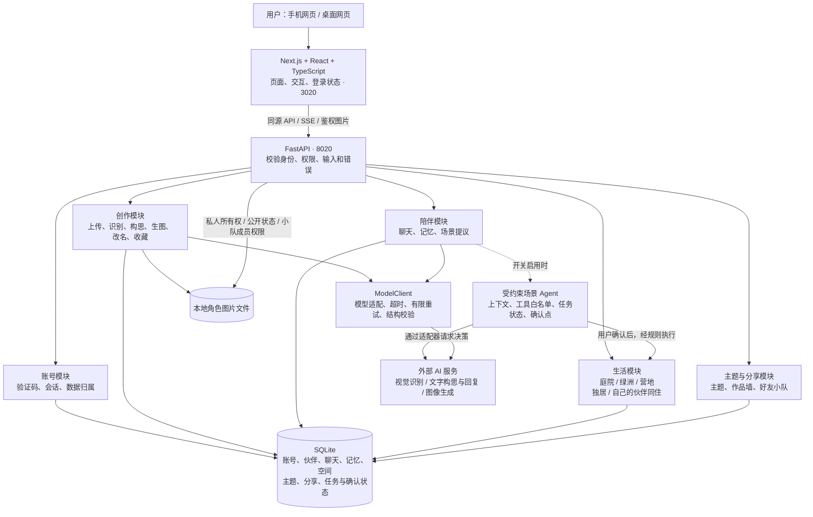
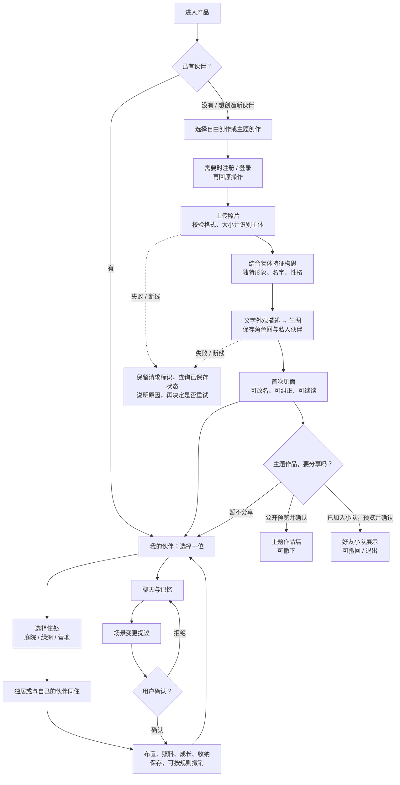
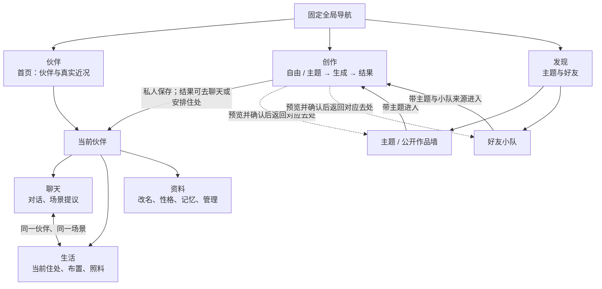
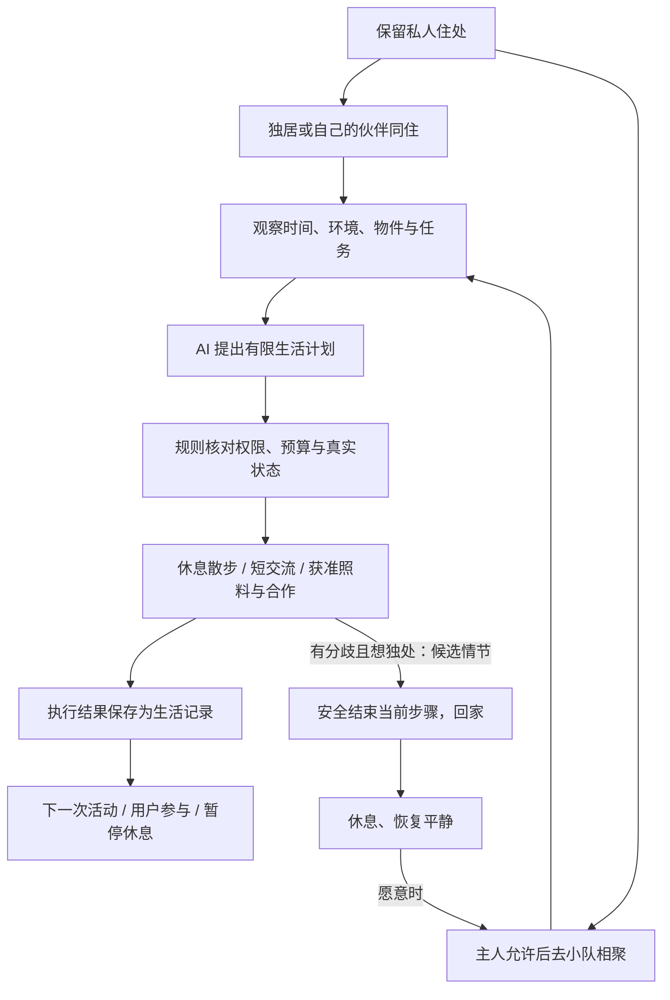
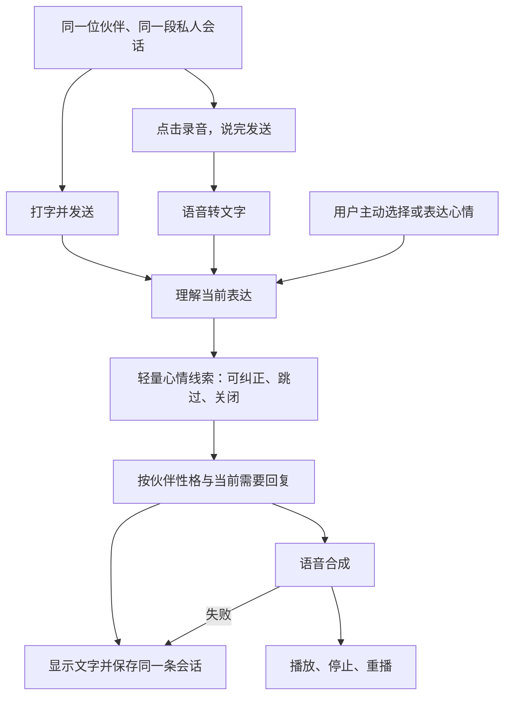

# 项目架构与完整流程

更新：2026-09-22。实现基线：V1.1 `0f13a8b`。前两图描述已有代码职责与业务链路，不表示已正式上线或所有真实模型能力已验收。第三至第五图为 V1.2 交互、自主生活与语音规划，尚未开发。

可视化阅读版：[打开架构与流程图](项目架构与流程图.html)。本文件为图的文字依据。

## 1. 技术架构：页面、业务、AI 与存储

这些是逻辑模块，不是多个微服务。当前是一套 Next.js 前端、一套 FastAPI 后端；生活内核、Agent 与普通业务共用项目内持久化存储。前端经同源代理访问后端，模型密钥留在服务端。

短信目前为开发模拟实现；正式短信未接通。场景 Agent 与生成额度已有代码和隔离验证，主环境此前保持关闭，不能把虚线能力说成正式启用。普通创作与聊天按现有配置工作，本轮不调用模型验证效果。

## 2. 业务完整流程：从照片到持续陪伴

生成形象由照片特征与完整角色构思驱动，不是只靠名字。改名只改名字；同一主题不要求相同照片或相同结果。生成后默认私人保存，公开墙与小队展示是两次不同范围的用户选择，不会自动互相同步。

图中“我的伙伴 → 生活 → 聊天”共享同一个伙伴与当前住处。生活同住是自己的多个伙伴；好友小队是不同用户的主题展示，不是多人共同编辑场景。

## 3. V1.2 推荐界面结构：让上述模块容易找到

首页以伙伴和近况为主已由用户确认。三项全局导航、伙伴内三项局部导航及返回联动为推荐方案，待整体审阅后编写技术手册与实现。现状仍使用原有导航，不把本图当作已交付页面。

## 4. 实现依据与未完成项

| 职责 | 代码依据 |
| --- | --- |
| 页面与代理 | `frontend/app/`、`frontend/components/`、`frontend/next.config.ts` |
| 账号与图片边界 | `backend/app/api/auth.py`、`private_images.py`、`wall.py`、`teams.py` |
| 上传与创造 | `backend/app/api/photos.py`、`characters.py`；`services/model_client.py`、`character_concept.py`、`character_generation.py` |
| 对话与记忆 | `backend/app/api/chat.py`、`services/chat.py` |
| 生活与 Agent | `backend/app/living/`、`backend/app/scene_agent/`、`api/living.py` |
| 持久化 | `backend/app/core/database.py`、`models/models.py`、`living/store.py` |

V1.1 的数据库与图片联合恢复、真实模型质量、正式短信、生产部署和整体验收仍待完成。V1.2 的模型替换与全程 5 秒属于另一批待评测目标，不是当前架构图中的既成性能。

## 5. 新增图：伙伴怎样生活（C 批规划）

用户已确认保留私人住处、去小队相聚，以及自主规划／聊天／完成任务；先完整规划与模拟验证，再核定真实试跑预算。具体作息、权限、调用上限与情绪情节为推荐规则，见 [PRD 第10节](../../PRD.md)。原场景数据保留，共同生活不自动迁移旧主题小队。

## 6. 新增图：心情适配与语音会话（D 批规划）

语音首版交互和心情来源已由用户确认。绘画源于此前理解错误，已作废。转写、文本回复和语音合成分别验证与计费，当前未接入或调用；重试播放不重新发起聊天或重复场景动作。详见 [PRD 第11节](../../PRD.md)。
