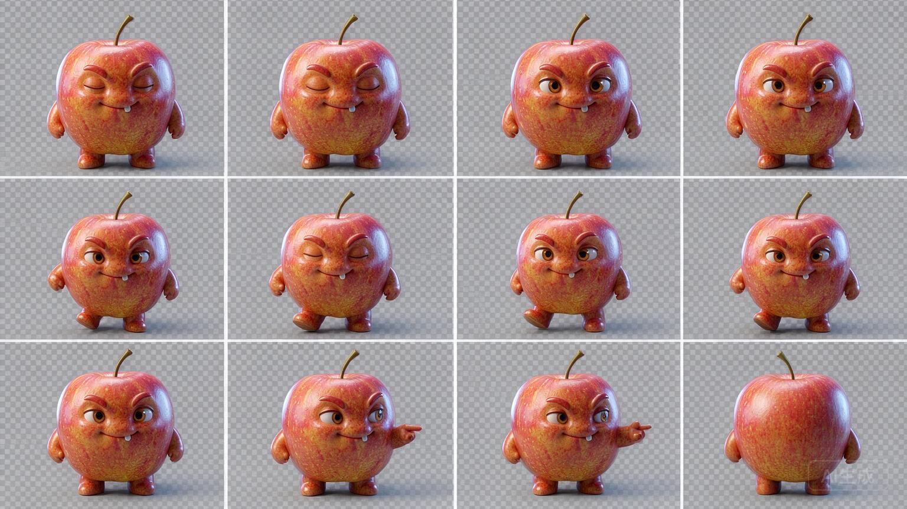

# C1.49 候选总图离线质量检查

日期：2026-09-28。对应 PRD 10.13；本轮无新模型调用、无新增模型费用。

已补上候选背景和明显静止帧的检查，C1.48 真实失败图的 12 格均因背景不均匀被拒绝，无法制成新的动作包。C1.45 已审苹果修正版仍能通过机器检查、进入人工审图。本批工程修复已验证；阶段 3 总闸门未关闭。

## 改动与证据

生成提示明确使用统一 #808080 灰底，禁止棋盘格、可见网格、地面阴影与背面姿态；行走要求左右脚交替，观察末帧回到正面。完整提示保存在 [prompt-v2.txt](prompt-v2.txt)，实际提示字符串 SHA-256 为 `8adfb9a6fc3994c6eabd48dff1ef7d2003b46eab49301b8ffe2951e951675ee1`（文件末尾额外含换行）。

根据[火山官方 API 说明](https://docs.volcengine.com/docs/ark/image-generation-api?lang=zh)，水印开关默认开启。适配器现显式传 `watermark=false`，并通过请求契约测试。是否仍出现模型自行绘制的文字，需要真实生成后人工检查；不改写上次原图。

逐格检查覆盖真实 alpha 边缘与面积、灰底边缘均匀度、前景有效性；整行四帧完全相同会被拒绝。灰底检测采样每格外围约 4% 区域，颜色中位数须在 #808080 每通道 ±16 内，99 分位偏差须 ≤12。它是保守的制作输入检查，不能证明角色一致性、无水印、步态正确或动作自然；局部内部瑕疵、近似重复帧及语义错误仍需人工审查。

供应商候选先保留原始图片，然后在回执保存 `rejected` 或 `needs_review`、图片哈希和逐格原因。通过也不会自动绑定。拒绝后的同一授权仍不可重复使用；历史回执与已绑定动作包保持原样，新制包必须通过检查。

### 原始失败样例



[离线检查结果](offline-quality.json)：`rejected`，12 格均命中 `background_not_uniform_gray`，图片 SHA-256 仍为 `d39a6af8f3545a74aff833d434b9be54703a8615a50d807951ee115640679f68`。没有修改原图像素，也没有把这张图绑定给正式伙伴。

## 验证

相关测试 49/49 通过；最终后端全量 **1464/1464** 通过，耗时 112.43 秒，2 条既有依赖弃用提示。首次全量执行达到命令时限后终止，未作为通过证据；延长时限后的完整结果才计入此处。

覆盖透明及灰底正例、棋盘格、分隔线、贴边、四帧静止、空格、伪 alpha、坏文件、拒绝时无部分制包、成功／拒绝回执落盘、独立进程重检一致、重复授权零追加调用。真实 C1.48 原始图作为离线回归；C1.45 修正版兼容性单独复核。测试中的供应商替身不计作新提示的真实验证。

## 自行核对

打开上面的原始候选图片和离线检查结果即可核对。需要复现时，在本项目 `backend/` 运行：

```bash
.venv/bin/python -m scripts.inspect_motion_atlas --atlas "../docs/PRD/版本/V1.2/验收证据/阶段3/C1.48火山单张候选/seedream-atlas-unreviewed.png"
```

应返回 `state: rejected`，退出码 2；一般候选退出码 0 只表示 `needs_review`。此命令不联网、不读取 Key、不写业务库。

## 阶段闸门

| 检查项 | 结果 |
| --- | --- |
| 本批范围实现 | 是；候选提示、接口水印参数、离线检查与回执 |
| 自动化测试 | 是；49/49 专项、1464/1464 后端全量 |
| 真实模型冒烟 | 待验；仅复用旧真实图离线检查，新提示尚未付费试跑 |
| 前端类型／Lint／生产构建 | N/A；无前端改动 |
| 密钥排除 | 是；修改及新建文本文件未包含本项目 Key，密钥配置不入库 |
| 重启可恢复 | 是；候选和回执落盘，新进程重检与保存结果相同 |
| 桌面与移动端 | N/A；无界面改动，复用原图作为审图证据 |
| README | 是；增加离线命令及退出码说明 |
| 项目状态 | 是；记录本批结果与待验边界 |
| 证据包 | 是；原图引用、检查结果、提示词与本报告 |

## 后续边界

下一张真实候选仍使用同一归档苹果原图、同一火山模型和单张请求，先通过机器检查，再逐项人工审图。旧的单次 ¥0.12 授权已经消耗完毕；新增费用需要新的明确授权。正式动作质量、产品内自动来源、真实自动生活与 8 秒／10 秒继续待验。
