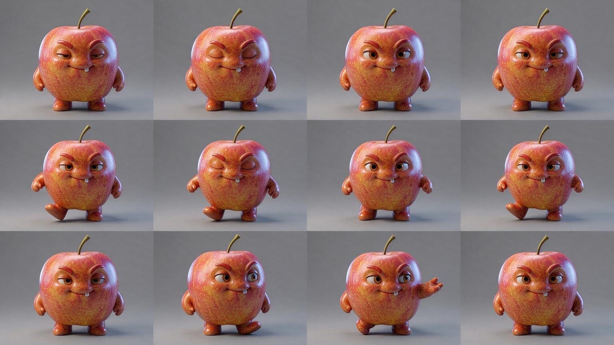

# C1.50 修正提示后的单张真实复验

日期：2026-09-28。对应 PRD 10.13。用户对“同一苹果原图、同一火山模型、新一张最多 ¥0.12”的确认回复“继续跑”。本批实际请求 **1 次**，没有自动重试或追加生成。

结论：请求成功，棋盘格与可见水印问题改善，观察动作回到正面；背景渐变与投影、散步步态仍不符合要求，**正式审图不通过**。机器检查正确拒绝全部 12 格的非均匀背景。候选未制包、未入队、未绑定；阶段 3 未通过。

## 原始候选与审图



| 检查项 | 本次观察 | 判定 |
| --- | --- | --- |
| 输出结构 | 1536×864、4列3行，PNG | 符合候选几何规格 |
| 背景 | 无棋盘格，但灰底存在渐变、地面与投影；alpha 全为255 | 不通过；不是真透明或统一灰底 |
| 水印 | 本次实看未见右下角叠加水印 | 本项改善，不代表自动水印检测已实现 |
| 角色外观 | 总图内苹果面孔、颜色、材质大体一致 | 仅本样本观察，不外推稳定性 |
| 休息 | 半闭眼、闭眼、睁眼可辨 | 具有姿态变化，未制作循环验收 |
| 散步 | 第1、2、4格抬起相同一侧的脚，第3格近似站立，左右脚交替不清楚 | 不通过 |
| 观察 | 侧看、伸手、回到正面可辨，未再出现背面结尾 | 本项改善，整体仍未通过 |
| 时限 | 命令启动至候选保存及机器检查共10.709秒 | 已超过10秒，且尚未含制包、绑定、前端展示；不能判全链路通过 |

原伙伴生成的8秒门槛本轮未重新测试。此轮失败不通过放宽检查、去掉报错或将机器送审状态当成人工通过来消除。

## 调用与费用

使用本项目现有 `ARK_API_KEY`，模型 `doubao-seedream-5-0-flash-260915`，同一归档苹果原图，1536×864，`watermark=false`。提示正文见 [C1.49冻结提示](../C1.49候选离线质量检查/prompt-v2.txt)。没有读取其他项目凭证，也没有把 Key 写入证据。

按当日核对的[官方价格](https://docs.volcengine.com/docs/ark/model-pricing?lang=zh)，本次预计 ¥0.12；与 C1.48 的一次请求合计预计 ¥0.24。未核对实际账单，不视为扣费证明。此轮授权已使用完毕。

来源 SHA-256：`7195f21cd80cefe8385308005f54acdabef54e12ac5e0c0254d2a7651445063c`。

提示 SHA-256：`8adfb9a6fc3994c6eabd48dff1ef7d2003b46eab49301b8ffe2951e951675ee1`。

候选 SHA-256：`ef9b4911e43408e2426dc5ae78f57a80b67c6ed970db255bacc2b744fa132d77`。

## 验证与自行核对

[脱敏回执与逐格结果](attempt-receipt.json)记录状态 `rejected`，12格均为 `background_not_uniform_gray`。图片按原始字节归档并核对哈希。新进程可读取候选、回执与隔离数据库；隔离样例库含1个合成伙伴、0条分类动作资产、0条准备任务，产品业务库未参与本次运行。

打开上方原始候选即可核对视觉结论；在本项目 `backend/` 可离线复核：

```bash
.venv/bin/python -m scripts.inspect_motion_atlas --atlas "../docs/PRD/版本/V1.2/验收证据/阶段3/C1.50修正提示真实复验/seedream-atlas-v2-rejected.png"
```

应输出 `rejected` 并以退出码2结束。该命令无新模型费用。

本轮仅按已验证实现执行真实试跑和归档，无应用代码修改；沿用 C1.49 最终后端1464/1464与专项49/49的通过记录，未重复运行无关测试。

## 阶段闸门

| 检查项 | 结果 |
| --- | --- |
| 本阶段功能与质量目标 | 否；单次复验完成，但正式动作质量未通过 |
| 自动化测试 | N/A本轮无代码改动；沿用C1.49后端1464/1464 |
| 真实模型冒烟 | 已运行1次；请求成功，质量不通过 |
| 前端类型／Lint／生产构建 | N/A；无前端改动 |
| 密钥排除 | 是；仅本项目现有Key，证据无Key |
| 重启可恢复 | 是；独立进程读取候选与回执一致，隔离库无新增动作／任务 |
| 桌面与移动端 | N/A；无产品界面改动，本次审原始候选 |
| README | 是；新增本轮结果与证据链接 |
| 项目状态 | 是；记录真实失败与授权已使用 |
| 证据包 | 是；原始图、脱敏回执、审图报告与离线核对步骤 |

## 下一步判断

两轮结果表明，同一张总图同时满足灰底与四帧左右脚交替尚不稳定。不继续用相同设置反复付费碰运气。先检查供应商可控背景能力及动作分步约束，再形成下一轮具体方案；新增付费试跑需新的预算授权。既有真实失败证据保持原样，正式自然度、产品自动来源、真实自动生活与8秒／10秒继续待验。
