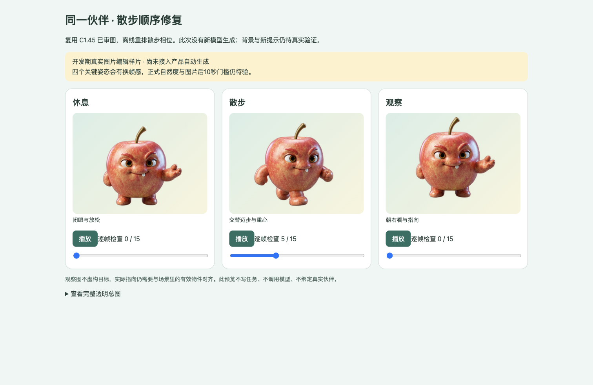

# C1.51 透明能力与步态编排

日期：2026-09-28。对应 PRD 10.13。本轮新增模型请求0次、费用0元。

已修正散步包的倒放与末尾停顿，并补齐供应商原生透明参数的选择、回执和拒绝检查。已审素材可以离线重建并播放。当前苹果 JPEG 仍不能直接使用这条透明输入路径，新提示和原生透明输出尚未做真实付费验证；阶段3不因此完成。

## 可以直接核对的结果

打开[离线动作预览](动作预览.html)，点击散步卡片的播放／暂停，或拖动逐帧控件。页面复用 C1.45 已审素材，只重新编排散步的四个姿态，不是新模型生成结果。



[390宽手机截图](mobile-review.png)已归档。三类资源正常加载，播放和暂停可用，桌面1512宽及手机390宽均无横向溢出。原始透明总图链接也已核对可加载。

## 改动及依据

[火山官方 API](https://docs.volcengine.com/docs/ark/image-generation-api?lang=en)支持 Flash 的 `background=transparent`，限制为单张带透明通道的图生图输入；透明模式需PNG输出，JPEG不支持。现有适配器按实际输入选择背景模式，显式请求 `output_format=png`，在预检与回执记录模式和提示哈希。

本地采用保守判断：PNG 中 alpha≤32 的像素至少1%，alpha>32的像素至少5%，才走原生透明模式；这是项目检查阈值，不是供应商规定的数值。全不透明PNG或仅清掉一个像素继续走opaque，近乎全透明无主体图片拒绝。不会为了传参而把JPEG套上RGBA容器并声称有透明角色。

请求透明模式后，返回图若有不透明格，会以 `native_transparency_missing` 拒绝，并保留候选与回执。不透明请求保持既有灰底检查，角色一致性、水印和动作自然度仍由人工判断。

步态提示用画面左右明确四相，要求第1与第3列分别伸出两侧不同的脚；取消让散步末帧重复首姿态的含糊要求。制包固定按四相正向循环，每相等长，16帧／8fps／首末一致均保留。新顺序（0起算）为：`0,1,1,2,2,3,3,0,0,1,1,2,2,3,3,0`。首末的相同帧合并成正常相位停留，不产生额外长暂停。

新[不透明提示](prompt-opaque.txt)与[透明提示](prompt-transparent.txt)均归档。已有绑定文件不重写；休息、观察新包与C1.45旧包逐字节相同，散步新包按新顺序重建。来源仍是同一归档苹果原图，详见[离线预检及字节比较](offline-checks.json)。

## 验证

最终后端全量 **1475/1475** 通过，耗时207.83秒，2条既有依赖弃用提示。包含本批新增11项测试、相关65项测试，以及原有来源绑定、私有交付、隔离队列重启和备份恢复回归。

新增测试覆盖JPEG、RGB PNG、全不透明RGBA、单透明像素、真实RGBA、调色板透明PNG的请求选择；空透明图拒绝；来源alpha变化在请求前拒绝；透明请求的透明／不透明返回与回执跨进程重检；逐帧像素对应四个姿态、正向无倒放、每相等长和首末一致。

首次相关测试63/65通过，两个旧断言分别要求散步相邻帧不重复及与旧倒放包逐字节相同。修正为新相位的差异检查和C1.51新散步归档字节对照，并保留休息／观察旧字节对照；新独立测试还逐像素验证四相只有正向转换，未降低动作顺序标准。

用现有C1.45已审总图离线制成三包，耗时669ms；这只是本地制包耗时，不包含模型或前端全链路，不用于关闭8秒／10秒门槛。C1.48／C1.50历史失败图不修改，已有背景拒绝规则保留。

## 离线复核

本项目 `backend/` 中：

```bash
.venv/bin/python -m scripts.inspect_motion_atlas --atlas "../docs/PRD/版本/V1.2/验收证据/阶段3/C1.45三活动姿态总图/apple-atlas-v2.png" --expected-background transparent
```

应返回 `needs_review`，只证明透明及输入结构检查通过。对于透明请求的回执，独立重检时需带上 `--expected-background transparent`；不带此参数为兼容的通用透明／灰底检查。

## 阶段闸门

| 检查项 | 结果 |
| --- | --- |
| 本批工程范围 | 是；背景参数、回执、拒绝检查、提示与正向相位 |
| 自动化测试 | 是；最终后端1475/1475，包含相关65项 |
| 新真实模型冒烟 | 待验；本轮没有模型请求 |
| 产品前端类型／Lint／构建 | N/A；无产品前端代码改动 |
| 密钥排除 | 是；36份修改／新建文本文件无本项目Key，差异格式及证据链接检查通过 |
| 重启可恢复 | 是；回执独立进程重检及隔离队列恢复测试通过 |
| 桌面／手机 | 是；离线预览1512／390宽、播放／暂停与资源加载 |
| README | 是；预览、报告及复核命令已链接 |
| 项目状态 | 是；已记录结果与待验边界 |
| 证据包 | 是；预览、截图、三包、提示、离线结果和本报告 |

## 下一步

已有透明C1.45总图仅用于能力预检与离线编排，未替换伙伴原图，未发送给供应商。推荐下一步建立“透明参考图—原伙伴原图”的来源校验和明确审图入口，保持伙伴原始身份；准备好可检查的透明参考后再安排新的单次真实验证。当前不再向JPEG原图重复发送相同灰底请求。
