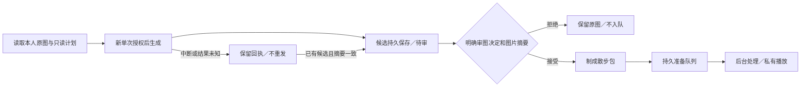

# C1.59 按伙伴生成候选与持久审图衔接

日期：2026-09-29。对应PRD10.13；遵照用户沿用当前Sunburst、性能优化后置的决定，先补前后端技术文档再开发。本轮为可信本地维护流程，不是产品用户自动付费开关。

## 完成的链路



新增 `app/services/character_walk_workflow.py` 与维护入口 `scripts/character_walk_workflow.py`。默认plan只读、不读Key、不创建任务；generate才读取本项目AIHubMix Key，要求当前原图摘要、当天核价、新单次授权与按量计费确认。授权记录沿用C1.55的同一文件命名空间，旧授权和并发重复执行不能再发一次请求。接口未提供单次费用硬封顶，入口也不虚构该能力；仍需项目专用Key额度及具体授权约束。

原图快照、候选摘要、供应商任务号、数值usage和审图记录持久保存；文件0600，目录私有，记录原子替换并fsync。中断保留attempted／unknown，不自动重新POST；recover只校验已经落盘的候选，不访问供应商。更新提示中的固定苹果称谓为参考角色，保留四相散步与真实透明约束；非苹果真实效果尚未验证。

review需要accept／reject、候选SHA-256和审图标识。未审图、摘要不符、原图或归属变化均不入队。通过后自动制包并调用既有准备队列，只有walk槽被提交；休息／观察继续等待各自素材。入队事务完成但回执写入中断后，可以继续原审图，队列和绑定保持幂等。不同决定不能覆盖原决定，首个审图标识保留。

## 已验证的证据

1. [默认只读入口](默认只读入口验证.json)：独立CLI进程返回dry-run、written=false、generation_requests=0。
2. [真实归档跨进程回放](真实归档跨进程回放.json)：五个独立进程执行导入、审图流程演练、消费、读取、重复审图；needs_review→queued→ready，消费次数仍1。
3. [真实素材逐字节复核](真实素材逐字节复核.json)：最终sprite与C1.56归档完全一致，16帧／8fps，仅一个分类资产。
4. [专项复验](专项复验.json)：92项通过；覆盖单次调用、旧授权拒绝、进程中断、已落盘候选恢复、身份／图片篡改、明确拒绝、入队后回执失败、并发和私有文件。首轮1项失败来自测试中未建立外键目标用户，补齐测试数据后通过，没有放宽业务校验。另补原图在生成中变化、机器拒绝不透明图、下载错误前任务号落盘三项，纳入最终全量回归。
5. [后端全量结果](后端全量验证.json)：1548/1548通过，212.24秒，2条warning。前端代码本轮未改，沿用C1.58的126项及类型／Lint／构建、桌面／390视口结果；[现有产品状态截图](../C1.58生成结果动作衔接/详情页准备状态.png)仅供对应界面参考。
6. [凭证排除检查](凭证排除检查.json)：32个变更文本文件扫描无命中，Git未跟踪.env、运行账本或数据库；git diff --check通过。

回放来自C1.55实际AIHubMix回执和原始候选，来源标记archived_receipt；本轮没有再次生成，也没有以替身证明新提示的真实质量。隔离回放的accept是重放C1.57已有预览的工程步骤，**不代表人类已经完成新的正式画质审图**。

## 如何复核

本项目 `backend/` 下运行以下零联网流程，每条都是独立进程：

```bash
.venv/bin/python -m scripts.check_archived_walk_workflow import
.venv/bin/python -m scripts.check_archived_walk_workflow review
.venv/bin/python -m scripts.check_archived_walk_workflow consume
.venv/bin/python -m scripts.check_archived_walk_workflow status
```

只写 `.runtime/c159-walk-workflow/check.db`、其上传目录和隔离账本，不动8020／8047库。已有回放再次运行时幂等返回当前状态，不会重新生成或覆盖原图。脚本主动拒绝读取Key和调用生成适配器；依赖本机C1.55历史回执。首次直接执行脚本因模块搜索路径失败，正确方式为以上 `python -m`，未因此产生模型请求。

实际维护入口在配置好目标数据库与UPLOAD_DIR后使用：

```bash
.venv/bin/python -m scripts.character_walk_workflow --character-id <伙伴ID> --owner-id <本人ID>
.venv/bin/python -m scripts.character_walk_workflow status --character-id <伙伴ID> --owner-id <本人ID> --job-id <任务摘要>
```

默认plan不会收费。未来真实generate需先给出具体图片、模型、次数和额度供用户确认，然后传原图摘要、新授权、当天核价和按量确认；旧单张试跑授权不能再次使用。审图使用 `review --decision accept|reject --candidate-sha256 ... --review-ref ...`，必须指向实际已检查的那张候选。未知生成结果先查看status；没有完整候选时不能recover，也不能复用原授权重发。

## 当前边界

已完成维护侧“按伙伴生成候选→保存待审→审图→自动制包入队”代码及恢复流程。没有新增HTTP收费接口、网页审图台或用户生成后自动触发的开关。生成网络分支本轮使用测试替身；本轮实际联网模型请求0、费用0。原图、候选与模型回执保留；新提示真实效果、非苹果动作、正式自然度和产品自动触发仍待后续验证，阶段3总体未完成。

## 本增量检查表

| 检查项 | 结论 |
| --- | --- |
| 当前维护流程范围实现 | 是，代码与命令已具备 |
| 相关自动化及后端回归 | 是，1548/1548通过 |
| 新模型请求真实冒烟 | 待验；本轮只回放已有真实素材 |
| 前端类型／Lint／构建 | N/A，本轮无前端变更，沿用C1.58 |
| 凭证与运行数据排除 | 是，变更文本扫描0命中，账本和数据库不入Git |
| 跨进程与幂等恢复 | 是，候选与队列回放已核对 |
| 桌面／手机界面 | N/A，无新增页面，沿用C1.58 |
| README、项目状态及证据 | 是，已同步当前停点、命令与下一步 |

本轮不因维护流程可用而宣布真实生成或第3阶段验收完成。
