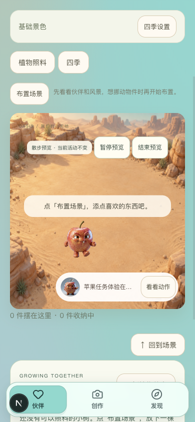

# C1.64 私人场景散步预览

日期：2026-09-29。对应 PRD 10.4、10.13。本批完成私人场景里的主动散步预览，复用 C1.62 已绑定真实素材；新增模型调用 0、费用 0。用户对当前真实散步评价“能用”，作为继续开发的可用基线，未补填自然度分数。

## 自己查看

打开[本人苹果的沙漠场景](http://127.0.0.1:3050/companions/4/scenes/desert/5cdc8bd2-c97d-4e54-befd-34cc6f584ceb)，点沙地右上角“场景散步预览”。苹果开始散步后，可以暂停、继续或结束；点“布置场景”也会退出预览。预览不写入自主活动或生活记录。若需要登录，使用原来的体验账号；2号苹果属于测试账号，不能用其链接代替本人入口。

当前使用隔离 3050／8048 服务；启动方式沿用 [C1.61 报告](../C1.61生成后持久任务/开发与验证报告.md)，后端入口 `backend/.venv/bin/python -m scripts.check_candidate_review serve`。主 3020／8020 服务未改。

## 实页验证

已获用户授权，使用 ego-browser 窗口「AI万物伙伴 Klein 账号与试跑准备」及既有 QA 账号2号，实际读取相同的 C1.62 真实动作。通过页面“搬进来”建立测试账号自己的私人沙漠，未改用户4号场景。未替换资源请求或使用模型 Mock。

- 桌面 1500×760：真实 canvas 绘制后开始移动；原生鼠标开始、暂停、继续、结束通过。暂停为已绘制静帧；继续重新读取动作；进入布置后预览卸载。
- 手机模拟视口 390×844：真实播放通过，文档宽度 390、无横向溢出；按钮与苹果可见。本轮不声称真机验收。
- 用户本人4号场景及 walk 查询 HTTP200、walk ready。页面截图来自 QA 2号；同一真实素材的用户4号资源读取核对成功。
- 控制工具的普通 click 会切换页面可见性，触发预览卸载并造成元素失效；改用同一页面的原生 CDP 鼠标输入验证成功。保留隐藏页面停止播放的产品行为。
- 检查后已结束播放、恢复桌面视口并交还窗口，保留验收页，未操作其他网站。




## 自动化与边界

前端相关 51/51：预览三场景、真实帧回调前不移动、暂停／恢复、退出、布置／隐藏／换号／切场景／活动失效、共同空间不显示入口及既有私有播放器。场景回归 42/42：场景流程、动作与当前活动。类型、Lint、隔离生产构建全部通过。组件替身用于交互回归，真实素材页面结果独立记录。

复现命令在 `frontend/` 执行：

```bash
npm test -- --run tests/scene-walk-preview.test.tsx tests/current-activity-motion.test.tsx tests/scene-browse-mode.test.tsx tests/private-motion-player.test.tsx tests/companion-motion-preview.test.tsx tests/scene-flow.test.tsx tests/living-motion.test.tsx tests/scene-life-now.test.tsx
npm run typecheck
npm run lint
NEXT_DIST_DIR=.next-c164-build BACKEND_URL=http://127.0.0.1:8048 NEXT_PUBLIC_DEV_SMS_CODE='' NEXT_PUBLIC_OFFLINE_PREVIEW=false NEXT_PUBLIC_LIFE_RUNTIME_PREVIEW=false npm run build
```

本批无后端接口或持久状态变更。素材持久性沿用 C1.62 实际重启验证，预览开关是页面临时状态，刷新后关闭。家庭／森林通过组件回归，本轮真实浏览器实看限定沙漠。完整 AI 自主生活、其余正式动作和后置的性能目标继续待验，第3阶段整体未宣布完成。

## 本批闸门

| 检查项 | 结果 |
| --- | --- |
| 本批范围实现 | 是，私人场景主动预览 |
| 自动化测试 | 是，93/93 |
| 真实模型冒烟 | N/A，本批不调用模型；C1.62真实产物已在页面实播 |
| 类型／Lint／生产构建 | 是 |
| 密钥排除 | 是，变更和客户端产物扫描通过 |
| 重启恢复 | N/A，无新增持久数据；既有资源重启证据沿用C1.62 |
| 桌面与移动宽度 | 是，1500×760／390×844模拟视口 |
| README | 是 |
| 项目状态 | 是，含用户“能用”评价 |
| 证据包 | 是，本文、截图与验证摘要 |
