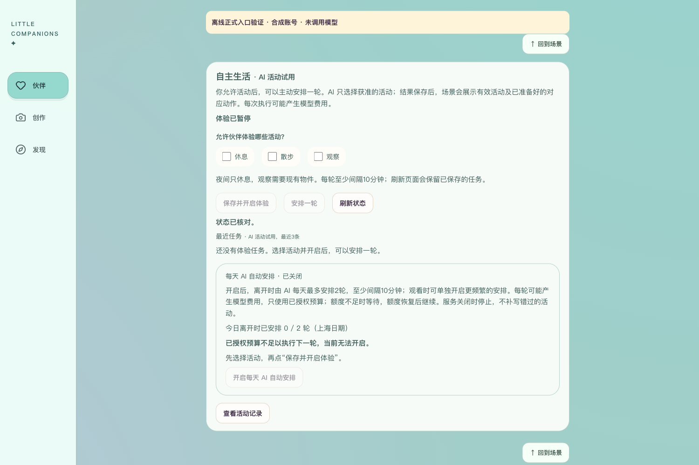
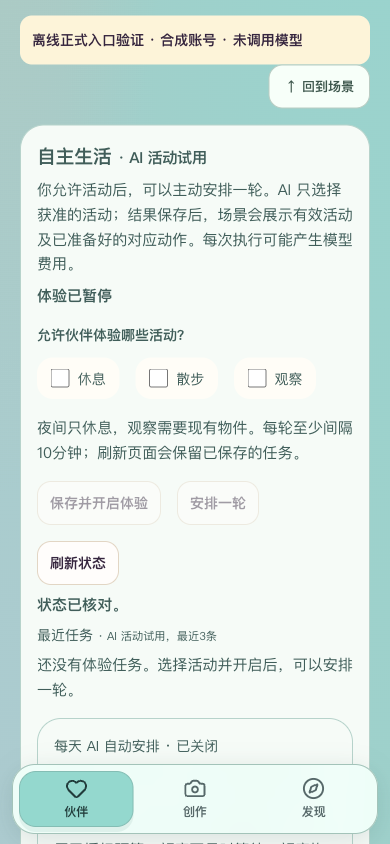

# C1.71 自主生活正式运行入口

2026-10-01。本轮补齐正式运行入口的工程缺口，离线验证通过；尚未开启真实持续调用，也不表示正式上线。用户继续开发，发布仍暂停。

## 问题与实现

对应PRD10.4、10.5、10.9、10.10。此前后端路由及worker要求`APP_ENV=test`和生活预览开关；前端同样只检查预览标志，生产环境关闭预览时，自主生活也不可用。

新增`LIFE_RUNTIME_ENABLED`与`NEXT_PUBLIC_LIFE_RUNTIME_ENABLED`，均默认false。正式模式始终使用`real_provider`运行器；与三个生活模拟／预览开关冲突时拒绝启动，要求已有固定规划服务／模型、非空凭证和持久SQLite。来源标记及拒绝混入旧离线记录的规则沿用原实现，不能把旧模拟活动改名为真实。

前后端开关只决定服务及界面是否开放，不授予活动许可、不开启每日安排、不创建额度、不发起请求。个人许可、白名单活动、每日2轮／观看每10分钟上限、共享间隔、未知费用保留和暂停机制保持。生产配置继续要求正式短信和其他既有条件；发布预检新增前后端开关一致性检查，配置一致也只列“持续真实运行待验”。

初始化选择对应运行库，生命周期启动既有串行worker，退出时取消并等待；默认关闭不启动生活worker。前端三场景复用现有面板，只在本人私人、可编辑且可见时启用。界面“AI活动试用”及离线来源判断沿用API返回值，不按开关伪造已发生的真实活动。

## 检查与证据

| 检查 | 结果与边界 |
| --- | --- |
| 后端第一批 | 89／89：新增正式配置与入口、旧预览API、真实运行协议、派发及发布预检 |
| 后端第二批 | 121／121：运行内核、真实／离线每日调度、观看频率、发布安全与短信配置回归 |
| 前端 | 52／52：三场景正式读取且不触发工作，隐藏／只读／共同空间限制及原私有图片／生产配置检查 |
| 静态／构建 | 类型检查、零警告Lint、独立生产构建通过；正式前端开关true、两预览开关false、固定验证码提示空 |
| 生命周期 | 非test模式选真实运行器；启动一次worker，关闭时实际取消；零预算派发未访问网络且不产生生活事件 |
| 持久启动 | 两个独立Python进程导入服务，临时持久库均为real_provider来源、任务0；没有自动新增任务 |
| 浏览器 | 生产构建3052＋隔离后端8052，1500×1000及390×844无横向溢出，两张截图已查看 |

本轮合计210项相关后端检查，保留两条既有依赖弃用警告；没有重跑或冒称本轮后端全量1761项。每日／观看恢复使用现有离线测试，持续真实模型效果仍待验。

收尾核对：18个新增／修改文件及1948个独立构建文件，6个本地凭证值命中0；修改文档相对链接全部存在，本项目diff格式检查通过。3052／8052临时监听已关闭，独立构建目录、合成库和临时服务器脚本已删除，Next自动改写的类型引用已还原。

浏览器采用合成伙伴、全新临时数据库和仅本机的身份替身，进程禁止外部网络。界面已标明“离线正式入口验证 · 合成账号 · 未调用模型”，用于验证生产构建下的入口和初始状态，不作为真实登录或模型效果证据。实际没有点击开启许可／每日安排／任务派发；默认暂停、今日0／2、预算不足无法开启已确认。身份隔离由后端真实鉴权测试验证。浏览器刷新后清除临时标注并关闭验证标签，临时服务与数据验证后删除。





## 复核与未来启用

在`backend/`运行：

```sh
.venv/bin/python -m pytest tests/test_life_formal_runtime.py tests/test_life_runtime_api.py tests/test_life_live_planner.py tests/test_life_dispatch.py tests/test_release_readiness.py -q
.venv/bin/python -m pytest tests/test_life_runtime.py tests/test_life_live_automatic.py tests/test_life_automatic.py tests/test_life_viewing.py tests/test_release_security.py tests/test_sms_provider.py -q
```

在`frontend/`运行：

```sh
npm test -- tests/scene-life-now.test.tsx tests/private-images.test.tsx
npm run typecheck
npm run lint
NEXT_DIST_DIR=.next-c171-check NEXT_PUBLIC_LIFE_RUNTIME_ENABLED=true NEXT_PUBLIC_LIFE_RUNTIME_PREVIEW=false NEXT_PUBLIC_OFFLINE_PREVIEW=false NEXT_PUBLIC_DEV_SMS_CODE='' npm run build
```

未来通过真实验收再配套启用两个正式开关。后端继续使用现有已验证规划模型，不新增供应商；正式运行器当前依赖SQLite，不宣称本批完成数据库迁移或多worker部署。已有离线运行记录的库会拒绝直接转为真实来源，需要另行审查数据接续方案；已有real_provider来源的持久库可沿用，先做备份恢复再启用。用户个人许可和模型调用预算仍独立，不能把开服务开关当成付费授权。

本轮未改实际.env、未重启3050／8048、未迁移本人运行库，未创建真实预算或调用真实模型／短信，也未推送GitHub或部署。原体验入口仍为[本地前端](http://127.0.0.1:3050/)。

## 本轮闸门

| # | 检查项 | 结论 |
| --- | --- | --- |
| 1 | 本轮范围实现 | 是，正式入口及生命周期；默认未开放 |
| 2 | mock自动化测试 | 是，后端210／210、前端52／52 |
| 3 | 真实模型冒烟 | 待验，本轮0次，不关闭持续真实运行验收 |
| 4 | 类型／Lint／构建 | 是 |
| 5 | 密钥排除 | 是，修改文件及独立产物检查，实际配置不入库 |
| 6 | 数据恢复 | 是，隔离持久库跨进程启动与现有恢复回归；本人运行库与云端恢复未在本轮重验 |
| 7 | 桌面／移动宽度 | 是，1500及390手机模拟；实体设备仍待验 |
| 8 | README | 是 |
| 9 | 项目状态 | 是 |
| 10 | 证据包 | 是，本报告和两张截图 |

本轮工程增量完成；持续真实调度、真实收信、实体语音与生产部署验收仍分别保留，不宣布第3阶段或项目整体完成。
