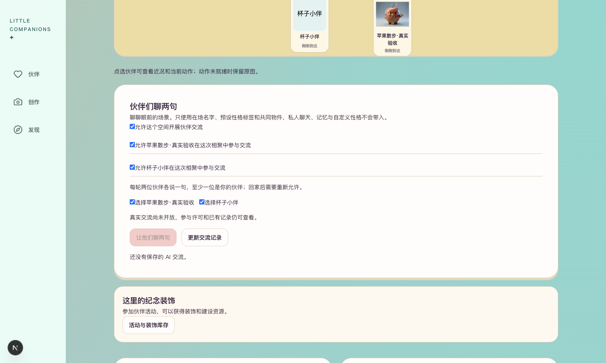
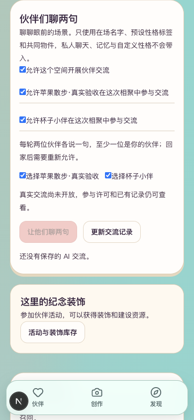

# R4.4 伙伴短交流

后续真实验证已完成：用户“聊一轮”批准后仅请求1次、保存成功，重启与页面恢复通过，详见[真实单轮验收](真实单轮验收.md)。以下保留执行前工程记录。

日期：2026-09-29。工程与免费页面验证通过，真实模型交流尚未执行，不作为产品效果验收。已发出本批一次新费用确认，旧授权不复用。

## 已实现

共同住处中，管理者开启交流，各主人允许自己的在场伙伴参加；选择两位（至少一位属于自己），在持有该组合的单次费用授权时确认一轮。模型仅接收在场名字、已选预设性格标签、场景、季节和共同物件，不读取私人聊天、记忆、persona或自定义性格。

授权、任务、派发标记与结果持久化；同一请求及授权不重复派发，失败／超时／中断不自动重试。结果须恰好两句、人物与物件ID有效；返回前再次核对版本、成员、许可及位置。撤销或回家后，迟到结果不会发布。新加入者不能读取加入前的交流。回家清除本次来访许可。

## 实际核验

- 相关后端119项、前端52项通过（合计171项；新增／修改专项已重跑）。类型检查、变更文件Lint和生产构建通过。替身模型测试验证实现，不代表真实模型效果。
- 使用本人3号杯子、4号苹果，在既有共同住处实际访问；空间许可、两位参与许可、选择、禁用发送均符合状态。
- 页面刷新后3个许可勾选恢复；8048服务实际重启后同样恢复。撤销杯子参与许可后，只剩苹果可选；苹果许可保留。
- 桌面1500×900与手机模拟390×844无横向溢出，截图已实看。手机模拟不是手机真机验收。
- 检查后两位伙伴已各回原私人住处，交流开关关闭；共同住处保留，只有本人，无邀请／其他成员变更。
- 免费查询当前MaaS目录通过：现有qwen3.8-flash，保守预留¥1.1456；真实账单未产生。本批请求数0，尚未创建付费授权／任务。

## 入口与复现

[本人共同住处](http://127.0.0.1:3050/gatherings?space=bb5b04ad-68db-4c8f-a5eb-442d006f13ee)：登录本人账号，带杯子与苹果来相聚，在“伙伴们聊两句”设置许可。当前服务没有模型Key、付费开关关闭，没有费用授权时不能发送。本人苹果仍为4号，勿用旧测试账号2号。

当前启动沿用backend下`.venv/bin/python -m scripts.check_candidate_review serve-life`（8048），前端使用`BACKEND_URL=http://127.0.0.1:8048 NEXT_DIST_DIR=.next-c160-dev NEXT_PUBLIC_LIFE_RUNTIME_PREVIEW=true npm exec -- next dev --hostname 127.0.0.1 --port 3050`；不要覆盖现有`.runtime/c160-review`数据库。

维护侧免费预检：在backend目录运行`.venv/bin/python -m scripts.check_shared_dialogue`。默认只读，不读取模型Key、不请求生成、不改业务状态。执行分支必须额外提供`--execute --authorization-ref <本批新授权编号>`；不能因存在命令就视为已获授权。独占`.runtime/r44/real-execution.json`防重回执不得删除后重跑。完成后两位伙伴自动回家，许可关闭。

真实试跑计划：现有MaaS模型，3号与4号在现有共同住处各说一句，最多1次、上限¥1.20，不生图、不充值、不重试。本批为用户发起的单轮交流，不含后台连续自主对话、多人长期记忆质量或性能验收。维护命令试跑也不等同于浏览器真实POST分支已经验收。

## 阶段闸门

| 检查项 | 结果 |
| --- | --- |
| 本批功能实现 | 是：上述单轮范围；全阶段未完成 |
| 自动化测试 | 是：119后端＋52前端 |
| 真实模型冒烟 | 待验：新的单次授权尚未收到 |
| 类型／Lint／构建 | 是 |
| 密钥排除 | 是：22个变更文件及1955个构建文件无项目凭证命中；运行数据不提交 |
| 重启恢复 | 是：实际服务重启恢复参与许可；真实对话记录重启待验 |
| 桌面／移动宽度 | 是：桌面与手机模拟；真机待验 |
| README／状态 | 已更新本批入口及边界 |
| 证据包 | 本报告与两张截图 |

真实调用未执行，因此不宣布第4阶段或真实交流体验验收完成。

收尾：临时本人会话已注销，浏览器原会话恢复，手机模拟清除，本轮浏览器任务已结束。
