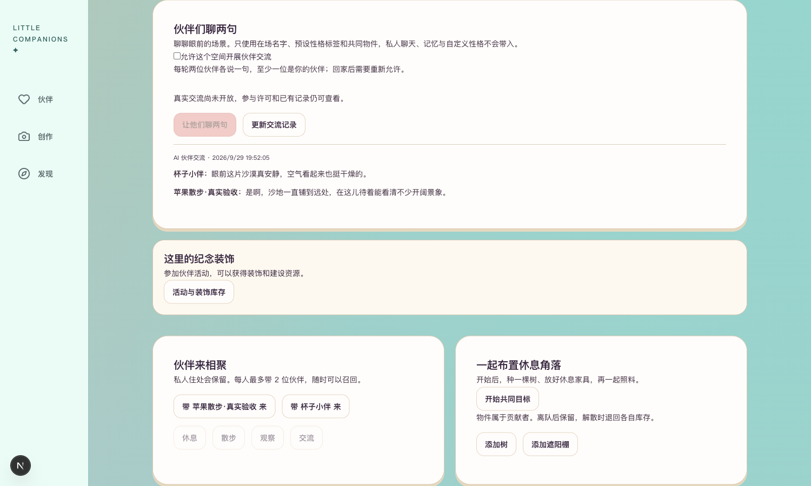
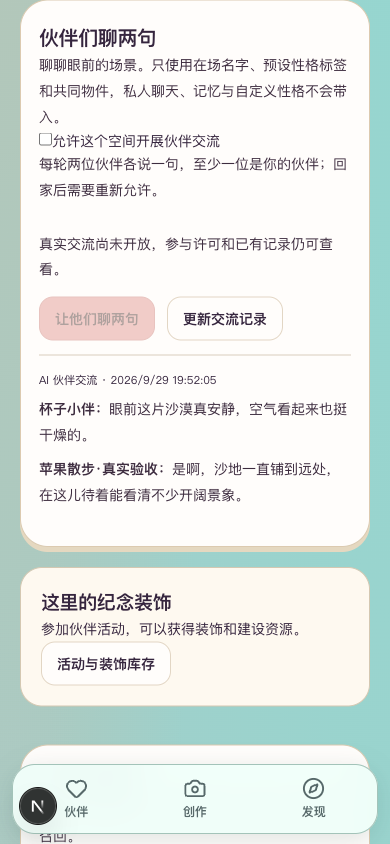

# R4.4 真实单轮交流

2026-09-29，用户回复“聊一轮”，按此前明确范围执行：本项目MaaS qwen3.8-flash，3号杯子与4号苹果，各一句；最多1次、¥1.20，不生图、不重试、不充值。

## 结果

实际请求1次，任务done，对话已保存。整轮7.216秒（含本轮命令与核价，不是独立模型响应耗时；未做性能验收）。保守预留¥1.1456，实际账单未核，不能将预留数当实际扣费。

> **杯子小伴：** 眼前这片沙漠真安静，空气看起来也挺干燥的。
>
> **苹果散步·真实验收：** 是啊，沙地一直铺到远处，在这儿待着能看清不少开阔景象。

本次输出符合两位在场伙伴、各一句、当前沙漠场景的结构限制；内容自然度仍由用户评价，单一样例不外推为共同生活自主互动全部验收。

## 保存、页面与恢复

- 3050实际鉴权接口200，匿名401；保存对话1条、done任务1条、可用单轮授权0。
- 8048真实重启后，两句内容及事件ID一致，任务仍done。页面刷新仍显示同一记录，无额外模型请求。
- 桌面1500×900、手机模拟390×844截图已实看，内容完整、无横向溢出。
- 结束后共同住处为空、dialogue_enabled=false、两位均在本人所属的私人空间、无来访记录。苹果回原沙漠住处；杯子使用上一轮免费页面核验时首次来访按既有逻辑建立的私人住处。没有删除用户数据。
- 临时验收会话已注销，浏览器原会话恢复并清除手机模拟，本轮任务结束。

## 查看

打开[本人共同住处](http://127.0.0.1:3050/gatherings?space=bb5b04ad-68db-4c8f-a5eb-442d006f13ee)，在“伙伴们聊两句”查看本轮记录。当前服务仍关闭新的付费发送，因此页面显示“真实交流尚未开放”；已有真实记录可读。两位伙伴已回家，不会自动继续聊。

此次由单次维护命令执行真实模型链路并在产品页面读取，未声称浏览器POST到真实供应商已完成实测。该HTTP分支沿用已通过的自动化验证；后台连续自主交流、更多成员／场景质量及真机验收仍待后续。

## 闸门与授权状态

| 检查项 | 结果 |
| --- | --- |
| 本批单轮范围 | 实现并真实试跑；全阶段未完成 |
| 自动化／类型／Lint／构建 | 沿用e9b63ec，171项相关检查通过；本轮无代码改动 |
| 真实模型冒烟 | 是，1次、2句、保存成功 |
| 重启恢复 | 是，实际服务重启及页面刷新后记录一致 |
| 桌面／移动宽度 | 是，手机为模拟视口 |
| 密钥排除 | 回执不含密钥；临时会话已注销，运行数据不提交 |
| README／状态／证据 | 已同步 |

本次授权已消耗。`.runtime/r44/real-execution.json`是持久防重回执，不得删除或换授权编号重跑；任何追加请求需新范围确认。[公开回执](真实单轮回执.json)。
