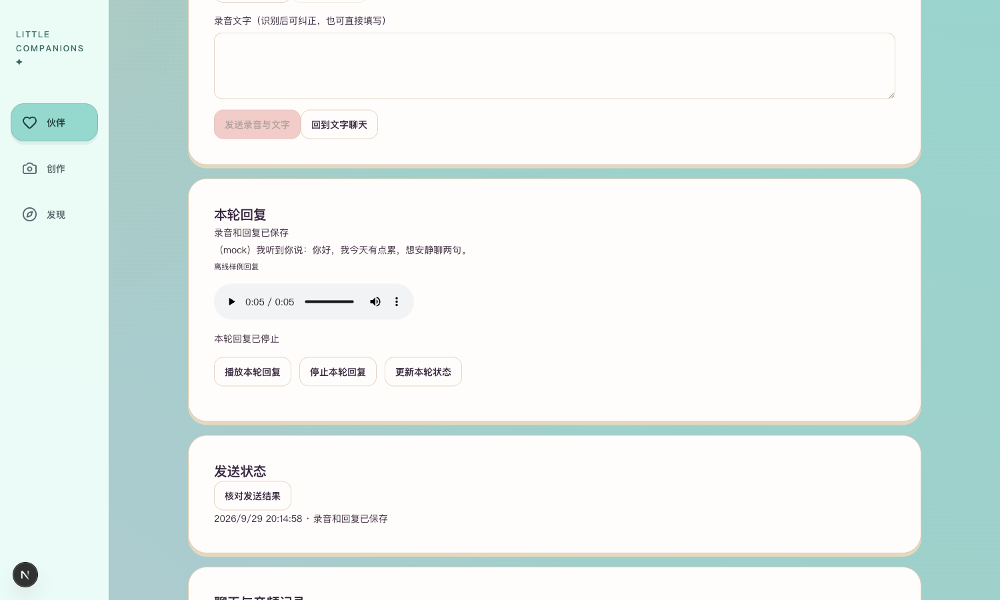
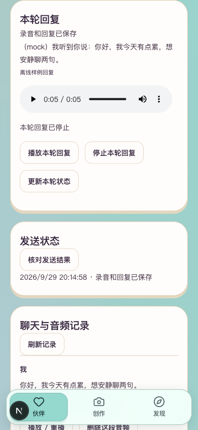

# R5.1 语音回复即时展示与播放

后续：用户明确授权后真实试跑1次完成，已保存并实际播放；见[真实单轮验收](真实单轮验收.md)。以下保留授权前工程记录。

2026-09-29：工程检查及免费页面验证通过。真实文字模型→本机合成的本批试跑尚未执行，已发出单独费用确认；不作为语音质量验收。

## 本批变化

发送后就近展示本轮进度，文字保存后立即显示；音频准备好后，仅对本页主动发送的该轮回复尝试自动播放一次。浏览器阻止播放时保留文字和主动播放入口；可停止。刷新或重开不自动播放历史，切后台／离开／换号取消读取与播放；新录音、试听或历史播放停止本轮音频，避免声音重叠。

服务端回执增加可空reply_message_id，用来准确关联本轮助手文字和音频。前端每秒只读核对当前请求，最长90秒；失败或网络未知不重发POST。终态同步历史并释放已发送草稿；识别仍必须先核对文字再主动发送。现有持久化、过期清理及权限规则不变，无数据库迁移。

固定3050／8048启动器此前未设置本地ASR目录，已补为复用本项目已安装模型，不自动下载。真实付费回复开关仍关闭。

## 实际验证

- 后端语音相关53项、单轮命令3项、前端32项，共88项通过；类型检查、变更文件Lint、生产构建通过。
- 本地Tingting合成固定句“你好，我今天有点累，想安静聊两句。”约1.966秒；faster-whisper实际识别5.481秒，将“安静”误为“乾淨”，保留原始失败，不宣称识别准确率通过。
- 浏览器使用同一句合成音轨走实际录制→识别接口，此次识别为“你好,我今天有點累,想安靜聊兩句。”；识别后消息数0，核对填写简体文字后才发送。
- 仅在原有QA伙伴2发送1轮明确offline_fixture文字回复，本机合成真实音频。本人伙伴3／4未添加离线对话。
- 浏览器观测：约1.086秒时文字出现，约3.199秒时开始播放；音频播放进度达到5.767秒。该数值来自离线文字回复的工程流程，不能作为真实模型语音速度。
- 桌面1500×900与手机模拟390×844截图实看，无横向溢出；停止有效。刷新后2条消息恢复，没有播放中的音频，没有再次发送。真人麦克风／真机／真实回复自然度仍待验。
- 临时QA会话已注销，浏览器原会话恢复，手机模拟清除。测试记录留在原QA账号；未删除用户历史。

## 入口、启动与真实试跑准备

本人入口：[4号苹果语音页](http://127.0.0.1:3050/companions/4/voice)。本机识别已配置，当前文字回复仍明确标为离线样例。不能把本页样例回复当作真实模型体验交付。

继续使用8048的`.venv/bin/python -m scripts.check_candidate_review serve-life`，3050前端及数据库不变。不要seed覆盖现有记录；常规3020／8020不改。

维护预检：在backend目录运行`.venv/bin/python -m scripts.check_voice_round`，默认只读、无模型请求。需用户新确认后才可带`--execute --authorization-ref <本批授权编号>`。固定4号、现有MaaS模型、既有v4语音风格、单次请求、零重试、¥1.20上限，执行前重新核价；原音本地转写、按固定原句核对文字后发送，回复和音频进入同一聊天。会使用该伙伴私人上下文，已在确认卡说明。

`.runtime/r51/real-execution.json`独占创建，禁止删除后重跑；响应未知也占用一次请求。开关只在该维护进程内配置，常驻服务不获得Key或无上限调用权限。该维护试跑不等同于真人麦克风或浏览器真实POST端到端验收。当前尚未执行，本轮付费模型请求0。

## 闸门

| 检查项 | 结果 |
| --- | --- |
| 本批实现 | 是：即时展示、单次播放及恢复；全阶段未完成 |
| 相关自动化 | 是：88项 |
| 真实模型冒烟 | 待验：本批新授权尚未回复 |
| 类型／Lint／构建 | 是 |
| 密钥排除 | 18个变更文件及1947个构建文件扫描无本项目凭证命中；运行目录不提交 |
| 恢复 | 复用已有持久结构，无迁移；页面刷新读回两条QA消息且不播放 |
| 桌面／移动 | 是：手机模拟，不代替真机 |
| README／项目状态／证据 | 已同步 |

本地识别的误字、真实模型自然度与全链路速度保持待验；不宣布第5阶段完成。
