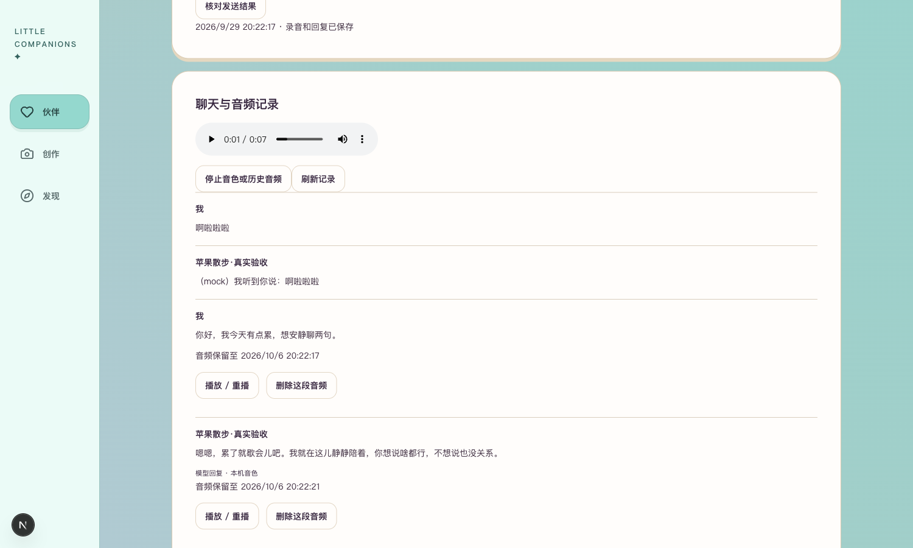
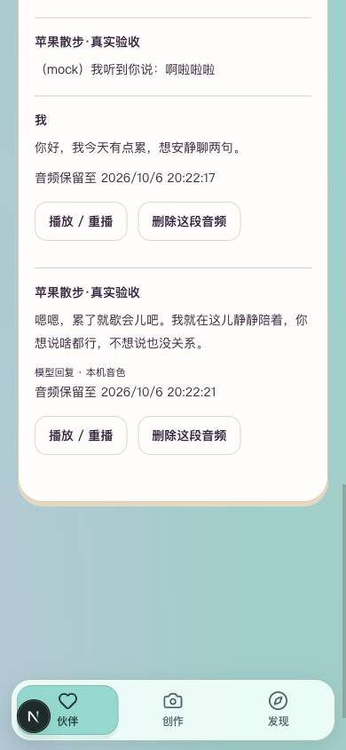

# R5.1 真实语音单轮

2026-09-29，用户回复“确认授权”后，执行此前确认的4号苹果固定测试句，最多1次模型请求、上限¥1.20，不重试、不追加。使用本机合成输入、本地识别、当前MaaS qwen3.8-flash语音v4文字回复及本机Meijia音色。

## 真实结果

输入：“你好，我今天有点累，想安静聊两句。”

本地识别原文：“你好,我今天有點累,想乾淨聊兩句。” 仍将“安静”误为“乾淨”；按已确认的原句纠正后发送，不把原识别标成正确。

用户实际收到的回复：

> 嗯嗯，累了就歇会儿吧。我就在这儿静静陪着，你想说啥都行，不想说也没关系。

回复经过现有v4语音开头规范，是保存并朗读的最终文字，不另称未经处理的模型原文。文字自然度及音色是否满意仍由用户评价。

| 项目 | 结果 |
| --- | --- |
| 真实模型请求 | 1次，completed，无错误、无追加 |
| 本地识别 | 4.391秒 |
| 文字模型响应 | 1.398秒 |
| 识别至保存语音的整轮 | 8.960秒，含数据库与合成处理，不含事先制作输入音频、浏览器加载及播放 |
| 回复音频 | ready，WAV，7.602秒，339334字节 |
| 费用 | ¥1.1456为保守预留；实际账单未核 |

## 保存与页面

执行进程退出后，常驻8048服务经3050读取同一completed回执、用户文字和助手回复，音频属于4号本人。鉴权播放资源200，匿名401。浏览器实际点击本轮助手音频后播放进度前进、paused=false、无媒体错误；停止有效。页面刷新后真实文字仍在，没有自动播放。

桌面1500×900及手机模拟390×844已实看，无横向溢出。历史旧mock文字保持原样，本次新回复明确标注“模型回复 · 本机音色”。页面顶部的离线提示表示常驻服务当前新发送模式，不能据此把本次维护命令生成的真实历史误标为mock；常驻服务本轮未得到供应商Key或无限发送权限。

[打开4号苹果语音页](http://127.0.0.1:3050/companions/4/voice)，在“聊天与音频记录”找到上述回复，点击其下方“播放 / 重播”。音频沿用7天保留期，文字继续保留。

临时本人会话已注销、浏览器原会话恢复、模拟视口清除，本轮浏览器任务已结束。没有清除既有聊天或音频。

## 范围与后续

本次真实跑通的是维护命令→本地识别→原句核对→真实文字模型→本机合成→持久化→产品内播放。输入是合成语音，不是真人麦克风样本；未新增浏览器真实发送授权，也不将旧离线页面自动播放验证冒充真实浏览器POST全链路验收。识别误字、真人输入、自然度及长时间稳定性继续待验，不宣布第5阶段完成。

沿用56a976d的88项相关检查、类型／Lint／构建；本轮无代码修改，不重复全套测试。公开回执及媒体检查见[真实单轮回执](真实单轮回执.json)，不含Key、原始私人提示或历史全文。

本次授权已消耗，`.runtime/r51/real-execution.json`是持久防重依据，不得删除重跑；后续调用需新范围确认。
