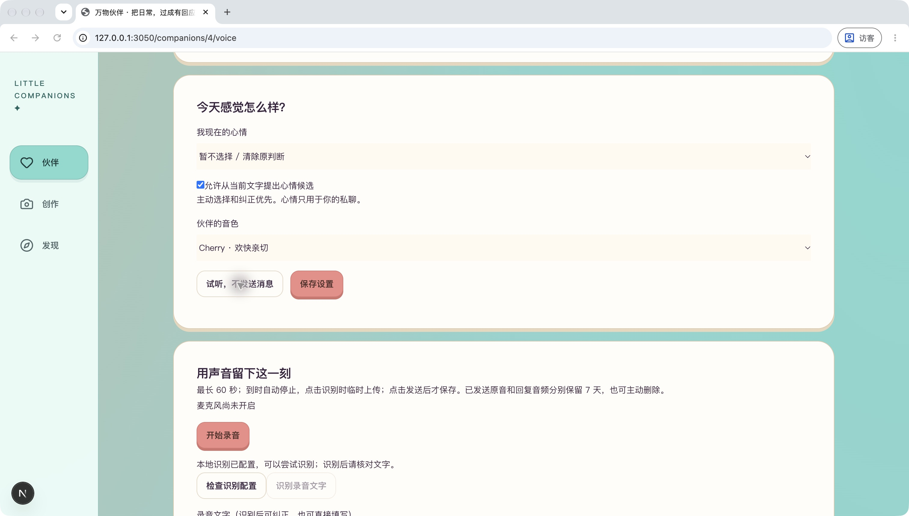
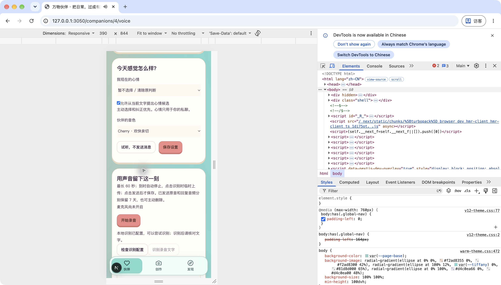

# R5.5 Cherry 聊天接入

后续进展：新授权的两轮真实聊天现已通过，见[真实两轮验收](真实两轮验收.md)。下文保留执行前工程验证及当时待验边界。

2026-09-30。对应 PRD 第11节，用户已选择「Cherry 欢乐」并要求继续开发。本批工程接入和免费试听验证通过；新生成聊天回复的真实效果待验，第5阶段尚未整体验收。

## 可以直接检查

打开[本人苹果语音页](http://127.0.0.1:3050/companions/4/voice)，在「伙伴的音色」看到「Cherry · 欢快亲切」，点击「试听，不发送消息」。本机 Chrome 已播放完整2.64秒。试听复用上一批真实音频，不生成新消息、不调用模型。





当前页面显示原会话已使用2／2轮，因此不能发送新回复；已有聊天与音频可继续查看和播放。真人麦克风及 Cherry 对新回复的自然度尚未验证。

## 本批实现与边界

- 自然音色接入既有语音回复流程，按本轮真实回复文本合成。本人4号伙伴已保存 Cherry；其他伙伴已保存的偏好保持不变。
- 试听使用项目内真实 WAV。正式合成必须绑定本人、伙伴和有效会话轮次，每轮至多一次合成请求，费用预留包含文字模型与语音，仍受每轮¥1.20上限约束。
- 合成响应先私有保存，再校验及下载；失败恢复仅下载已有结果，不重新合成。服务重启、撤销、过期、删除和清空均有相应处理，响应与音频最多保留7天。
- 本批新增模型请求0，新增收费0，正式合成记录0。候选音色已经真实调用通过，不代表本批新聊天端到端通过。

## 验证

后端相关86／86、前端38／38通过；类型检查、Lint、生产构建通过。覆盖轮次防重、额度不足拦截、超时／失败恢复、跨用户隔离、超长回复、重启和删除。

8048实际重启后，旧消息、音频、轮次、会话及偏好五张表保持恢复；随后按用户选择保存 Cherry，再次启动后网页仍显示 Cherry。当前保存消息12、音频10、轮次5、会话1、偏好2。匿名直连8048及3050代理均返回401。

桌面与390×844手机模拟视口已检查，Cherry选择、试听按钮、录音区域可见且可操作；两种视口均播放免费试听。非实体手机验收。开发服务曾出现 PostCSS 子进程超时，使用独立开发缓存重启后页面恢复；生产构建也通过。

项目专用密钥仍在被忽略的 `backend/.env`，私有数据库同样排除；构建产物及相关代码684个文件扫描未发现该密钥。未用模拟结果冒充真实聊天。

## 启动与复验

仓库默认开发端口仍为3020／8020；本次沿用已建立的隔离验收环境3050／8048及原数据库。

在本项目 `backend/` 执行：

```sh
.venv/bin/python -m scripts.check_candidate_review serve-voice
```

在本项目 `frontend/` 执行：

```sh
BACKEND_URL=http://127.0.0.1:8048 NEXT_DIST_DIR=.next-r55-dev NEXT_PUBLIC_OFFLINE_PREVIEW=false NEXT_PUBLIC_LIFE_RUNTIME_PREVIEW=true node node_modules/next/dist/bin/next dev --hostname 127.0.0.1 --port 3050
```

后端相关检查：

```sh
.venv/bin/python -m pytest -q tests/test_cloud_speech.py tests/test_voice.py tests/test_voice_sessions.py tests/test_qwen_tts_candidate.py tests/test_voice_reply.py
```

前端运行 `npm test -- tests/voice-transcription.test.tsx tests/voice-round-progress.test.tsx`、`npm run lint`、`npm run typecheck`。生产构建需将开发登录提示设为空、两个预览开关设为false，并使用独立 `NEXT_DIST_DIR`。

旧会话额度不能复用。新真实试聊须先确定新批次数量与费用，再用既有 `scripts.voice_live_session` 开通。Key不写进命令或报告。

## 阶段闸门

| # | 检查项 | 结果 |
| --- | --- | --- |
| 1 | 本批范围功能实现 | 是；Cherry聊天适配与免费试听 |
| 2 | 自动化测试 | 是；后端86／86、前端38／38 |
| 3 | 真实模型冒烟 | 待验；本批新聊天合成0次，候选真实音频复播通过 |
| 4 | 类型、Lint、生产构建 | 是 |
| 5 | 密钥排除 | 是 |
| 6 | 重启后恢复 | 是；旧数据和Cherry选择恢复；新云端记录仅隔离测试 |
| 7 | 桌面和移动宽度 | 是；Chrome桌面、390×844模拟视口 |
| 8 | README启动与验证方法 | 是 |
| 9 | 项目状态更新 | 是 |
| 10 | 证据交付 | 是；本报告、页面入口与两张截图 |

第3项仍待验，不宣布R5.5整体验收或第5阶段完成。
