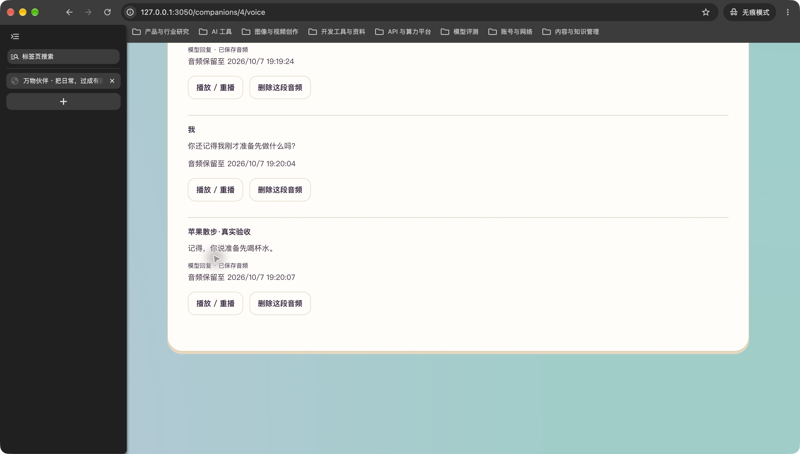

# R5.5 Cherry 真实两轮验收

用户后续确认（2026-09-30）：“试听没问题，Commit，可以继续开发。”本次Cherry音色与两段真实回复的主观试听已通过；下文保留执行时的事实和当时待验说明。真人录音识别及其他语境不由本次试听代验。

2026-09-30。用户明确批准新批次2轮、费用上限¥2.40、每轮一次文字回复和一次Cherry合成、失败停批。两轮均成功保存并在Chrome完整播放；真实聊天到Cherry音频的链路已跑通。真人录音识别和声音自然度仍需用户体验，第5阶段不据此宣布整体验收。

## 打开复看

打开[本人苹果语音页](http://127.0.0.1:3050/companions/4/voice)，滚动到聊天记录底部，找到19:19与19:20的新记录，点击两条伙伴回复下的「播放／重播」。这里只读取已保存音频，不追加模型调用。

## 真实结果

| 轮次 | 已核对输入 | 真实回复 | 发送至音频保存 | 音频时长 | 结果 |
| --- | --- | --- | --- | --- | --- |
| 1 | 刚才说累了，我准备先喝杯水。 | 嗯嗯，去喝吧。 | 3.171秒 | 1.52秒 | 文字与Cherry音频保存、完整播放 |
| 2 | 你还记得我刚才准备先做什么吗？ | 记得，你说准备先喝杯水。 | 3.047秒 | 2.64秒 | 文字与Cherry音频保存、完整播放 |

通过3050前端代理的真实发送接口，使用既有两段本机合成录音和已核对文字顺序提交。没有重新录制真人声音，也没有重新测识别时间；表中的时间包括文字模型、语音合成、下载与保存，不包含录音、转写或人工核对。没有将此速度套用到照片生图的8秒目标。

第二轮内容与本轮输入衔接，已有历史也包含同主题记录。本样例证明当前聊天能接续该话题，不单独证明长期记忆能力或所有语境下的回复质量。第一轮回复较短，声音自然度、语气与陪伴感由用户听取后评价。

实际新增2次文字模型请求和2次Cherry合成，无重试、无追加。两条语音回执状态均为ready，计费字符分别12和22。会话使用2／2轮并进入exhausted；包含语音的保守费用预留共¥2.40，这是授权上限，不是实际账单。实际扣费未核。

## 保存与恢复

8048服务已实际停止再启动，六张相关表的数量及内容摘要完全一致，包括两条新语音合成回执。当前消息16、音频14、轮次7、会话2、音色偏好2、云端语音回执2。两条回复音频重启后经3050读取均200，内容摘要一致；页面刷新后新消息和播放入口恢复，Cherry设置保留，额度保持耗尽。

临时接口登录会话已退出。私有请求响应和执行记录保留于项目被忽略的运行目录，未进入本证据包；私人聊天音频保持原有7天留存和本人访问限制。截图为测试账号下本次固定样例。

## 本批闸门

| # | 检查项 | 结果 |
| --- | --- | --- |
| 1 | 本批范围 | 是；仅运行已批准的两轮真实链路 |
| 2 | 自动化测试 | 是；沿用同一实现的后端86／86、前端38／38，无代码变更 |
| 3 | 真实模型冒烟 | 是；两轮文字与Cherry均成功，声音主观效果仍待用户评价 |
| 4 | 类型、Lint、生产构建 | 是；沿用本批工程验证，未修改代码 |
| 5 | 密钥排除 | 是；沿用工程扫描，新增交付仅报告和页面截图 |
| 6 | 重启恢复 | 是；六表摘要一致、音频200且内容相同、页面刷新恢复 |
| 7 | 桌面与移动宽度 | 是；本次桌面真实聊天播放；同一实现390×844布局及试听见开发报告 |
| 8 | README | 是 |
| 9 | 项目状态 | 是 |
| 10 | 证据包 | 是；本报告、页面入口与截图 |

本批真实链路通过。真人麦克风、真实环境识别、不同表达的声音效果和PRD第11.7整体验收继续保留。
