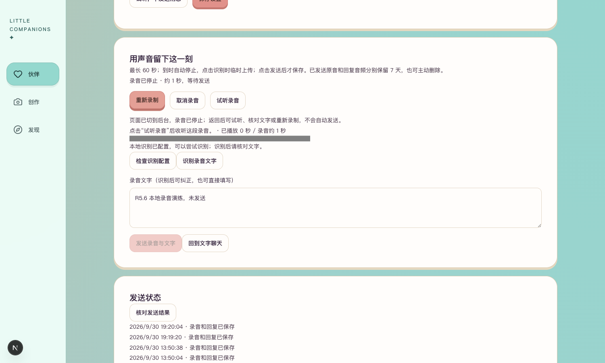
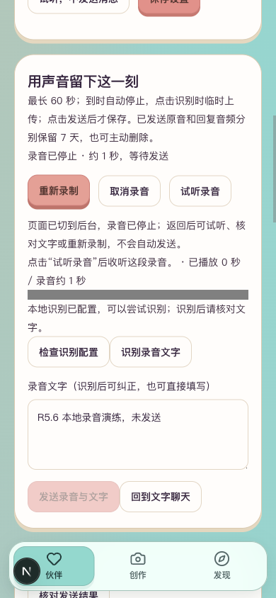

# R5.6 后台停止录音

2026-09-30。对应PRD11.5、11.7。用户已确认Cherry试听通过并要求继续开发。本批补齐页面隐藏、离开及迟到结果的媒体生命周期；不新增收费调用。

## 行为

录音过程中切到其他标签页或页面触发pagehide时，立即停止采集，按现有收尾流程保留未发送录音及文字。录音按钮旁显示停止原因，返回后可试听、核对文字或重新录制，不自动识别、发送或重新开启麦克风。

如果麦克风授权或PCM初始化在切走后才完成，释放迟到的音频流；即使已回到页面，也不能自行开始采集。已在读取的试听／历史音频若迟到，也不能在切走或返回时自行响起。当前播放会暂停。

## 可以检查

打开[本人语音页](http://127.0.0.1:3050/companions/4/voice)，点击「开始录音」，在允许麦克风后说一句话，再切到其他标签页并返回。应看到「录音已停止」和保留的试听、重录入口；点击「识别录音文字」才执行本地识别，发送仍受既有额度约束。当前真实聊天额度已用完。





## 验证与边界

相关45／45项通过，涵盖录音中隐藏、pagehide、权限迟到、PCM初始化迟到、迟到音频下载、返回后不自动恢复及原有发送、播放和恢复流程。Lint无警告、类型检查与生产构建通过。

浏览器采用明确标注的合成媒体流，经实际MediaRecorder采集；注入隐藏事件触发停止，再恢复可见状态。桌面1500×900和手机模拟390×844均确认音轨ended、录音停止、文字保留、无横向溢出，转写／发送／试听接口POST为0。完成后取消测试录音、清空测试文字、关闭合成音源并移除测试替换。截图中的测试文字没有写入聊天。

本批不是实际麦克风许可或实体手机系统切后台验收，也未新增真实识别样例。真人麦克风、环境噪声与PRD11.7其余整体验收继续保留；用户已通过的Cherry试听结论保持。

保存消息16、音频14、语音轮次7、会话2、云端合成回执2，均与本批之前一致。生产产物509个文件扫描未发现项目两类模型密钥；临时构建目录已删除，生成配置已恢复。

## 启动与检查

继续使用3050／8048隔离验收服务；启动命令见[R5.5开发报告](../R5.5Cherry聊天接入/开发与验证报告.md#启动与复验)。后端代码和数据契约未修改。

在项目 `frontend/` 运行：

```sh
npm test -- tests/voice-transcription.test.tsx tests/voice-round-progress.test.tsx tests/pcm-recorder.test.ts
npm run lint
npm run typecheck
NEXT_DIST_DIR=.next-r56 NEXT_PUBLIC_DEV_SMS_CODE='' NEXT_PUBLIC_OFFLINE_PREVIEW=false NEXT_PUBLIC_LIFE_RUNTIME_PREVIEW=false BACKEND_URL=http://127.0.0.1:8048 npm run build
```

## 本批闸门

| # | 检查项 | 结果 |
| --- | --- | --- |
| 1 | 本批范围功能实现 | 是；隐藏、离开、迟到结果停止处理 |
| 2 | 自动化测试 | 是；45／45 |
| 3 | 真实模型冒烟 | N/A；媒体生命周期改动，无模型变更；Cherry真实试听已获用户确认 |
| 4 | 类型、Lint、生产构建 | 是 |
| 5 | 密钥排除 | 是；生产产物扫描通过 |
| 6 | 重启恢复 | N/A；本批不改持久化，未发送录音按契约只在内存；已发送结果重启证据见R5.5 |
| 7 | 桌面与移动宽度 | 是；1500×900、390×844模拟视口 |
| 8 | README | 是 |
| 9 | 项目状态 | 是 |
| 10 | 证据包 | 是；本报告、截图和操作入口 |

本批工程与浏览器模拟验证通过，不代表第5阶段整体验收完成。
