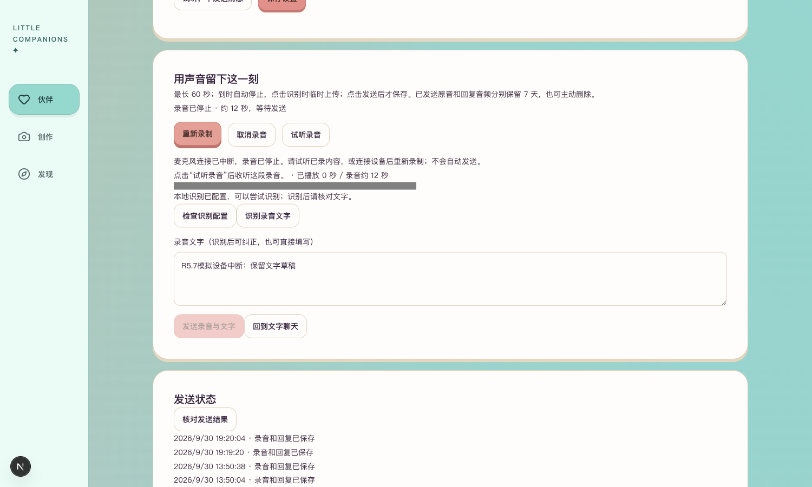
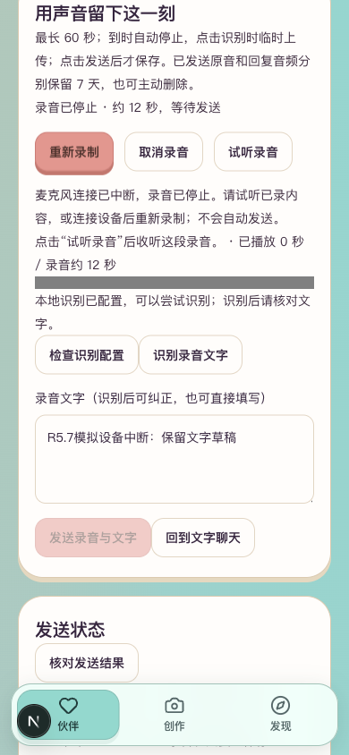

# R5.7 录音设备中断

2026-09-30。对应PRD11.7，前后端技术文档先更新后开发；本批为录音生命周期修复，新增模型调用0。

## 已实现

拒绝麦克风权限、没有设备、设备暂不可读时显示中文处理提示，并保留已有录音与文字。Native和PCM录音均监听设备结束；意外断开后停止采集与计时，已采内容整理为待发送草稿。PCM初始化中断开则取消初始化，保留旧草稿。正常停止、取消和卸载清理监听，旧设备事件不能中断下一次录音。满60秒自动停止并提示核对后发送。

## 可以检查

打开[本人语音页](http://127.0.0.1:3050/companions/4/voice)，点击「开始录音」。拒绝许可应看到允许麦克风的操作说明；允许后可录一句话，再断开外接麦克风，检查停止原因和「试听录音／重新录制」入口。录满60秒应停止待发送。当前真实聊天额度已用完，本批未追加授权。





## 验证

53／53相关自动化测试通过，含新增四类设备错误、Native／PCM音轨结束、旧设备迟到事件、初始化中断与60秒停止；既有取消、空音频、延迟收尾、后台停止、发送防重与恢复回归通过。类型检查、无警告Lint和生产构建通过。

浏览器注入明确标识的许可拒绝和220Hz合成音源，用真实MediaRecorder采集，停止音轨后注入ended事件。页面显示停止及中断说明、12秒草稿、保留文字；桌面1500×900和390×844无横向溢出，已查看截图。非GET请求计数0，未调用转写、发送或重新合成。最后通过「取消录音」清理测试音频与文字，关闭音源并还原测试替换。

这不是实体设备拔插、操作系统权限弹窗或真人麦克风识别质量验收；这些仍待实际体验。Cherry此前人工试听通过，第5阶段不据此宣布整体验收完成。

生产构建705个文件扫描未发现项目两类模型密钥；生成配置已恢复，临时构建目录已删除。后端及持久化契约无改动，已发送记录的重启验证沿用R5.5原始证据。

## 复验命令

在本项目`frontend/`运行：

```sh
npm test -- tests/voice-transcription.test.tsx tests/pcm-recorder.test.ts tests/voice-round-progress.test.tsx
npm run typecheck
npm run lint -- --max-warnings=0
NEXT_DIST_DIR=.next-r57 NEXT_PUBLIC_DEV_SMS_CODE='' NEXT_PUBLIC_OFFLINE_PREVIEW=false NEXT_PUBLIC_LIFE_RUNTIME_PREVIEW=false BACKEND_URL=http://127.0.0.1:8048 npm run build
```

现有3050／8048隔离服务启动方式见[R5.5报告](../R5.5Cherry聊天接入/开发与验证报告.md#启动与复验)。

## 本批闸门

| # | 检查项 | 结果 |
| --- | --- | --- |
| 1 | 本批功能 | 是；录音设备异常与60秒提示 |
| 2 | 自动化测试 | 是；53／53 |
| 3 | 真实模型冒烟 | N/A；未改模型调用；本批调用0 |
| 4 | 类型、Lint、构建 | 是 |
| 5 | 密钥排除 | 是；产物扫描无命中 |
| 6 | 重启恢复 | N/A；本批不改持久化，未发送录音仍只在内存 |
| 7 | 桌面与移动宽度 | 是；1500×900、390×844模拟视口 |
| 8 | README | 是 |
| 9 | 项目状态 | 是 |
| 10 | 证据包 | 是；本报告、截图及操作入口 |

本批工程与浏览器模拟验证通过，实体设备与整体验收仍待验。
