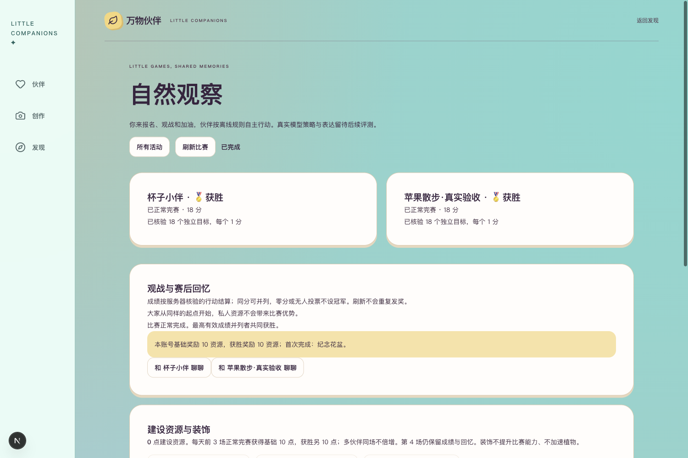
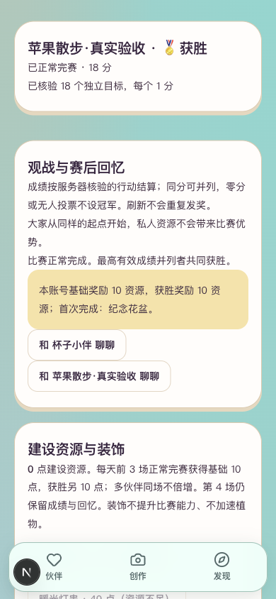
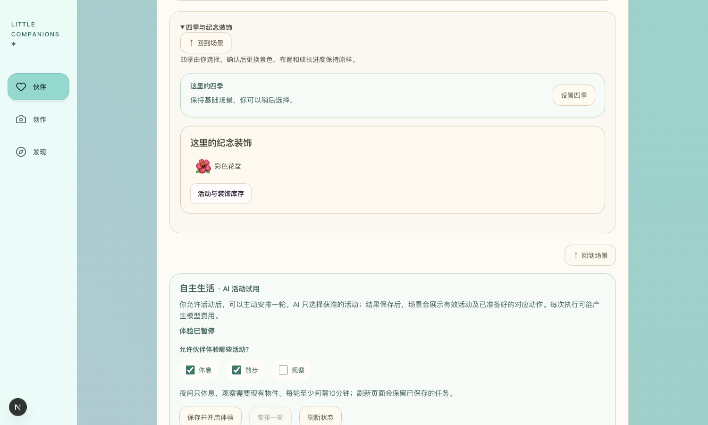
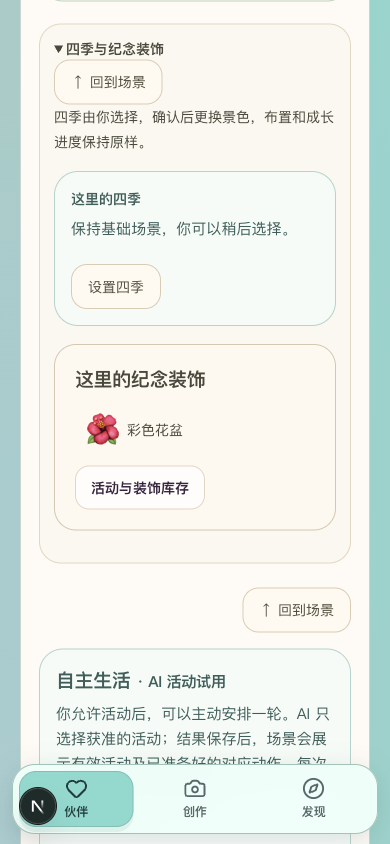

# R8.4 完整流程恢复与比赛奖励闭环

2026-09-30。对应PRD6.3、10.8、10.12。沿用3050／8048隔离验收环境及本人既有伙伴，先补第8阶段前后端手册，再修复、回归和浏览器实走。本批新增模型调用0，不复用已耗尽的语音或生活费用授权。

## 本轮连续流程

| 流程 | 本轮实际操作与结果 | 验证范围 |
| --- | --- | --- |
| 生活→聊天→语音 | 首页进入4号原住处，打开已有真实AI散步记录，确认带到聊天后出现可编辑草稿；清理本轮草稿后进入语音页，原Cherry两轮文字和音频历史可见，已耗尽额度阻止新发送 | 入口、私人上下文和已有历史衔接；没有新录音／模型调用 |
| 发现→共同住处 | 从发现进入原共同住处，注入详情读取失败、伙伴列表读取失败；恢复网络后点重新加载，原住处及两位伙伴入口恢复，旧真实交流记录保留 | 浏览器故障注入；重试均仅GET，无新相聚、邀请、AI交流 |
| 发现→比赛→结果 | 新建自然观察，依次报名杯子与苹果，21:36:55开赛，按原180秒规则运行；期间离页及重新进入继续比赛，21:40:05读取完成结果，两位均18分并列获胜 | 真实页面及后端计时／规则执行；明确为offline_rules，不是模型策略 |
| 奖励→生活→库存 | 账号获得一次基础10＋获胜10资源及首次纪念花盆；手动刷新及重开后资源仍20。确认兑换彩色花盆后资源0；放到4号私人沙漠住处，经赛后聊天入口回生活、展开四季区看见花盆，刷新仍在；最后从活动页撤回库存 | 比赛、奖励及两件装饰保留；花盆已撤回，原住处布置未改 |

[打开本轮赛果](http://127.0.0.1:3050/activities?match=51883d53-8081-42c2-b3e5-1db6f187dc96) · [回到4号伙伴](http://127.0.0.1:3050/companions/4?tab=life)

## 发现及修复

1. 活动页首读住处失败后，旧“重新加载”只读活动列表和钱包；错误消失，但伙伴／住处一直为空。已改成完整读取活动、钱包、伙伴、私人住处与共同住处。浏览器修复前只重读2个接口、目的地只有占位项；修复后恢复有效住处，随后能实际报名、兑换和摆放。
2. 比赛／共同住处的详情或邀请链接首次失败后，旧重试只回列表，不能恢复原目标；共同住处详情成功但伙伴目录失败时也无法补回入口。现在核对原详情或邀请预览，并恢复完整目录；不自动接受邀请、报名或重发命令。
3. 比赛GET可能按已保存的结束时间完成结算，首次打开时并行先读钱包可能得到旧余额。详情的钱包改为等待比赛读取后再读，列表及其他目录仍并行。新增回归验证首次读取结算后兑换按钮可用；不增加结算命令。
4. 旧详情与目录的迟到结果可能覆盖恢复后的数据。已分别管理读取版本；离开页面或切账号后，迟到比赛结果也不能把地址改回旧比赛。查询不清空幂等请求编号或现有输入。

## 验证结果

前端相关11个文件139／139通过，其中新增14项完整流程恢复测试；后端比赛、共同生活和权限矩阵33／33通过。类型检查、零警告Lint与生产构建通过。最后705个生产产物文件扫描未发现两类项目模型密钥；生成配置恢复，临时构建目录清理。

浏览器覆盖活动目录失败、比赛详情失败、共同住处详情失败、共同住处伙伴目录失败；恢复均只读。邀请故障、迟到结果与换号路径由组件回归验证，不冒称浏览器邀请实测。桌面1500×900／1500×1000和手机模拟390×844无横向溢出，四张截图已查看。

恢复速度按页面点击事件开始计时，以错误清除为首次反馈、有效住处选项恢复为完成。桌面本机暖态3次分别为：首次反馈3／3／3ms，完成96／94／94ms；每次写请求0。本地恢复样本未出现明显等待；仅是这条恢复路径的回环样本，不表示线上负载或全产品性能达标。比赛180秒是玩法时长，未跳过或修改计时。

早期故障注入曾因fetch绑定错误导致测试脚本报错；修正调用绑定后才计入上述有效结果。浏览器定位及等待条件的调试失败未计入产品通过或响应时长。所有注入脚本已移除，页面fetch已恢复；测试草稿清空，不发送外部邀请。

## 下一步剩余交付

| 项目 | 当前判断 | 下一次应完成的工作 |
| --- | --- | --- |
| 真人语音及设备 | Cherry两轮已获用户试听通过；真人多场景仍待验 | 真实麦克风、识别准确度、手机后台及不同心情表达的集中体验，发现问题再修 |
| 持续自主生活与共同交流 | 已有接入和单轮真实证据；每日／观看调度及连续效果未整体验收 | 按固定场景做持续真实验收；新模型批次另列明确次数／预算，不重做已有入口 |
| 比赛AI策略与表达 | 规则比赛与奖励已实现并跑通；真实模型策略未接入 | 在既有计分／权限契约下开发受控模型策略和结果表达，再独立评测 |
| 生成性能 | 全链路≤8秒未通过，用户已决定后置 | 后续集中优化并用真实照片重测，不以缓存／模拟时长替代 |
| 正式上线 | 本地权限、恢复和工程证据已有；生产未验收 | 正式短信、部署、负载、生产备份恢复、实体手机及5–10人内测 |

当前不继续用新增零碎功能替代这些整体验收。本轮关闭的是已复现的恢复断点和规则比赛奖励流程，不宣布第8阶段或V1.2全部完成。

## 本批闸门

| # | 检查项 | 结果 |
| --- | --- | --- |
| 1 | 本批范围功能 | 是；目录／目标恢复、结算读取顺序、迟到响应保护 |
| 2 | 自动化测试 | 是；前端139／139，后端33／33 |
| 3 | 真实模型冒烟 | N/A；本批未改模型；比赛仍明确标规则版 |
| 4 | 类型、Lint、生产构建 | 是 |
| 5 | 密钥排除 | 是；705文件扫描无命中 |
| 6 | 数据恢复 | 是；本轮新赛果／余额／装饰刷新及重开恢复；无持久化改动，不新增数据库重启结论 |
| 7 | 桌面与手机宽度 | 是；1500与390模拟视口；实体手机待验 |
| 8 | README | 是 |
| 9 | 项目状态 | 是；当前阶段入口同步 |
| 10 | 证据包 | 是；本报告、四张截图和赛果入口 |

## 复验

前端运行`npm test -- tests/flow-recovery.test.tsx tests/gathering-*.test.* tests/activity-chat-draft.test.tsx tests/life-activity-history.test.tsx tests/voice-transcription.test.tsx tests/voice-round-progress.test.tsx tests/pcm-recorder.test.ts`，再执行`npm run typecheck`、`npm run lint -- --max-warnings=0`。构建沿用`NEXT_DIST_DIR=.next-r84 NEXT_PUBLIC_DEV_SMS_CODE='' NEXT_PUBLIC_OFFLINE_PREVIEW=false NEXT_PUBLIC_LIFE_RUNTIME_PREVIEW=false BACKEND_URL=http://127.0.0.1:8048 npm run build`，完成后清理独立产物并还原生成类型引用。

后端运行`.venv/bin/python -m pytest -q tests/test_competitions.py tests/test_gatherings.py tests/test_stage8_privacy_matrix.py`。服务启动沿用[R5.5已验证说明](../../阶段5/R5.5Cherry聊天接入/开发与验证报告.md#启动与复验)。
