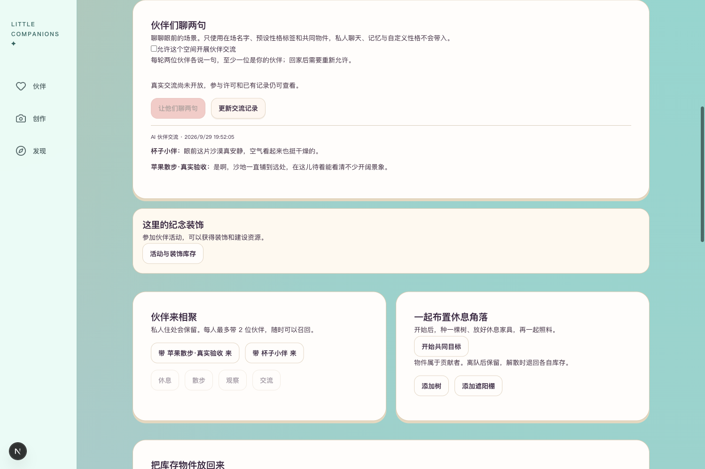
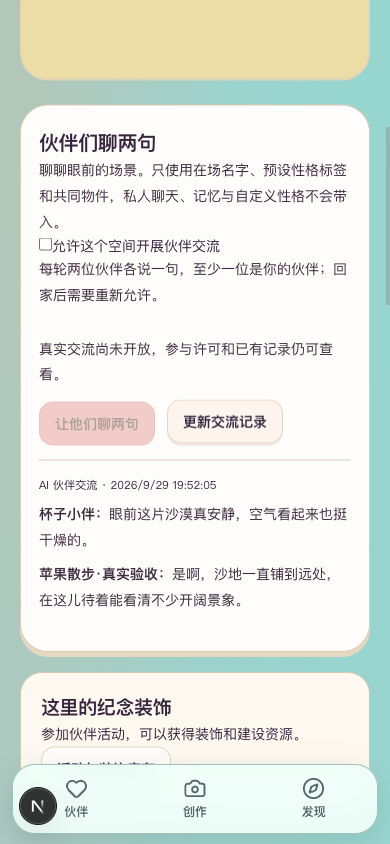
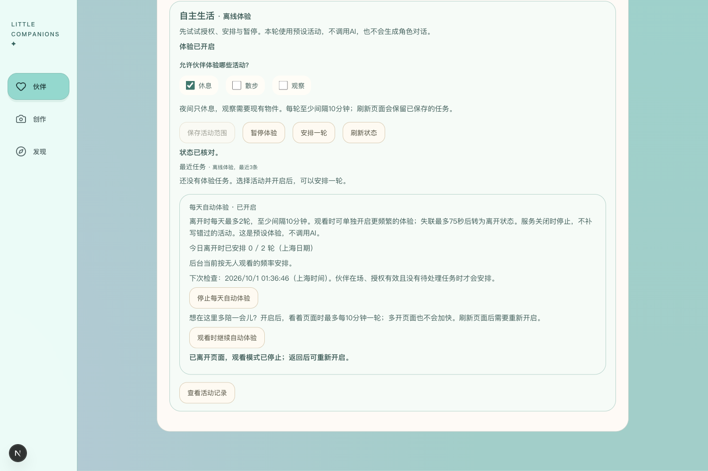
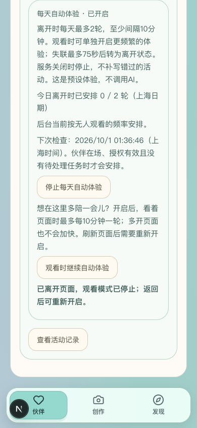

# 持续生活与返回恢复

2026-10-01。本轮按用户“流程能跑通”口径推进。修复共同交流快速返回时漏读，以及观看模式未处理pagehide离页的问题；每日安排、观看频率、暂停、预算等待和持久恢复的离线流程复验通过。新增真实模型调用0，未新增预算或修改本人原生活开关。本轮流程修复完成，不代表持续真实AI效果或正式上线已验收。

## 修复与复验

| 流程 | 问题与结果 | 证据性质 |
| --- | --- | --- |
| 共同交流快速切后台再回来 | 原请求取消后pending仍占用，返回读取被跳过。现在取消即释放读取位置，新请求独立持有控制器，旧响应与finally不能影响新请求 | 新增回归先失败；修复后通过。Chrome实际页面挂起一次GET，隐藏／恢复使读取次数1→2，无POST；已有真实交流恢复可见 |
| 共同交流离页再返回 | 原pagehide后仍可继续轮询。现在暂停读取，pageshow只读恢复；运行到完成不重发生成 | 组件模拟pagehide／pageshow，校验最终对话出现及POST为0 |
| 本页观看模式离页 | 原仅监听visibilitychange，独立pagehide后仍续报。现在关闭本页租约、取消计时器；迟到成功不能重新开启，返回须再点开启 | 组件回归及Chrome离线接口替身，模拟pagehide／pageshow；本地租约开启／关闭各1次，服务端写入0 |
| 每日及观看调度 | 默认关闭、每日2轮、10分钟共享间隔、多页／多worker防重、租约75秒到期、跨日不补历史 | 后端禁网测试与受控时钟，不宣称在真实时间中持续运行了数日 |
| 暂停、预算与恢复 | 暂停丢弃迟到结果，权限变更取消旧任务；不足／未知费用不增派。重新打开数据库与独立进程核对开关、计数、事件和费用账本一致 | 临时测试库；未重启本人的8048服务，未增加真实额度 |

前端83／83、后端87／87通过。新增4项回归修复前全部失败、修复后全部通过；后端只有原有两项依赖弃用警告。类型检查、零警告Lint、隔离生产构建通过。1948个产物文件扫描3个项目密钥值，命中0；构建临时目录已删除，生成的类型引用已恢复。

浏览器桌面1500×1000、手机模拟390×844已检查，无横向溢出，4张截图均已查看。观看页面明确显示离线体验；替身只在该页内存中存在，刷新后恢复原“体验已暂停”和预算不足状态。共同交流展示原有真实记录，未新生成对话。首次故障注入因读取被聚焦事件取消而未完成，调整注入后取得有效结果；一次截图子树定位参数错误也已纠正，均未计为产品通过。页面替身和可见性覆盖已清理。

## 可自行查看

- [共同住处及已有交流](http://127.0.0.1:3050/gatherings?space=bb5b04ad-68db-4c8f-a5eb-442d006f13ee)：找到“伙伴们聊两句”，点“更新交流记录”；切到其他标签页再回来，已有对话仍可查看，不会自动再聊一轮。
- [苹果生活页](http://127.0.0.1:3050/companions/4?tab=life)：点“活动设置”，原真实体验仍暂停。本轮离线观看演练已清理，查看下方截图即可，不需要为验收开启收费功能。

## 本轮闸门

| # | 检查项 | 结果 |
| --- | --- | --- |
| 1 | 本轮范围功能 | 是；两个前端返回／离页断点修复，后端现有持续流程复验 |
| 2 | mock自动化 | 是；前端83／83，后端87／87 |
| 3 | 真实模型冒烟 | N/A；本轮未改模型，新增调用0；持续真实效果另列待验 |
| 4 | 类型、Lint、生产构建 | 是 |
| 5 | 密钥排除 | 是；产物扫描无命中 |
| 6 | 数据可恢复 | 是；临时库重开及独立进程恢复回归通过；本人存档未写入 |
| 7 | 桌面与手机宽度 | 是；1500与390，实体手机系统生命周期仍待验 |
| 8 | README | 是 |
| 9 | 项目状态 | 是 |
| 10 | 证据包 | 是；本报告、四张截图及两个入口 |

## 复现方法与后续

前端目录执行 `npm test -- tests/life-viewing.test.tsx tests/life-automatic.test.tsx tests/life-runtime-panel.test.tsx tests/gathering-dialogue.test.tsx tests/gathering-sync.test.tsx`，再执行 `npm run typecheck`、`npm run lint -- --max-warnings=0`。生产构建沿用项目检查配置：`NEXT_DIST_DIR=.next-r45-check NEXT_PUBLIC_DEV_SMS_CODE='' NEXT_PUBLIC_OFFLINE_PREVIEW=false NEXT_PUBLIC_LIFE_RUNTIME_PREVIEW=false BACKEND_URL=http://127.0.0.1:8048 npm run build`。

后端目录执行 `.venv/bin/python -m pytest -q tests/test_life_automatic.py tests/test_life_live_automatic.py tests/test_life_viewing.py tests/test_life_dispatch.py tests/test_gathering_dialogue.py tests/test_gatherings.py`。服务启动方式继续使用[既有启动说明](../../阶段5/R5.5Cherry聊天接入/开发与验证报告.md#启动与复验)。

剩余工作集中于实体语音设备体验、持续真实AI运行和正式上线准备；性格表达与性能优化按用户决定后置，不再用主观评分阻塞当前mock流程。新模型批次或云资源费用需具体授权，不复用已消耗的旧批次。
