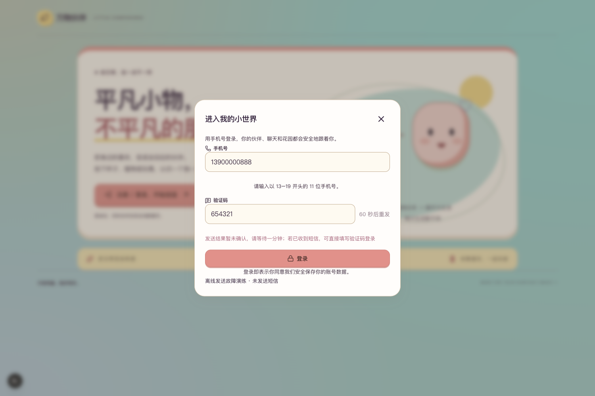
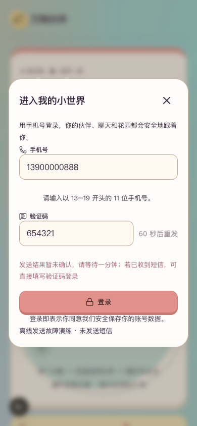

# R8.7 短信登录与发送恢复

2026-10-01。本轮工程增量已实现并通过离线验证；真实收信仍待验，第8阶段及正式上线未完成。用户暂停发布后要求继续开发，本轮没有推送GitHub、部署、发送真实短信或调用模型。当前3050／8048体验服务和用户运行库未重启、未迁移。

## 范围与结果

承接V1.1第2阶段手机号验证码登录及V1.2第8阶段发布准备，开发前先补齐前后端第8阶段技术文档。火山短信是代码中的候选适配，尚未确认平台开通和真实发送批次。

- 新增可选火山短信适配：仅使用官方SDK纯签名器，固定域名、版本、单号码及六位代码，通过httpx发送一次，不自动重试。连接和读取超时受限，流式响应有大小和期限检查；初始化失败、明确拒绝和发送未知分别返回固定中文错误，不返回供应商原始响应。
- 真实发送必须同时具备provider、显式开关、独立短信凭证、消息组、审核签名／模板和正数每日总上限。默认mock、开关关闭、额度0；项目实际配置没有改动。生产配置检查不再无条件拒绝所有短信实现，但配置齐全仍只记“待真实验收”。
- 发送前把按UTC日期的全局次数与号码代码记录在同一事务提交；并发只能有一个请求赢得该号码冷却。请求未知、失败或重启不自动退次数、不重发。明确拒绝使代码失效；结果未知保留代码至有效期，收到短信仍可登录。
- 修复成功登录删除验证码整行的问题：改为一次性失效，保留重发间隔和当日限额；并发消费仅一次成功。数据库只存代码哈希。
- 页面收到发送未知、部分服务错误或网络异常时保留输入并冷却60秒，不阻止已有验证码登录，也不自动重新发送。

新增`sms_daily_quotas`表本轮仅在临时测试库创建。默认数据库初始化可创建新表；将来更新当前运行服务前，先按R8.6备份并核对恢复，再重启并检查，不能把本次临时库测试写成现有用户库迁移验收。

## 验证

| 项目 | 结果 | 范围 |
| --- | --- | --- |
| 短信后端专项 | 27／27 | 真实SDK签名＋禁网HTTP替身，错误脱敏、响应限制、0或1次发送、并发与限流 |
| 后端全量 | 1761／1761 | 141.23秒；保留两条既有依赖弃用警告，无失败 |
| 前端登录组件 | 7／7 | 已输入验证码直接登录、未知结果冷却、关闭重开恢复及会话保存异常 |
| 前端静态和生产检查 | 全通过 | typecheck、零警告Lint、独立目录生产构建；三个开发提示／预览开关关闭 |
| 持久恢复 | 通过 | 临时SQLite记录两次未知发送，独立Python进程重新打开后次数仍为2；登录后同号限流保留 |
| 桌面／手机模拟 | 通过 | 1500×1000和390×844，无横向溢出，截图逐张查看 |

收尾检查：本项目21个新增／修改文件及1948个独立构建文件，6个本地凭证值命中0；本轮修改文档的相对链接全部存在，本项目`git diff --check`通过。临时3052监听已停止，两份临时构建目录已删除；Next生成引用已还原。

浏览器使用独立3052页面及仅拦截`/auth/code`的离线503替身，页面标明“离线发送故障演练 · 未发送短信”。合成手机号和验证码保留，发送只被拦截一次，倒计时开始，登录按钮可用。浏览器没有点击真实登录，登录消费由组件和后端测试验证。刷新后替身清除，临时标签与服务关闭；不影响3050登录状态。





## 本地复核

在项目`backend/`中安装可选签名依赖：`.venv/bin/python -m pip install -r requirements-sms.txt`。本轮项目虚拟环境已安装`volcengine==1.0.228`；依赖只用于签名，不读取SDK全局凭证，不调用其自带重试的发送包装。

在`backend/`运行：

```sh
.venv/bin/python -m pytest tests/test_sms_provider.py -q
.venv/bin/python -m pytest -q
```

在`frontend/`运行：

```sh
npm test -- tests/auth-modal.test.tsx
npm run typecheck
npm run lint
NEXT_DIST_DIR=.next-r87-check NEXT_PUBLIC_DEV_SMS_CODE='' NEXT_PUBLIC_OFFLINE_PREVIEW=false NEXT_PUBLIC_LIFE_RUNTIME_PREVIEW=false npm run build
```

本轮检查完成后删除独立构建目录，并还原Next自动改写的类型引用及tsconfig附加路径。截图保留在本目录，原用户文件与其他项目改动不纳入提交。

真实接入配置说明见`backend/.env.example`中的`SMS_*`字段。凭证只填写本项目私有配置，不能发在聊天或写入报告。当前`SMS_PROVIDER=mock`、`SMS_LIVE_ENABLED=false`、`SMS_DAILY_LIMIT=0`的默认值不变；每日次数上限按UTC日期计算，是发送次数保护，不代表货币预算。正式启用前仍需确定审核通过的模板变量为`code`、实际单价、测试号码和本批次数／费用，并验证真实收信及登录。本轮没有创建云资源或申请短信签名／模板。

接口依据为[火山SendSms文档](https://www.volcengine.com/docs/6361/67380?lang=zh)及[官方调用示例](https://www.volcengine.com/docs/6361/1927042?lang=zh)，核对日期2026-10-01。适配使用`SmsAccount`、`Sign`、`TemplateID`、`TemplateParam`和单号码`PhoneNumbers`，成功响应要求单条`Result.MessageID`。真实平台兼容性仍待本批收信验收。

## 本轮闸门

| # | 检查项 | 结论 |
| --- | --- | --- |
| 1 | 范围内功能实现 | 是，候选短信适配及登录恢复 |
| 2 | mock自动化测试 | 是，后端1761／1761，前端相关7／7 |
| 3 | 真实服务冒烟 | 待验，真实短信0次；本轮不涉及模型改动 |
| 4 | 类型／Lint／生产构建 | 是 |
| 5 | 密钥排除 | 是，提交文件及独立构建检查，凭证无命中；私有配置不入库 |
| 6 | 重启后可恢复 | 是，临时库独立进程恢复计数；当前用户运行库未重启，生产恢复仍待验 |
| 7 | 桌面／移动宽度 | 是，桌面及390宽手机模拟；实体设备未测 |
| 8 | README | 是，新增安装、验证入口与真实短信边界 |
| 9 | 项目状态 | 是，记录发布暂停及本轮结果 |
| 10 | 证据包 | 是，本报告及两张离线截图 |

本轮代码与离线流程已交付，真实短信未验收，不宣布第8阶段整体完成。后续仍需真实收信、实体语音体验、持续生活真实调度和独立生产环境验收；已后置的性格细节及性能优化继续按用户决定保留。
