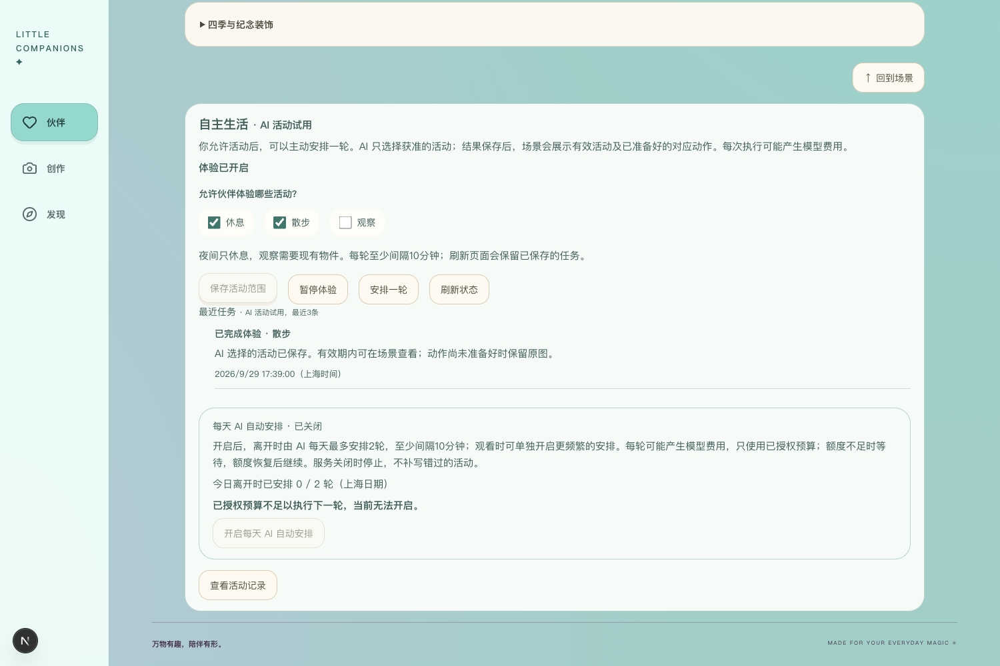
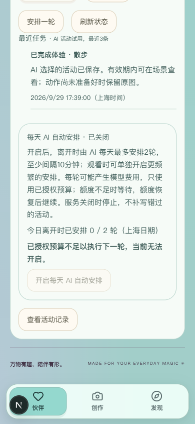
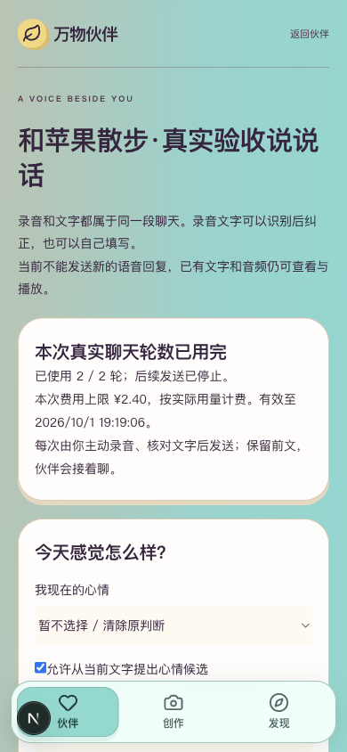
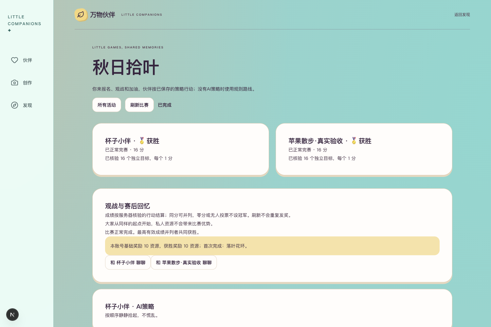

# R8.8 当前体验版更新与验证

2026-10-01。按用户“先备份、更新体验版、核对登录及历史”的明确选择，最新代码已应用到正在使用的8048后台。3050前端继续运行，用户原有登录与业务记录保留；没有新模型／短信调用、云资源或公网发布。

## 备份与更新

更新前保存62张数据库表、19个上传文件，并补齐32个动作生成ledger文件及7个根目录状态JSON。新目录恢复后逐项摘要一致，数据库完整性通过。快照位于本项目`.runtime/r88-before-update/`，共61个文件（含数据库和两份清单），目录0700、文件0600，Git忽略；不包含.env或日志。恢复演练副本与一次性备份脚本核对后删除，更新前快照保留。

停止旧8048进程后再次核对源库与快照一致，然后按既有`serve-voice`入口启动最新代码。原进程49798退出，新进程65944监听8048；原3050前端未重启。初始化新增`life_runtime_budget_changes`与`sms_daily_quotas`，共64表，两张新表均0行。

启动后、登录检查前，原62张表逐表行值摘要全部一致，19个上传文件与32个ledger文件全部一致，没有用空库替代、覆盖或删除原数据。保留历史未知调用和已消耗额度，没有重新发奖或新增生活事件。

当前体验环境仍使用本地mock短信及既有隔离生活入口，并未切到生产模式。新的正式运行能力已经在代码中，启用仍需独立真实验收与配置；此次更新不会自动开放真实短信或分配任何新预算。

## 登录和存档核对

| 项目 | 实际结果 |
| --- | --- |
| 前端主页 | HTTP 200，3050可访问 |
| 匿名本人信息 | HTTP 401，未绕过登录 |
| 既有浏览器会话 | `/auth/me` 200，重启前的登录继续有效 |
| 错误验证码 | 400，拒绝登录 |
| 正确本地固定码 | 200，创建独立临时会话；没有请求短信 |
| 临时会话本人信息 | 200 |
| 临时会话退出 | 204；随后用该临时会话读取返回401 |
| 用户原浏览器会话 | 仍200，浏览器令牌未替换、未退出 |
| 生活状态和历史 | 均200，原1条完成的散步任务仍在 |
| 本人语音状态和历史 | 均200，5条发送回执与10份音频记录可读 |
| 活动列表 | 200，原5场保留，含4场完成与1场取消 |
| 秋日拾叶结果 | 页面仍显示两位各16分并列获胜，原20资源与落叶花环结果保留 |

核对结束后，原7份会话身份集合与备份相同，只有`last_seen_at`及正常续期的`expires_at`变化，既有有效期未缩短；其余61张旧表仍与备份完全一致。两张新增表继续0行，上传与ledger仍一致。运行进程元数据已更新为当前PID，历史状态文件保留其原含义。

这里的登录测试是本地固定码流程，不等于真实短信收信验收。未改用户心情、音色、许可、钱包或比赛状态；未播放新合成、录音上传、点击生成或申请新额度。

## 许可、额度与界面

本次实际核对澄清了当前状态：私人生活的**活动许可已开启**，已允许休息、散步；这是已有值，本轮没有重新开启。**每日自动安排关闭，生活剩余可用额度为0**，不会因重启自行获得新额度。不能把“自动安排关闭”写成“所有活动许可关闭”。

语音页仍显示本批2／2轮已用完，已有文字及音频可读取，新增语音回复保持停止。真实持续生活与实体麦克风效果没有在本轮重新调用验证。

桌面1500×1000与手机模拟390×844均无横向溢出。以下四张截图来自更新后的实际3050页面，已逐张查看；没有接口替身或合成账号注入。









## 直接查看

- [体验版首页](http://127.0.0.1:3050/)
- [私人生活与已有散步记录](http://127.0.0.1:3050/companions/4/scenes/desert/5cdc8bd2-c97d-4e54-befd-34cc6f584ceb)：点击“活动设置”，可看已有任务、每日自动安排关闭和额度不足。
- [语音历史](http://127.0.0.1:3050/companions/4/voice)：可看已有轮数、文字和音频；不要把“额度已用完”当成更新失败。
- [秋日拾叶赛果](http://127.0.0.1:3050/activities?match=f518deeb-5e29-55a4-9d15-84b7f2c7db1d)：两位各16分，读取不会重复发奖。

如未来需要重启当前本地体验后台，在项目`backend/`使用同样的明确隔离开关：

```sh
LIFE_RUNTIME_ENABLED=false SMS_PROVIDER=mock SMS_LIVE_ENABLED=false SMS_DAILY_LIMIT=0 .venv/bin/python -m scripts.check_candidate_review serve-voice
```

先检查8048是否已有本项目服务，不重复启动。不要运行`seed`或覆盖现有数据库。原数据库与uploads可使用R8.6恢复工具恢复到新目录；本次额外ledger和状态JSON分别保存在快照`ledger/`与`sidecars/`，与`extra-manifest.json`核对后再评估恢复，不能直接覆盖更新后已有新业务的数据。

## 本轮闸门

| # | 检查项 | 结论 |
| --- | --- | --- |
| 1 | 本轮更新范围 | 是，当前后台已更新并核对存档 |
| 2 | 自动化测试 | 本轮无业务代码变更，沿用C1.72的152／152及此前短信／前端结果；新增实际启动、摘要及接口检查全部通过 |
| 3 | 真实模型冒烟 | N/A，本轮更新不调用模型；持续真实运行仍待验 |
| 4 | 类型／Lint／构建 | N/A，无前端实现改动，沿用C1.71通过结果 |
| 5 | 密钥排除 | 是，快照私有且Git忽略，不包含.env／日志；提交文件扫描通过 |
| 6 | 数据恢复 | 是，完整新目录恢复及当前后台实际重启，原业务数据一致 |
| 7 | 桌面／移动宽度 | 是，1500及390手机模拟；实体手机仍待验 |
| 8 | README | 是，更新当前体验入口与结果 |
| 9 | 项目状态 | 是，记录64表、最新进程与实际许可状态 |
| 10 | 证据包 | 是，本报告及四张实页截图 |

本次体验版更新完成。真实短信、实体语音、持续模型调度和正式发布仍按后续独立验收推进，不把本次本地更新写成公网部署完成。
